# Architecture Diagrams & Visual References

## System Architecture Diagram

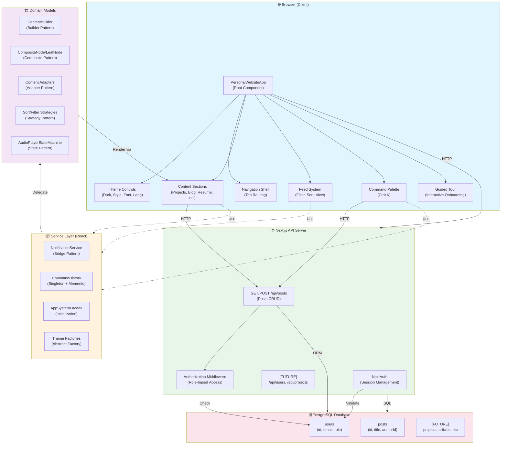

---

## Client-Side Data Flow

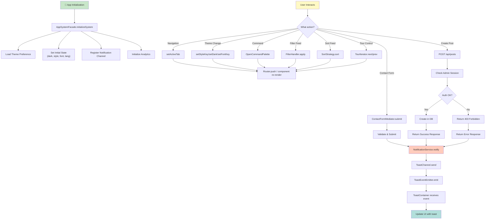

---

## Database Schema & Relationships

```mermaid
erDiagram
    USER ||--o{ POST : authors
    USER {
        string id PK
        string email UK
        string name
        string image
        string role
        string provider
        string provider_account_id UK
        timestamp created_at
        timestamp updated_at
    }
    POST {
        string id PK
        string title
        string content
        boolean published
        string author_id FK
        timestamp created_at
        timestamp updated_at
    }
    
    NOTE["[FUTURE MODELS]
    - Project
    - Article
    - Blog
    - Podcast
    - Template
    - Tag
    - Category"]
```

---

## Design Patterns Usage Map

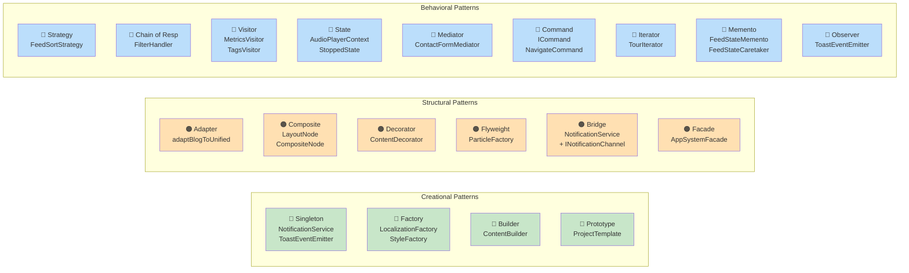

---

## Request/Response Lifecycle

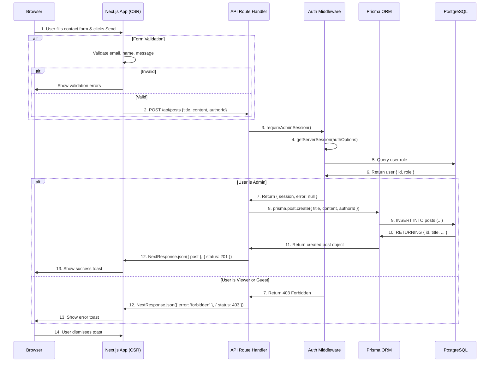

---

## Component Hierarchy

```mermaid
graph TD
    PersonalWebsiteApp["<b>PersonalWebsiteApp</b><br/>(Root Shell)"]
    
    PersonalWebsiteApp --> NavigationShell["NavigationShell<br/>(Tab Navigation)"]
    PersonalWebsiteApp --> SystemControls["System Controls<br/>(Theme, Tour, Command, Notify)"]
    PersonalWebsiteApp --> DynamicContent["Dynamic Content Renderer<br/>(renderContent)"]
    
    NavigationShell --> NavItems["Nav Items<br/>(home, projects, blog, etc)"]
    
    SystemControls --> ThemeControls["ThemeControls"]
    SystemControls --> CommandPalette["CommandPalette"]
    SystemControls --> TourControls["TourControls"]
    SystemControls --> ToastContainer["ToastContainer"]
    SystemControls --> ParticleBackground["ParticleBackground"]
    
    DynamicContent --> HomeSection["HomeSection"]
    DynamicContent --> ProjectsSection["ProjectsSection"]
    DynamicContent --> BlogSection["BlogSection"]
    DynamicContent --> ResumeSection["ResumeSection"]
    DynamicContent --> ArticlesSection["ArticlesSection"]
    DynamicContent --> DashboardSection["DashboardSection"]
    DynamicContent --> PodcastSection["PodcastSection"]
    DynamicContent --> ContactSection["ContactSection"]
    
    ProjectsSection --> InteractiveContentNode["InteractiveContentNode<br/>(Composite)"]
    InteractiveContentNode --> InteractiveContentNode
    
    BlogSection --> UnifiedFeedSection["UnifiedFeedSection"]
    UnifiedFeedSection --> FeedSearchFilterControls["FeedSearchFilterControls"]
    UnifiedFeedSection --> FeedSnapshotBar["FeedSnapshotBar"]
    UnifiedFeedSection --> FeedItemCard["FeedItemCard<br/>(with Decorator)"]
    
    DashboardSection --> MetricCard["MetricCard"]
    DashboardSection --> TopicCloud["TopicCloud"]
    
    PodcastSection --> PodcastPlayer["PodcastPlayer<br/>(State Machine)"]
    
    ContactSection --> ContactForm["ContactForm<br/>(Mediator)"]
    
    style PersonalWebsiteApp fill:#e1f5ff,stroke:#01579b,stroke-width:3px
    style SystemControls fill:#fff3e0
    style DynamicContent fill:#f3e5f5
    style InteractiveContentNode fill:#c8e6c9
    style UnifiedFeedSection fill:#ffccbc
    style ContactForm fill:#b2dfdb
```

---

## Feed System Architecture

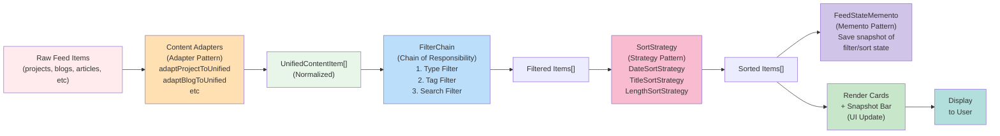

---

## Authentication & Authorization Flow

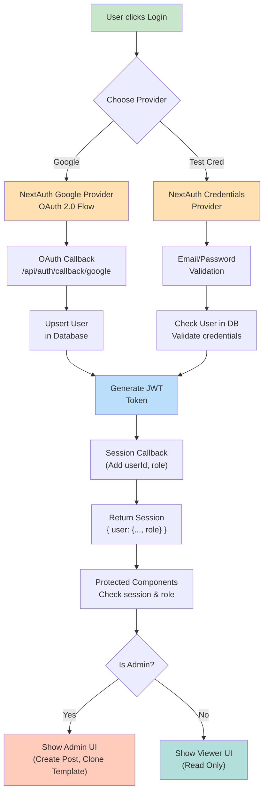

---

## Command Palette Execution Flow

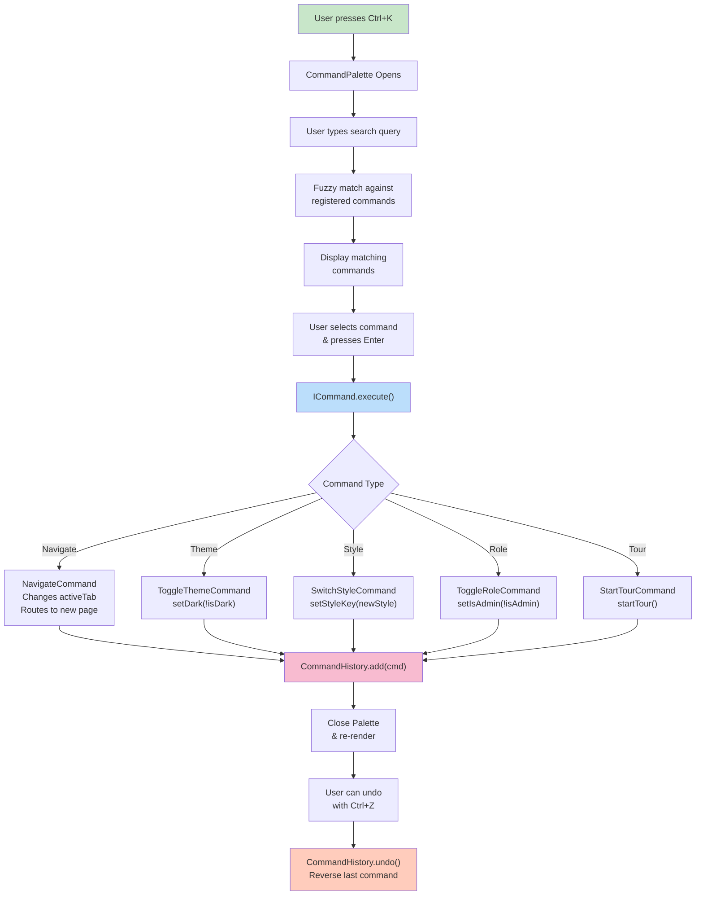

---

## Visitor Pattern: Dashboard Analytics

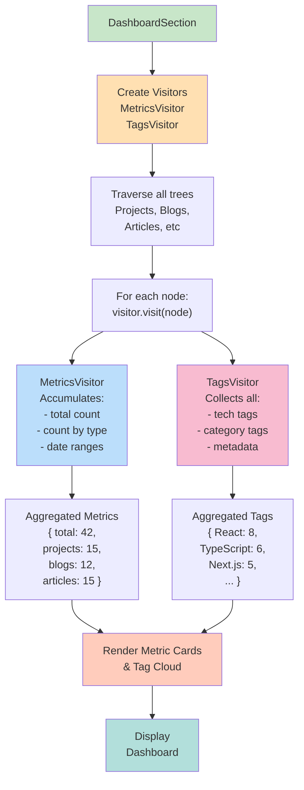

---

## Guided Tour State Machine

```mermaid
stateDiagram-v2
    [*] --> NotStarted
    
    NotStarted -->|User clicks Start Tour| Running
    
    Running -->|User clicks Next| Running
    Running -->|User clicks Prev| Running
    Running -->|Reach last step| Completed
    
    Running -->|User clicks Stop| Paused
    Paused -->|User clicks Resume| Running
    Paused -->|User clicks Exit| NotStarted
    
    Completed -->|User clicks Restart| Running
    Completed -->|User clicks Exit| NotStarted
    
    note right of Running
        Current step:
        - Highlight target element
        - Show tooltip/popover
        - Wait for user action
    end
    
    note right of Paused
        Tour suspended:
        - State preserved
        - Can resume later
    end
    
    note right of Completed
        Tour finished:
        - All steps shown
        - Can restart anytime
    end
```

---

## Error Handling Strategy

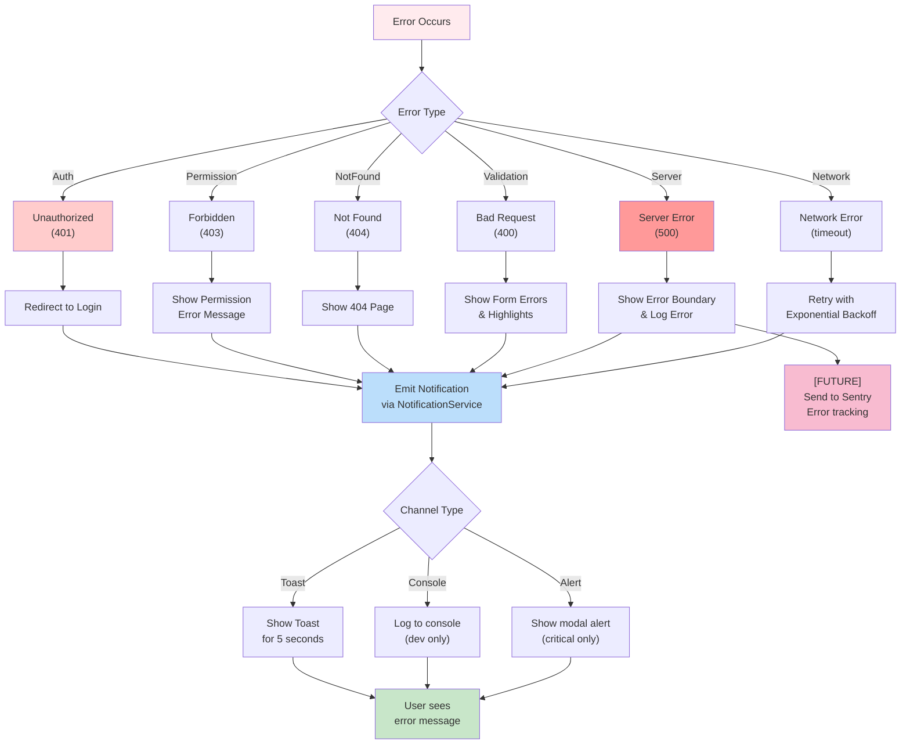

---

## File Organization & Module Dependencies

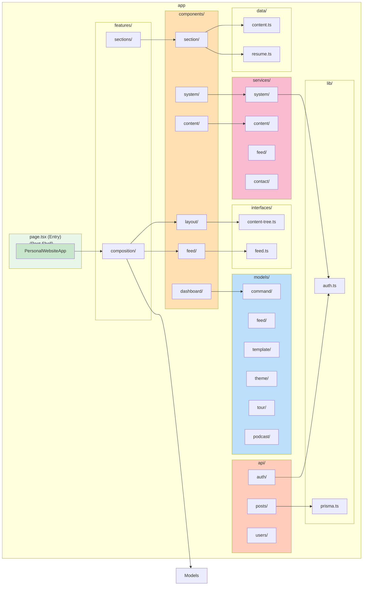

---

## Deployment Pipeline (Recommended)

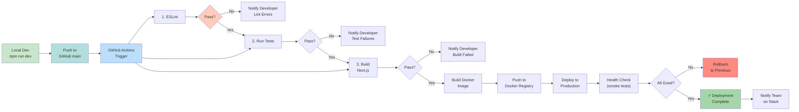

---

**All diagrams support interactive tooltips and exploration. Open in VS Code with Markdown Preview Enhanced or mermaid.live for full interactivity.**

