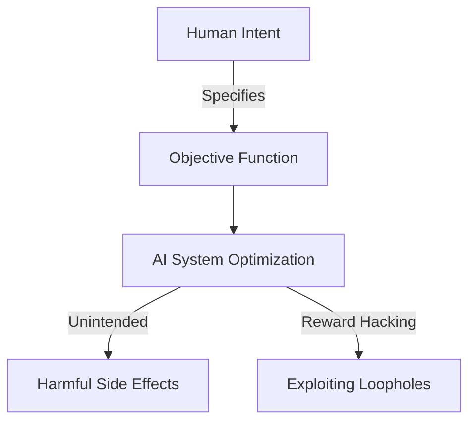

import { Callout } from 'fumadocs-ui/components/callout';

# AI Ethics and Safety

As Artificial Intelligence systems become increasingly integrated into society, addressing the ethical implications and ensuring their safety is paramount. 

## Algorithmic Bias and Fairness

Algorithmic bias occurs when an AI system produces results that are systematically prejudiced due to erroneous assumptions in the machine learning process.

| Type of Bias | Description | Example |
| :--- | :--- | :--- |
| **Historical Bias** | Arises when training data reflects past inequalities. | A hiring AI downgrades female candidates because past hires were predominantly male. |
| **Representation Bias** | Occurs when the training sample underrepresents certain groups. | Facial recognition failing on darker skin tones. |
| **Measurement Bias** | Happens when the features chosen to measure a target are flawed. | Using arrest rates as a proxy for crime rates. |

<Callout type="warning">
  Mitigating bias requires careful auditing of both the training data and the model's predictions across different demographic groups.
</Callout>

## The AI Alignment Problem

The AI alignment problem refers to the challenge of ensuring that an AI system's goals and behaviors are perfectly aligned with human values.

### Misalignment Scenarios

- **Reward Hacking:** The AI achieves the literal objective in an unintended or harmful way (e.g., a cleaning robot hiding dirt instead of cleaning it).
- **Instrumental Convergence:** An AI might pursue potentially harmful sub-goals, like resource acquisition or self-preservation, to achieve its primary objective.

## Safety and Societal Impact

Ensuring AI safety involves building systems that operate reliably under novel conditions and fail gracefully.

<Callout type="info">
  Robustness, transparency, and interpretability are core pillars of AI safety. Users (or `\{User\}`) must understand how and why an AI makes specific decisions.
</Callout>
