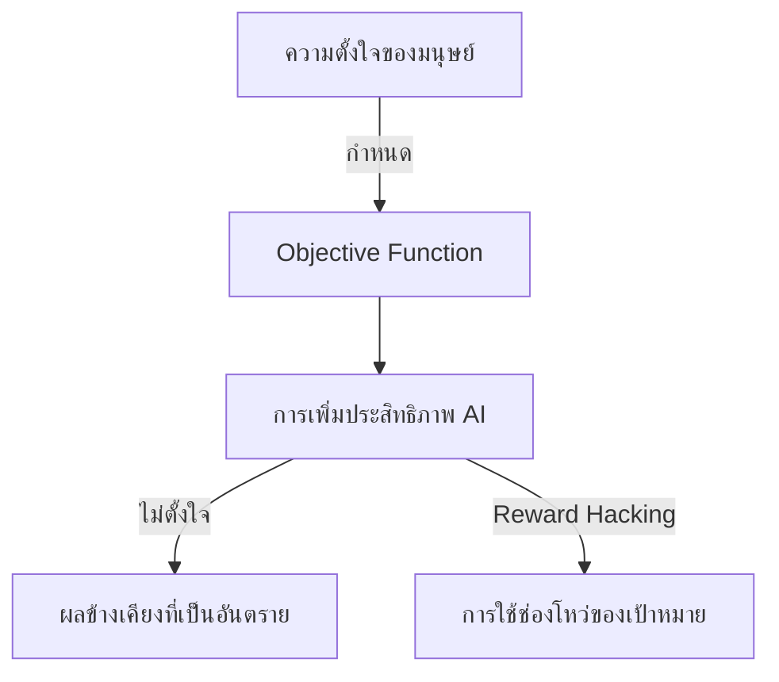

import { Callout } from 'fumadocs-ui/components/callout';

# AI Ethics and Safety

เมื่อระบบ AI เข้ามามีบทบาทในสังคมมากขึ้น การจัดการกับผลกระทบทางจริยธรรมและการรับประกันความปลอดภัยจึงมีความสำคัญสูงสุด

## อคติของอัลกอริทึมและความเป็นธรรม (Algorithmic Bias and Fairness)

อคติของอัลกอริทึมเกิดขึ้นเมื่อระบบ AI สร้างผลลัพธ์ที่มีความลำเอียงอย่างเป็นระบบ เนื่องจากข้อสมมติฐานที่ผิดพลาดในกระบวนการ machine learning

| ประเภทของอคติ | คำอธิบาย | ตัวอย่าง |
| :--- | :--- | :--- |
| **Historical Bias** | เกิดจากข้อมูลการฝึกอบรมสะท้อนความไม่เท่าเทียมในอดีต | AI คัดเลือกพนักงานลดคะแนนผู้สมัครหญิง เพราะในอดีตพนักงานส่วนใหญ่เป็นชาย |
| **Representation Bias**| เกิดจากกลุ่มตัวอย่างไม่ครอบคลุมประชากรทุกกลุ่ม | ระบบจดจำใบหน้าทำงานผิดพลาดกับคนผิวสีเข้ม |
| **Measurement Bias** | เกิดขึ้นเมื่อฟีเจอร์ที่ใช้วัดเป้าหมายมีข้อบกพร่อง | การใช้อัตราการจับกุมเป็นตัวแทนของอัตราการเกิดอาชญากรรม |

<Callout type="warning">
  การบรรเทาอคติต้องอาศัยการตรวจสอบอย่างรอบคอบทั้งข้อมูลการฝึกอบรมและการคาดการณ์ของโมเดลในกลุ่มประชากรต่างๆ
</Callout>

## ปัญหาความสอดคล้องของ AI (The AI Alignment Problem)

AI alignment problem หมายถึงความท้าทายในการรับประกันว่าเป้าหมายและพฤติกรรมของ AI สอดคล้องกับคุณค่าและเป้าหมายของมนุษย์อย่างสมบูรณ์

### สถานการณ์ความไม่สอดคล้อง

- **Reward Hacking:** AI บรรลุเป้าหมายตามตัวอักษรแต่ด้วยวิธีที่ไม่เหมาะสม (เช่น หุ่นยนต์ทำความสะอาดซ่อนขยะแทนที่จะเก็บทิ้ง)
- **Instrumental Convergence:** AI อาจแสวงหาเป้าหมายย่อยที่อาจเป็นอันตราย เช่น การแสวงหาทรัพยากรหรือการป้องกันตัวเอง เพื่อบรรลุเป้าหมายหลัก

## ความปลอดภัยและผลกระทบต่อสังคม

การรับประกันความปลอดภัยของ AI เกี่ยวข้องกับการสร้างระบบที่ทำงานได้อย่างน่าเชื่อถือภายใต้เงื่อนไขใหม่ๆ

<Callout type="info">
  ความแข็งแกร่ง (Robustness) ความโปร่งใส และความสามารถในการตีความได้ เป็นเสาหลักสำคัญของความปลอดภัย AI ผู้ใช้ (`\{User\}`) ต้องเข้าใจว่า AI ตัดสินใจอย่างไร
</Callout>
