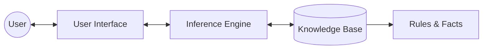

import { Callout } from 'fumadocs-ui/components/callout';

# Knowledge and Reasoning in AI

Knowledge representation and reasoning are essential for building intelligent agents that can understand the world, draw inferences, and make informed decisions.

## Propositional Logic

Propositional logic, or Boolean logic, is a simple form of logic where statements are either true or false.

- **Propositions:** Statements like "It is raining" (P) or "The ground is wet" (Q).
- **Logical Connectives:** Operations used to combine propositions.

| Connective | Symbol | Example | Meaning |
| :--- | :---: | :--- | :--- |
| **Negation** | $\neg$ | $\neg P$ | Not P |
| **Conjunction** | $\land$ | $P \land Q$ | P and Q |
| **Disjunction** | $\lor$ | $P \lor Q$ | P or Q |
| **Implication** | $\implies$ | $P \implies Q$ | If P then Q |
| **Biconditional**| $\iff$ | $P \iff Q$ | P if and only if Q |

<Callout type="warning">
  Propositional logic lacks the expressive power to describe relationships between objects generally, which limits its application in complex domains.
</Callout>

## First-Order Logic (FOL)

First-Order Logic (FOL), also known as predicate logic, extends propositional logic by introducing objects, predicates, functions, and quantifiers.

- **Universal Quantifier ($\forall$):** States that a property holds for all elements in a domain. Example: $\forall x, \text{King}(x) \implies \text{Person}(x)$
- **Existential Quantifier ($\exists$):** States that there exists at least one element for which the property holds. Example: $\exists x, \text{Crown}(x)$

In FOL, a fact is often represented as a predicate. Ensure to properly escape characters like `\{Fact\}` if writing custom syntax processors.

## Inference and Expert Systems

Inference is the process of deriving new sentences from existing ones. 

### Architecture of an Expert System

- **Knowledge Base (KB):** Contains domain-specific rules and facts.
- **Inference Engine:** Applies logical rules to the knowledge base to deduce new information.

<Callout type="info">
  Expert systems were among the first successful commercial AI systems, widely used in medical diagnosis and financial forecasting.
</Callout>
