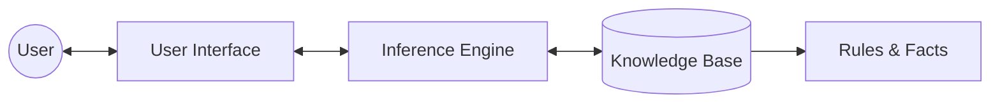

import { Callout } from 'fumadocs-ui/components/callout';

# Knowledge and Reasoning in AI

การนำเสนอความรู้ (Knowledge representation) และการใช้เหตุผล เป็นสิ่งจำเป็นสำหรับการสร้าง intelligent agents ที่สามารถเข้าใจโลก สรุปความ และตัดสินใจได้อย่างมีข้อมูล

## Propositional Logic

Propositional logic หรือตรรกศาสตร์บูลีน เป็นรูปแบบตรรกศาสตร์ที่เรียบง่ายซึ่งประพจน์มีค่าความจริงเป็นจริงหรือเท็จเท่านั้น

- **ประพจน์ (Propositions):** เช่น "ฝนกำลังตก" (P) หรือ "พื้นเปียก" (Q)
- **ตัวเชื่อมทางตรรกศาสตร์ (Logical Connectives):**

| ตัวเชื่อม | สัญลักษณ์ | ตัวอย่าง | ความหมาย |
| :--- | :---: | :--- | :--- |
| **นิเสธ (Negation)** | $\neg$ | $\neg P$ | ไม่ใช่ P |
| **และ (Conjunction)** | $\land$ | $P \land Q$ | P และ Q |
| **หรือ (Disjunction)** | $\lor$ | $P \lor Q$ | P หรือ Q |
| **ถ้า...แล้ว (Implication)** | $\implies$ | $P \implies Q$ | ถ้า P แล้ว Q |
| **ก็ต่อเมื่อ (Biconditional)**| $\iff$ | $P \iff Q$ | P ก็ต่อเมื่อ Q |

<Callout type="warning">
  Propositional logic ขาดพลังในการอธิบายความสัมพันธ์ระหว่างวัตถุในระดับทั่วไป ซึ่งจำกัดการใช้งานในโดเมนที่ซับซ้อน
</Callout>

## First-Order Logic (FOL)

First-Order Logic (FOL) หรือ predicate logic ขยายขีดความสามารถของ propositional logic โดยการแนะนำ objects, predicates, functions และ quantifiers

- **Universal Quantifier ($\forall$):** ระบุว่าคุณสมบัติเป็นจริงสำหรับทุกสมาชิกในโดเมน ตัวอย่าง: $\forall x, \text{King}(x) \implies \text{Person}(x)$
- **Existential Quantifier ($\exists$):** ระบุว่ามีสมาชิกอย่างน้อยหนึ่งตัวที่คุณสมบัตินั้นเป็นจริง ตัวอย่าง: $\exists x, \text{Crown}(x)$

ใน FOL fact มักถูกแสดงเป็น predicate ควรตรวจสอบให้แน่ใจว่าได้ escape ตัวอักษรเช่น `\{Fact\}` อย่างถูกต้อง

## Inference และ Expert Systems

Inference คือกระบวนการอนุมานประโยคใหม่จากประโยคที่มีอยู่

### สถาปัตยกรรมของ Expert System

- **Knowledge Base (KB):** ประกอบด้วย rules และ facts เฉพาะโดเมน
- **Inference Engine:** นำกฎทางตรรกศาสตร์มาใช้กับ knowledge base เพื่ออนุมานข้อมูลใหม่

<Callout type="info">
  Expert systems เป็นหนึ่งในระบบ AI เชิงพาณิชย์ที่ประสบความสำเร็จเป็นกลุ่มแรก โดยใช้กันอย่างแพร่หลายในการวินิจฉัยทางการแพทย์
</Callout>
