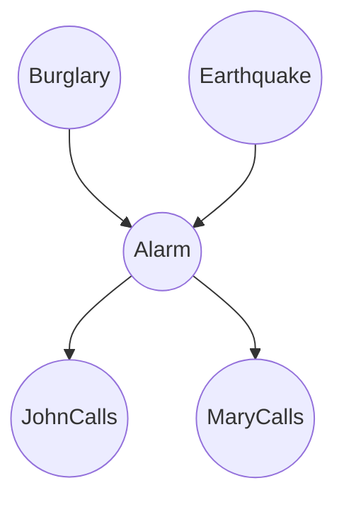

import { Callout } from 'fumadocs-ui/components/callout';

# Probabilistic Reasoning in AI

Artificial Intelligence often operates in environments that are partially observable, non-deterministic, or dynamic. In such scenarios, absolute certainty is impossible. Probabilistic reasoning provides a formal mathematical framework for managing uncertainty and making rational decisions based on available evidence.

## Uncertainty in AI

Uncertainty arises from various sources, including noisy sensor data, incomplete information, and inherent stochasticity in the environment.

<Callout type="info">
  Probabilistic models allow AI agents to express their degree of belief in various states of the world, represented as values between 0 and 1.
</Callout>

## Bayes' Theorem

At the core of probabilistic reasoning is Bayes' Theorem, which describes how to update the probability of a hypothesis as more evidence or information becomes available.

$$
P(A|B) = \frac{P(B|A)P(A)}{P(B)}
$$

Where:
- $P(A|B)$ is the posterior probability: the probability of hypothesis A given evidence B.
- $P(B|A)$ is the likelihood: the probability of evidence B given that hypothesis A is true.
- $P(A)$ is the prior probability: the initial probability of hypothesis A before observing evidence.
- $P(B)$ is the marginal likelihood: the total probability of observing the evidence.

## Bayesian Networks

Bayesian Networks, also known as belief networks, are directed acyclic graphs (DAGs) that represent a set of variables and their conditional dependencies. 

- **Nodes:** Represent random variables (e.g., Burglary, Earthquake).
- **Edges:** Represent conditional dependencies.

<Callout type="warning">
  Bayesian Networks dramatically reduce the computational complexity of representing joint probability distributions by exploiting conditional independence between variables.
</Callout>

## Markov Decision Processes (MDPs)

While Bayesian Networks model beliefs, Markov Decision Processes (MDPs) provide a framework for decision-making under uncertainty.

An MDP is defined by a tuple `\{S, A, P, R, \gamma\}`:

| Component | Symbol | Description |
| :--- | :---: | :--- |
| **States** | `S` | A finite set of states in the environment. |
| **Actions** | `A` | A set of available actions the agent can take. |
| **Transitions** | `P` | $P(s'\|s, a)$ is the probability of moving to state $s'$ after taking action $a$ in state $s$. |
| **Rewards** | `R` | $R(s, a, s')$ is the immediate reward received after transitioning. |
| **Discount** | $\gamma$ | A factor between 0 and 1 that discounts future rewards. |

The goal of solving an MDP is to find an optimal policy, $\pi^*$, which maps states to actions in a way that maximizes the expected cumulative reward.

<Callout type="info">
  The Markov Property states that the future is independent of the past given the present. This means the transition probabilities depend only on the current state and action.
</Callout>
