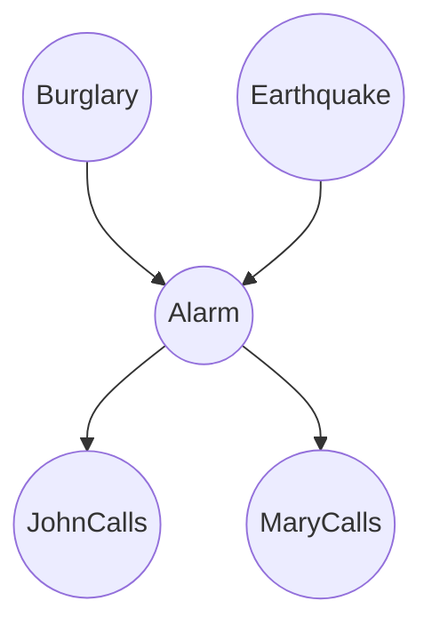

import { Callout } from 'fumadocs-ui/components/callout';

# Probabilistic Reasoning in AI

บ่อยครั้งที่ปัญญาประดิษฐ์ต้องทำงานในสภาพแวดล้อมที่สังเกตได้บางส่วน (partially observable) ไม่สามารถคาดเดาได้อย่างแน่นอน (non-deterministic) หรือมีการเปลี่ยนแปลงตลอดเวลา การให้เหตุผลเชิงความน่าจะเป็น (Probabilistic reasoning) เป็นกรอบคณิตศาสตร์ที่เป็นทางการสำหรับการจัดการกับความไม่แน่นอน

## ความไม่แน่นอนใน AI

ความไม่แน่นอนเกิดจากหลายสาเหตุ รวมถึงข้อมูลเซนเซอร์ที่มีสัญญาณรบกวน ข้อมูลที่ไม่สมบูรณ์ และความน่าจะเป็นที่มีอยู่ในสภาพแวดล้อม

<Callout type="info">
  โมเดลความน่าจะเป็นช่วยให้ AI agent สามารถแสดงระดับความเชื่อมั่นในสถานะต่างๆ ของโลก โดยแสดงเป็นค่าระหว่าง 0 ถึง 1
</Callout>

## ทฤษฎีบทของเบย์ (Bayes' Theorem)

หัวใจสำคัญของการให้เหตุผลเชิงความน่าจะเป็นคือ Bayes' Theorem ซึ่งอธิบายวิธีการอัปเดตความน่าจะเป็นของสมมติฐานเมื่อมีหลักฐานหรือข้อมูลเพิ่มเติม

$$
P(A|B) = \frac{P(B|A)P(A)}{P(B)}
$$

โดยที่:
- $P(A|B)$ คือ posterior probability: ความน่าจะเป็นของสมมติฐาน A เมื่อมีหลักฐาน B
- $P(B|A)$ คือ likelihood: ความน่าจะเป็นของหลักฐาน B เมื่อสมมติฐาน A เป็นจริง
- $P(A)$ คือ prior probability: ความน่าจะเป็นเริ่มต้นของสมมติฐาน A ก่อนที่จะสังเกตหลักฐาน
- $P(B)$ คือ marginal likelihood: ความน่าจะเป็นรวมในการสังเกตหลักฐาน

## เครือข่ายแบบเบย์ (Bayesian Networks)

Bayesian Networks หรือที่เรียกว่า belief networks เป็นกราฟแบบไม่มีวงวนที่มีทิศทาง (DAGs) ซึ่งแสดงชุดของตัวแปรและความสัมพันธ์แบบมีเงื่อนไข

- **โหนด (Nodes):** แสดงตัวแปรสุ่ม
- **เส้นเชื่อม (Edges):** แสดงความสัมพันธ์แบบมีเงื่อนไข

<Callout type="warning">
  Bayesian Networks ช่วยลดความซับซ้อนในการคำนวณการแสดง joint probability distributions อย่างมากโดยอาศัยประโยชน์จาก conditional independence ระหว่างตัวแปร
</Callout>

## Markov Decision Processes (MDPs)

ในขณะที่ Bayesian Networks ใช้จำลองความเชื่อ แต่ Markov Decision Processes (MDPs) เป็นกรอบสำหรับการตัดสินใจภายใต้ความไม่แน่นอน

MDP ถูกกำหนดโดย tuple `\{S, A, P, R, \gamma\}`:

| องค์ประกอบ | สัญลักษณ์ | คำอธิบาย |
| :--- | :---: | :--- |
| **สถานะ (States)** | `S` | เซตของสถานะในสภาพแวดล้อม |
| **การกระทำ (Actions)** | `A` | เซตของการกระทำที่ agent สามารถทำได้ |
| **การเปลี่ยนสถานะ** | `P` | $P(s'\|s, a)$ คือความน่าจะเป็นที่จะย้ายไป $s'$ หลังทำ $a$ ใน $s$ |
| **รางวัล (Rewards)** | `R` | $R(s, a, s')$ คือรางวัลทันทีที่ได้รับจากการเปลี่ยนสถานะ |
| **ส่วนลด (Discount)** | $\gamma$ | แฟกเตอร์ระหว่าง 0 ถึง 1 เพื่อลดทอนคุณค่าของรางวัลในอนาคต |

เป้าหมายของการแก้ปัญหา MDP คือการหานโยบายที่ดีที่สุด $\pi^*$ ซึ่งแมปสถานะเข้ากับการกระทำในลักษณะที่เพิ่มผลตอบแทนสะสมที่คาดหวังให้สูงสุด

<Callout type="info">
  Markov Property ระบุว่าอนาคตเป็นอิสระจากอดีตหากทราบปัจจุบัน ซึ่งหมายความว่าความน่าจะเป็นในการเปลี่ยนสถานะขึ้นอยู่กับสถานะและการกระทำปัจจุบันเท่านั้น
</Callout>
