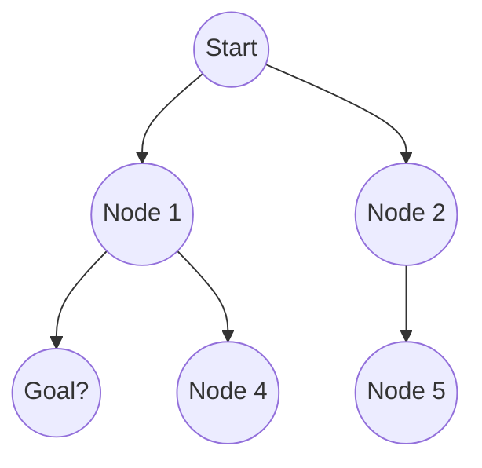
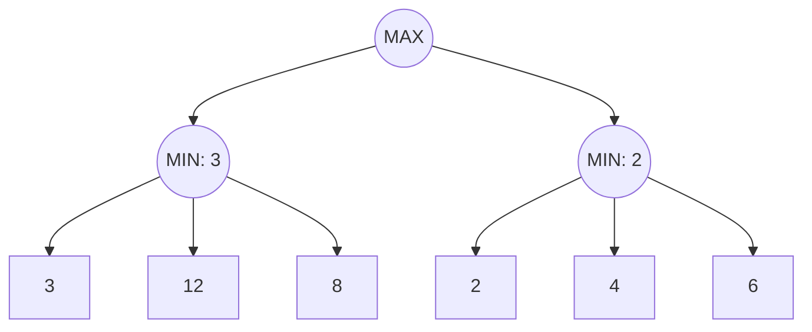

import { Callout } from 'fumadocs-ui/components/callout';

# Search and Problem Solving in AI

Search algorithms form the foundation of artificial intelligence by enabling agents to explore state spaces to find solutions. A state space can be conceptualized as a set of states, for example, `\{State_1, State_2\}`.

## Uninformed Search

Uninformed search algorithms, also known as blind search, operate without any domain-specific knowledge about the goal location.

### Search Tree Expansion

### Breadth-First Search (BFS)
BFS explores the state space level by level. It guarantees finding the shallowest goal node. It typically uses a queue data structure.

### Depth-First Search (DFS)
DFS explores as far as possible along each branch before backtracking. It uses a stack data structure and is more memory-efficient than BFS but does not guarantee the shortest path.

<Callout title="Note">
Uninformed search can be highly inefficient for large state spaces due to exponential time complexity.
</Callout>

| Feature | Breadth-First Search (BFS) | Depth-First Search (DFS) |
| :--- | :--- | :--- |
| **Data Structure** | Queue (FIFO) | Stack (LIFO) |
| **Optimality** | Optimal (if path cost is uniform) | Not optimal |
| **Space Complexity** | High (must store all nodes at current level) | Low (only stores current path) |
| **Time Complexity** | Exponential | Exponential |

## Informed Search

Informed search uses problem-specific knowledge, known as heuristics, to guide the search process more efficiently.

### Heuristics and A* Search
A* search is a popular informed search algorithm that evaluates nodes by combining the cost to reach the node and the estimated cost to the goal.

The evaluation function is defined as:
$$f(n) = g(n) + h(n)$$

Where:
- $n$ is the current node.
- $g(n)$ is the exact cost from the start node to node $n$.
- $h(n)$ is the heuristic estimated cost from node $n$ to the goal.

<Callout title="Important">
For A* to be optimal, the heuristic function $h(n)$ must be admissible, meaning it never overestimates the actual cost to reach the goal.
</Callout>

## Adversarial Search

Adversarial search is used in multi-agent environments where agents compete against each other, such as in zero-sum games.

### Minimax Algorithm
The Minimax algorithm computes the optimal move for a player assuming that the opponent also plays optimally.

### Alpha-Beta Pruning
Alpha-Beta pruning is an optimization technique for the Minimax algorithm. It maintains two values:
- $\alpha$: The best value that the maximizer can guarantee.
- $\beta$: The best value that the minimizer can guarantee.

If $\beta \leq \alpha$, the branch can be pruned, saving massive computation time without affecting the final result.
