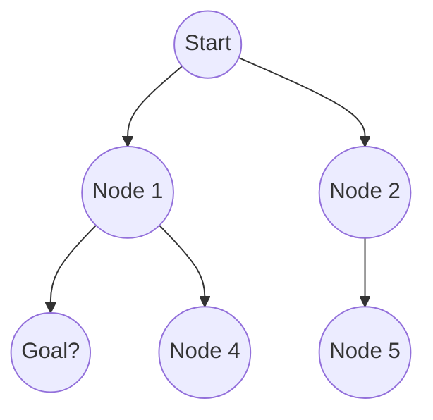
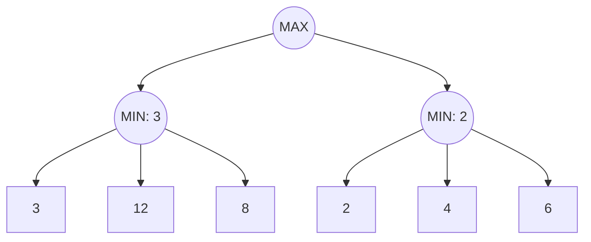

import { Callout } from 'fumadocs-ui/components/callout';

# Search and Problem Solving in AI

Search algorithms เป็นรากฐานของปัญญาประดิษฐ์ (Artificial Intelligence) โดยช่วยให้ agent สามารถสำรวจ state space เพื่อค้นหาคำตอบได้ state space สามารถตีความได้ว่าเป็นเซตของสถานะ ตัวอย่างเช่น `\{State_1, State_2\}`

## Uninformed Search

Uninformed search algorithms หรือ blind search คือการค้นหาโดยไม่มีข้อมูลเฉพาะทางเกี่ยวกับตำแหน่งของเป้าหมาย

### การขยายต้นไม้ค้นหา (Search Tree Expansion)

### Breadth-First Search (BFS)
BFS จะสำรวจ state space ทีละระดับชั้น โดยรับประกันว่าจะพบโหนดเป้าหมายที่ตื้นที่สุดเสมอ มักใช้โครงสร้างข้อมูลแบบ Queue

### Depth-First Search (DFS)
DFS จะสำรวจลงไปให้ลึกที่สุดในแต่ละกิ่งก่อนที่จะย้อนกลับ (backtracking) ใช้โครงสร้างข้อมูลแบบ Stack ซึ่งประหยัดหน่วยความจำมากกว่า BFS แต่ไม่รับประกันว่าจะได้เส้นทางที่สั้นที่สุด

<Callout title="Note">
Uninformed search อาจไม่มีประสิทธิภาพอย่างมากสำหรับ state spaces ที่มีขนาดใหญ่เนื่องจากมีความซับซ้อนของเวลาแบบยกกำลัง (Exponential time complexity)
</Callout>

| คุณสมบัติ | Breadth-First Search (BFS) | Depth-First Search (DFS) |
| :--- | :--- | :--- |
| **โครงสร้างข้อมูล** | Queue (FIFO) | Stack (LIFO) |
| **ความเหมาะสม (Optimality)** | ดีที่สุด (หากต้นทุนเท่ากัน) | ไม่รับประกัน |
| **การใช้พื้นที่ (Space)** | สูง (เก็บทุกโหนดในชั้น) | ต่ำ (เก็บเฉพาะเส้นทางปัจจุบัน) |
| **เวลา (Time)** | Exponential | Exponential |

## Informed Search

Informed search ใช้ข้อมูลเฉพาะของปัญหาหรือ heuristic เพื่อนำทางกระบวนการค้นหาอย่างมีประสิทธิภาพ

### Heuristics และ A* Search
A* search เป็นอัลกอริทึม informed search ที่ได้รับความนิยม ซึ่งประเมินโหนดโดยรวมต้นทุนที่ใช้เดินทางไปถึงโหนดนั้นและต้นทุนโดยประมาณที่จะไปถึงเป้าหมาย

ฟังก์ชันประเมินถูกกำหนดให้เป็น:
$$f(n) = g(n) + h(n)$$

โดยที่:
- $n$ คือโหนดปัจจุบัน
- $g(n)$ คือต้นทุนที่แน่นอนจากโหนดเริ่มต้นถึงโหนด $n$
- $h(n)$ คือต้นทุนโดยประมาณ (heuristic) จากโหนด $n$ ไปยังเป้าหมาย

<Callout title="Important">
เพื่อให้ A* ค้นหาได้อย่างเหมาะสม ฟังก์ชัน heuristic $h(n)$ จะต้องเป็น admissible ซึ่งหมายความว่ามันจะต้องไม่ประเมินต้นทุนจริงที่จะไปถึงเป้าหมายสูงเกินไป
</Callout>

## Adversarial Search

Adversarial search ถูกนำมาใช้ในสภาพแวดล้อมแบบ multi-agent ที่ agent แข่งขันกันเอง เช่น ใน zero-sum games

### Minimax Algorithm
Minimax algorithm คำนวณการเคลื่อนไหวที่ดีที่สุดสำหรับผู้เล่นโดยสมมติว่าคู่ต่อสู้ก็เล่นได้ดีที่สุดเช่นกัน

### Alpha-Beta Pruning
Alpha-Beta pruning เป็นเทคนิคการปรับปรุง Minimax algorithm เพื่อลดจำนวนโหนดที่ต้องประเมิน โดยรักษาสองค่าไว้:
- $\alpha$: ค่าที่ดีที่สุดที่ maximizer สามารถรับประกันได้
- $\beta$: ค่าที่ดีที่สุดที่ minimizer สามารถรับประกันได้

หาก $\beta \leq \alpha$ กิ่งนั้นสามารถถูกตัดออกได้ (pruned) ซึ่งช่วยลดเวลาการประมวลผลมหาศาลโดยไม่กระทบต่อผลลัพธ์
