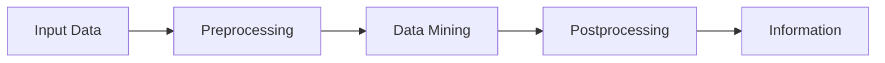

import { Callout } from 'fumadocs-ui/components/callout';

<Callout title="Warning" type="warning">
This article is a work in progress and may contain incomplete information or inaccuracies. Please verify details from reliable sources.
</Callout>

# Data Mining (DM)

# Chapter 1: Data Mining (Definition and Overview)

## 1) What is Data Mining? (Synthesized Definition)
> Data Mining is the process of automatically discovering useful information in large data repositories.
> — Tan et al.

3 Key Keywords:
- Non-trivial: Not just a simple query, but discovering complex patterns.
- Implicit & Previously Unknown: Knowledge is hidden, not explicitly stated.
- Potentially Useful: Can be used to aid business or scientific decision-making.

Brief Comparison:
- Query: Asking "How many cups of coffee were sold yesterday?" (Direct question, direct answer)
- Data Mining: Asking "Which snack do customers who buy iced coffee usually purchase together on a Friday afternoon?" (Finding hidden relationships)

## 2) KDD Process (Knowledge Discovery in Databases)

Data Mining is just "one step" in KDD, with important details:
- Data Preprocessing:
	- Data Subsetting/Sampling: Selecting a portion of data to process when the dataset is too large.
	- Feature Selection: Selecting columns that actually have an impact, discarding garbage columns.
	- Dimensionality Reduction: Reducing data dimensions, such as merging variables or using PCA to make the model work easier.
	- Normalization: Scaling numerical values equally (e.g., age 0–100 and salary 0–100,000 must be scaled similarly).
- Postprocessing:
	- Filtering redundant or unreasonable patterns.
	- Creating visualizations and summarizing results for human comprehension.

## 3) Case Study: Super Mart — Customer Churn Prediction
To clearly illustrate according to Tan's book (which often cites Market Basket Analysis or Classification), let's simulate a Project "Predicting which customer will stop their membership (Customer Churn Prediction)".

- Input Data (Raw Data): 100,000 customers from the database
	- Data fields: [ID, name, age, gender, salary, registration_date, days_since_last_purchase, total_purchase, address, phone]

### Step 1: Data Preprocessing {/*(Preparing raw materials)*/}
{/* This step is the most important (taking 60–80% of real work time) */}

- Data Subsetting (Sampling):
	- 100,000 records might take too long for testing, so we randomly select 10,000 that represent the population appropriately.
- Feature Selection:
	- Discard: name, phone, ID (No effect on the analysis of whether they will stop being a customer or not).
	- Keep: age, total_purchase, days_since_last_purchase.
- Dimensionality Reduction:
	- Suppose we have columns "2023 total purchases", "2024 total purchases", "2025 total purchases", we might merge them into a single column "3-year average purchases" to reduce complexity.
- Normalization:
	- age: Values range from 18–80.
	- salary: Values range from 15,000–200,000.
	- problem: If fed directly into Data Mining, the salary value will completely overshadow the age value.
	- solution: Scale both to be in the range of 0 to 1 (Min–Max Scaling).

### Step 2: Data Mining {/*(Mining for Patterns)*/}
- Goal: We want to classify who will "stay" or "churn" (Classification).
- Technique: Use Decision Tree to generate Rules for prediction.
- Process (Example Rules Discovered):
	- Rule 1: If "has not purchased anything for over 30 days" and "total purchases under 500" → 90% chance to "churn".
	- Rule 2: If "age > 50" and "buys every week" → 95% chance to "stay".

### Step 3: Postprocessing {/*(Polishing)*/}
- Filtering Patterns:
	- We might find weird patterns like "People with 0 salary have a 100% chance to stay" (which is actually likely an error in data), so we must filter only rules that make sense or have high confidence.
- Visualization: Draw the Decision Tree graph to show the marketing team.
- Pattern Interpretation: Interpret the meaning.
	- Example: "From data mining, it is found that the customers at risk of churning are teenagers who have not visited the store for over 45 days."

### Output: Information {/*(Information)*/}
- Information ready to be used for decision-making.
- Action: Send a 50% discount coupon to the teenage group who has not visited the store for over 30 days to bring them back.

## Conclusion (Takeaway)
- Data Mining according to Tan et al. is not magic, but it is "the process of converting raw Data into Knowledge".
- If Preprocessing is bad (e.g., no Normalization) → Data Mining results will be distorted (Garbage In, Garbage Out).
- If Postprocessing is not done → You will get a lot of garbage patterns that are not practically usable.
