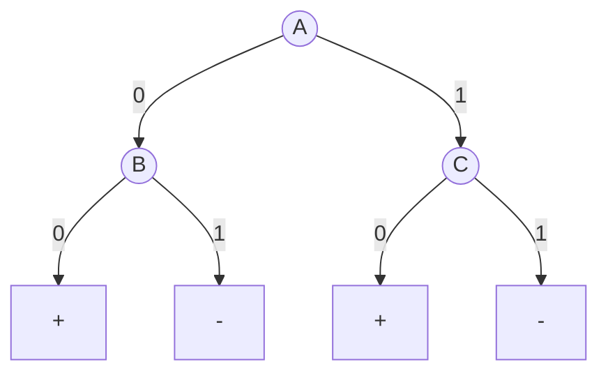

import { Callout } from 'fumadocs-ui/components/callout';

<Callout title="Warning" type="warning">
This article is a work in progress and may contain incomplete information or inaccuracies. Please verify details from reliable sources.
</Callout>

# Data Mining Exercise 9

## Training Set:
|instance|A|B|C|Class|
|------

--|--|--|--|-----|
|1|0|0|0|+|
|2|0|0|1|+|
|3|0|1|0|+|
|4|0|1|1|-|
|5|1|0|0|+|
|6|1|0|0|+|
|7|1|1|0|-|
|8|1|0|1|+|
|9|1|1|0|-|
|10|1|1|0|-|

## Validation Set:
|instance|A|B|C|Class|
|------

--|--|--|--|-----|
|11|0|0|0|+|
|12|0|1|1|+|
|13|1|1|0|+|
|14|1|0|1|-|
|15|1|0|0|+|

## Question 9: Calculating Generalization Error Rate

The problem provides a Decision Tree along with Training data (10 rows) and Validation data (5 rows). We need to calculate the Error Rate in various ways.

### Tree Rules (from diagram)

**If A=0 look at B:**
- B=0 → Predict (+)
- B=1 → Predict (-)

**If A=1 look at C:**
- C=0 → Predict (+)
- C=1 → Predict (-)

---

### Check Errors on Training Set (10 instances)

| # | A | B | C | Actual | Predict | Result |
|---|---

|---|---|------|-------|------|
| 1 | 0 | 0 | 0 | (+) | + | ✅ Correct |
| 2 | 0 | 0 | 1 | (+) | + | ✅ Correct |
| 3 | 0 | 1 | 0 | (+) | - | ❌ Incorrect |
| 4 | 0 | 1 | 1 | (-) | - | ✅ Correct |
| 5 | 1 | 0 | 0 | (+) | + | ✅ Correct |
| 6 | 1 | 0 | 0 | (+) | + | ✅ Correct |
| 7 | 1 | 1 | 0 | (-) | + | ❌ Incorrect |
| 8 | 1 | 0 | 1 | (+) | - | ❌ Incorrect |
| 9 | 1 | 1 | 0 | (-) | + | ❌ Incorrect |
| 10 | 1 | 1 | 0 | (-) | + | ❌ Incorrect |

#### Data Summary

- **Total data count ($N$):** 10
- **Number of mispredictions ($e$):** 5 (Items 3, 7, 8, 9, 10)
- **Number of Leaf Nodes ($k$):** 4 leaves

---

### 9a. Compute using the Optimistic Approach

This method is optimistic, meaning it uses the Error on the Training Data directly without any penalty added.

$$\text{Error Rate} = \frac{e}{N} = \frac{5}{10} = \mathbf{0.5} \, (50\%)$$

---

### 9b. Compute using the Pessimistic Approach

This method adds a penalty for model complexity (having many leaves). The problem specifies adding a Factor of 0.5 per Leaf Node.

**Formula:**

$$\text{Error}(T) = \frac{e + (k \times 0.5)}{N}$$

**Substitute values:**

$$\text{Error}(T) = \frac{5 + (4 \times 0.5)}{10} = \frac{5 + 2}{10} = \frac{7}{10} = \mathbf{0.7} \, (70\%)$$

---

### 9c. Compute using the Validation Set (Reduced Error Pruning)

This method uses the Validation dataset to measure actual performance.

#### Validation Data (5 instances)

| # | A | B | C | Actual | Predict | Result |
|---|---

|---|---|------|-------|------|
| 11 | 0 | 0 | 0 | (+) | + | ✅ Correct |
| 12 | 0 | 1 | 1 | (+) | - | ❌ Incorrect |
| 13 | 1 | 1 | 0 | (+) | + | ✅ Correct |
| 14 | 1 | 0 | 1 | (-) | - | ✅ Correct |
| 15 | 1 | 0 | 0 | (+) | + | ✅ Correct |

<Callout title="📊 Evaluation Result" type="info">
Mispredicted **1 item** (Item 12) out of **5 items**
</Callout>

$$\text{Error Rate} = \frac{1}{5} = \mathbf{0.2} \, (20\%)$$

---

## Question 11: Limitations of Leave-one-out (Exercise 11)

### Scenario

- Data has **100 instances:** 50 Positive (+) and 50 Negative (-)
- **Attributes are random** (no use for prediction at all)
- **Classifier used:** Majority Inducer - Predicts based on majority vote in Training Set (if equal, predict +)

---

### 11a. Error rate using Leave-one-out (LOO)

The LOO method pulls data out 1 by 1 to be the Test Set, then Trains with the remaining 99.

#### Case 1: Pull out a Positive (+) to Test

- **Remaining Training Set:** 49 (+) and 50 (-)
- **Majority Class:** Negative (-) (because 50 > 49)
- **Model Predicts:** (-)
- **Result:** Test instance is (+) but Model predicted (-) → ❌ Incorrect
- *(This happens all 50 times a positive instance is pulled out)*

#### Case 2: Pull out a Negative (-) to Test

- **Remaining Training Set:** 50 (+) and 49 (-)
- **Majority Class:** Positive (+) (because 50 > 49)
- **Model Predicts:** (+)
- **Result:** Test instance is (-) but Model predicted (+) → ❌ Incorrect
- *(This happens all 50 times a negative instance is pulled out)*

#### Conclusion

<Callout title="⚠️ Result" type="warn">
Incorrect every single time for all 100 rounds.
</Callout>

$$\text{Error Rate} = \frac{100}{100} = \mathbf{1.0} \, (100\%)$$

---

### 11b. Error rate using 2-fold Stratified Cross-validation

This method splits data into 2 equal piles while maintaining the Class proportion (Stratified).

#### Fold Splitting

- **Fold 1:** 25 (+), 25 (-)
- **Fold 2:** 25 (+), 25 (-)

#### Round 1: Train with Fold 1 / Test with Fold 2

- **Training (Fold 1):** 25 (+), 25 (-) → Equal amounts
- **Tie-breaking rule:** If equal, predict (+)
- **Test (Fold 2):** Has 25 (+) and 25 (-)
- **Model predicts all (+)** → Correct 25 items, Incorrect 25 items (those that are negative)

#### Round 2: Train with Fold 2 / Test with Fold 1

- **Training (Fold 2):** 25 (+), 25 (-) → Equal amounts → Predict (+)
- **Test (Fold 1):** Has 25 (+) and 25 (-)
- **Model predicts all (+)** → Correct 25 items, Incorrect 25 items

#### Conclusion

<Callout title="📊 Result" type="info">
Total incorrect **50 items** out of **100 items**
</Callout>

$$\text{Error Rate} = \frac{50}{100} = \mathbf{0.5} \, (50\%)$$

---

### 11c. Which method is more reliable?

#### Answer

<Callout title="✅ 2-fold Stratified Cross-validation is more reliable" type="success">
More reliable
</Callout>

#### Reason

Because the problem states the data is completely random (Purely random), the Model should only have a chance of guessing correctly equal to random guessing, or 50% (Error rate = 0.5).

**Leave-one-out gives 100% Error**
- Highly distorted from reality.
- Because the structure of LOO in this case causes Bias.
- When any class is pulled out, that class immediately becomes the minority in the Training set.
- Causing the Model to always predict opposite to reality.

**2-fold Stratified gives 50% Error**
- Matches the theoretical expectation for Random data.
