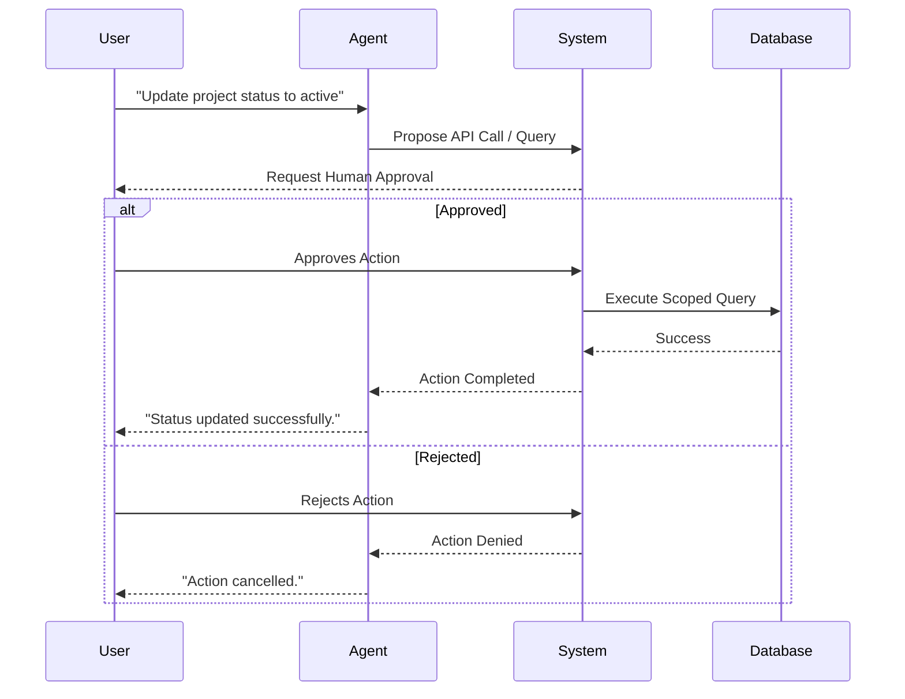

# Agentic Database Applications

As AI agents grow more capable, integrating them with databases introduces both immense utility and significant risk. This guide serves as a cheat sheet for securing agentic workflows and provides practical examples of safe database integrations.

<Callout title="Work in Progress" type="warning">
  This section outlines the theoretical boundaries for safe agent-database interaction. The actual runtime integrations for `taichi112.works` are still in development.
</Callout>

## Cheat Sheet: Core Principles of Agentic Security

When connecting AI to your database, adhere to the following principles to prevent destructive operations:

- **Default to Read-Only**: Enforce strictly read-only permissions for agents exploring or querying data.
- **Schema Allowlists**: Restrict the agent's visibility exclusively to required tables and columns. Do not expose sensitive data (e.g., PII, passwords).
- **Human-in-the-Loop (HITL) for Writes**: All modifying operations (INSERT, UPDATE, DELETE) must require explicit human approval before execution.
- **Scoped API Endpoints**: Force agents to write data via predefined API endpoints rather than executing direct SQL commands.
- **Audit Logging**: Maintain immutable logs of every action proposed and executed by the agent.

## Practical Examples: Securing Workflows

### Example 1: The Read-Only Query Pattern

**Scenario**: A user asks an agent, "How many active projects do we have?"

**Implementation**:
1. The agent translates the natural language query into a SQL `SELECT` statement.
2. The agent executes the query using a restricted, read-only database user profile.
3. The result is safely summarized and returned to the user.

**Why it works**: Even if the agent hallucinates a destructive `DROP TABLE` command, the read-only database permissions will reject the operation at the infrastructure level.

### Example 2: The HITL Approval Flow

**Scenario**: A user instructs an agent, "Update the status of project X to completed."

**Implementation**:
1. The agent formulates a proposed API call to update the project status.
2. The system intercepts the proposal and suspends execution.
3. The system presents the proposed action to the user for review.
4. If approved, the scoped API endpoint executes the change. If rejected, the action is discarded.

### Example 3: Mitigating Hallucinated Schemas

**Scenario**: An agent invents a non-existent table column when attempting to fulfill a complex request.

**Implementation**:
1. Provide the agent with a rigid, predefined schema allowlist via system prompts or metadata injection.
2. Validate all generated queries against this allowlist before execution.
3. If a hallucinated column is detected, the system immediately returns a structured error to the agent, prompting it to correct the query based on the approved schema.

---

**Next Step**: Put these concepts into practice in the [Database Labs](../labs).
