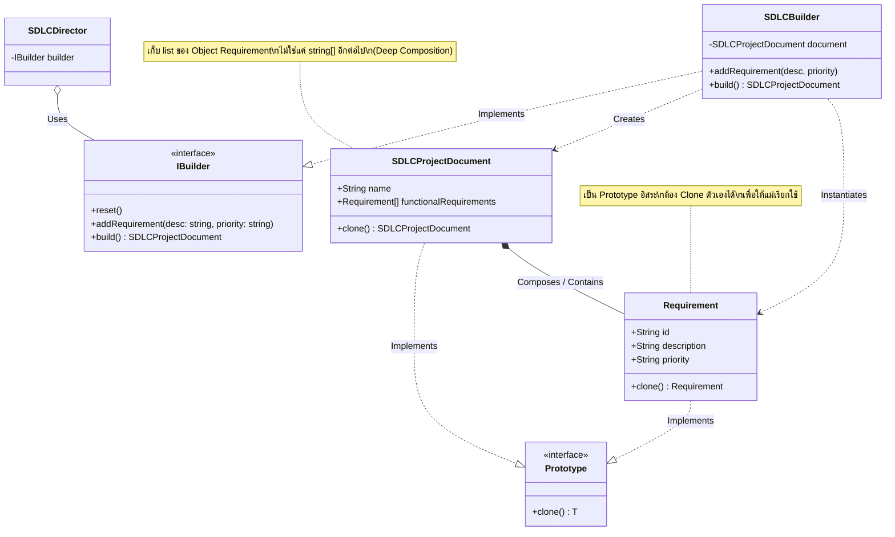
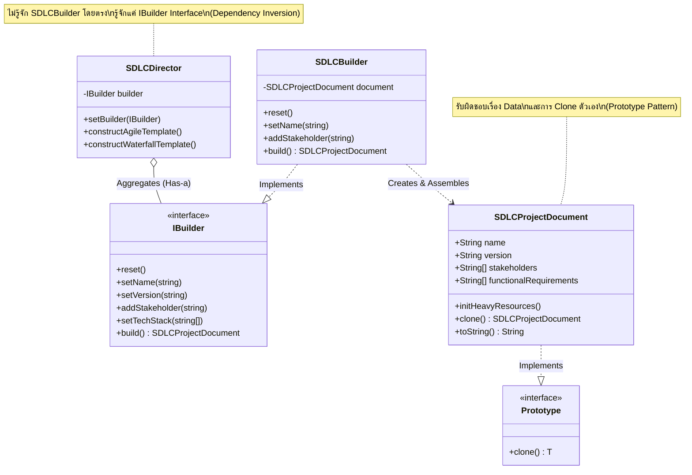

```mermaid
classDiagram
    %% ==================================================================================
    %% SECTION 1: DATA MODELS & CONTRACTS (Foundation Layer)
    %% ==================================================================================
    %% กำหนด Shape ของข้อมูลดิบ และ Output Interface สำหรับ UI
    
    class UICard {
        <<interface>>
        +getDisplayTitle() string
        +getDisplaySubtitle() string
        +getBadge() string
        +getActionLink() string
    }
    note for UICard "🎯 TARGET INTERFACE\nสัญญา UI Output ที่ทุก Node\nต้องแปลงตัวเองให้ได้"

    class TopicProps {
        +description: string
        +icon?: string
    }
    note for TopicProps "📁 Category/Folder Data"

    class ArticleProps {
        +author: string
        +readTime: number
        +content: string
    }
    note for ArticleProps "📄 Article Content Data"

    class ProjectProps {
        +repoUrl: string
        +techStack: string[]
        +status: 'active' | 'archived'
    }
    note for ProjectProps "🛠️ Project Metadata"

    %% ==================================================================================
    %% SECTION 2: COMPOSITE PATTERN (Tree Structure Management)
    %% ==================================================================================
    %% จัดการโครงสร้างแบบ Parent-Child แบบ Recursive
    
    class KnowledgeNode {
        <<abstract>>
        +id: string
        +title: string
        #children: KnowledgeNode[]
        ---
        +add(node: KnowledgeNode) void
        +getChildren() KnowledgeNode[]
        +getType()* string
    }
    note for KnowledgeNode "🌳 COMPOSITE COMPONENT\nBase class ของทุก Node\nสามารถมีลูกได้ (default)"

    class TopicNode {
        +data: TopicProps
        ---
        +constructor(title: string, data: TopicProps)
        +getType() string : returns 'TOPIC'
    }
    note for TopicNode "📂 COMPOSITE NODE\nเป็น Container ที่เก็บลูกได้\n(เหมือน Folder)"

    class ArticleNode {
        +data: ArticleProps
        ---
        +constructor(title: string, data: ArticleProps)
        +add(node) void : throws Error
        +getType() string : returns 'ARTICLE'
    }
    note for ArticleNode "📄 LEAF NODE\nไม่สามารถมีลูกได้\nOverride add() เพื่อป้องกัน"

    class ProjectNode {
        +data: ProjectProps
        ---
        +constructor(title: string, data: ProjectProps)
        +add(node) void : throws Error
        +getType() string : returns 'PROJECT'
    }
    note for ProjectNode "🛠️ LEAF NODE\nไม่สามารถมีลูกได้\nOverride add() เพื่อป้องกัน"

    %% Composite Relationships
    KnowledgeNode <|-- TopicNode : Inherits
    KnowledgeNode <|-- ArticleNode : Inherits
    KnowledgeNode <|-- ProjectNode : Inherits
    KnowledgeNode o-- KnowledgeNode : "Contains (Recursive)"

    %% Data Binding
    TopicNode ..> TopicProps : uses
    ArticleNode ..> ArticleProps : uses
    ProjectNode ..> ProjectProps : uses

    %% ==================================================================================
    %% SECTION 3: ADAPTER PATTERN (Translation Layer)
    %% ==================================================================================
    %% แปลง Internal Structure ให้เป็น UI-compatible Interface
    
    class NodeToUIAdapter {
        -adaptee: KnowledgeNode
        ---
        +constructor(node: KnowledgeNode)
        +getDisplayTitle() string
        +getDisplaySubtitle() string
        +getBadge() string
        +getActionLink() string
    }
    note for NodeToUIAdapter "🔌 ADAPTER CLASS\nห่อหุ้ม KnowledgeNode (Adaptee)\nแปลงเป็น UICard (Target)\nซ่อน if-else type checking จาก Client"

    %% Adapter Relationships
    UICard <|.. NodeToUIAdapter : Implements
    NodeToUIAdapter --> KnowledgeNode : "Wraps (Adaptee)"

    %% ==================================================================================
    %% SECTION 4: BUILDER PATTERN (Construction Orchestration)
    %% ==================================================================================
    %% สร้าง Complex Object แบบ Step-by-Step พร้อม Encapsulate Construction Logic
    
    class IKnowledgeBuilder {
        <<interface>>
        +reset(rootTitle: string) void
        +buildTopic(title: string, props: TopicProps) void
        +buildArticle(title: string, props: ArticleProps) void
        +buildProject(title: string, props: ProjectProps) void
        +closeScope() void
        +getResult() KnowledgeNode
    }
    note for IKnowledgeBuilder "🏗️ BUILDER INTERFACE\nสัญญาการสร้าง Product\nแยก Algorithm จาก Representation"

    class KnowledgeTreeBuilder {
        -root: TopicNode | null
        -currentContainer: TopicNode | null
        -stack: TopicNode[]
        ---
        +reset(rootTitle: string) void
        +buildTopic(title, props) void
        +buildArticle(title, props) void
        +buildProject(title, props) void
        +closeScope() void
        +getResult() KnowledgeNode
        -validateState() void
    }
    note for KnowledgeTreeBuilder "🔨 CONCRETE BUILDER\nจัดการ State & Stack\nสร้าง Tree แบบ Nested\nEncapsulate Composite Logic"

    class CurriculumDirector {
        +constructComputerVisionCourse(builder: IKnowledgeBuilder) void
    }
    note for CurriculumDirector "🎬 DIRECTOR\nเก็บ Construction Recipe\nกำหนดลำดับการสร้าง\nซ่อนความซับซ้อนจาก Client"

    %% Builder Relationships
    IKnowledgeBuilder <|.. KnowledgeTreeBuilder : Implements
    CurriculumDirector --> IKnowledgeBuilder : "Uses (Dependency)"
    KnowledgeTreeBuilder ..> TopicNode : Creates
    KnowledgeTreeBuilder ..> ArticleNode : Creates
    KnowledgeTreeBuilder ..> ProjectNode : Creates

    %% ==================================================================================
    %% SECTION 5: CLIENT INTEGRATION LAYER
    %% ==================================================================================
    %% Entry Point ที่รวม Pattern ทั้งหมดเข้าด้วยกัน
    
    class ClientApp {
        +mainApp() void
        -renderNode(node: KnowledgeNode, level: number) void
    }
    note for ClientApp "🎮 CLIENT CODE\n1. ใช้ Director+Builder สร้าง Tree\n2. ใช้ Adapter แปลง Node → UI\n3. Render แบบ Recursive"

    %% Client Relationships
    ClientApp --> CurriculumDirector : "Uses (Orchestration)"
    ClientApp --> KnowledgeTreeBuilder : "Uses (Construction)"
    ClientApp --> NodeToUIAdapter : "Creates (per Node)"
    ClientApp ..> KnowledgeNode : "Receives (Product)"
```

# 🏗️ Personal Knowledge Management System - Architecture Diagram

## Overview
ระบบนี้ใช้การผสมผสาน **3 Design Patterns** หลักเพื่อสร้าง PKM System ที่มีโครงสร้างซับซ้อน:
- **Composite Pattern**: จัดการโครงสร้างแบบ Tree (Topic → Article/Project)
- **Builder Pattern**: สร้าง Knowledge Tree แบบ Step-by-Step อย่างมีระเบียบ
- **Adapter Pattern**: แปลง Internal Data Structure ให้เป็น UI-friendly format

---



---

## 🔍 Pattern Interaction Flow

### 1️⃣ **Construction Phase (Builder Pattern)**
```typescript
// Client → Director → Builder → Product
const builder = new KnowledgeTreeBuilder();
const director = new CurriculumDirector();

director.constructComputerVisionCourse(builder); // Director สั่งงาน Builder
const tree = builder.getResult(); // ได้ TopicNode (root)
```

**จุดเด่น**:
- **Fluent API**: สามารถเรียกต่อเนื่องได้ (Method Chaining ถ้าต้องการ)
- **State Management**: `stack` จัดการ Nested Structure อัตโนมัติ
- **Validation**: `validateState()` ป้องกันการสร้างผิดลำดับ

---

### 2️⃣ **Tree Structure (Composite Pattern)**
```
📂 Computer Vision Mastery (TopicNode)
├── 📂 Image Processing 101 (TopicNode)
│   ├── 📄 What is a Pixel? (ArticleNode) ← Leaf
│   └── 🛠️ OpenCV Greyscale (ProjectNode) ← Leaf
└── 📂 Deep Learning (TopicNode)
    └── 📄 Understanding Convolution (ArticleNode) ← Leaf
```

**จุดเด่น**:
- **Uniform Interface**: ทุก Node มี `add()` และ `getChildren()`
- **Recursive Operations**: วน Loop ง่าย ไม่ต้องเช็ค type
- **Safety**: Leaf Nodes throw Error เมื่อพยายาม `add()`

---

### 3️⃣ **UI Translation (Adapter Pattern)**
```typescript
// Internal Node → UI Card
const node: KnowledgeNode = /* ... */;
const card: UICard = new NodeToUIAdapter(node);

console.log(card.getDisplayTitle());    // "WHAT IS A PIXEL?"
console.log(card.getDisplaySubtitle()); // "✍️ FumadProff (5 min)"
console.log(card.getBadge());          // "ARTICLE"
console.log(card.getActionLink());     // "/view/art-1234567890"
```

**จุดเด่น**:
- **Type Hiding**: Client ไม่ต้องรู้ว่า Node เป็น Article/Project/Topic
- **Centralized Logic**: Logic การแปลงอยู่ที่เดียว (Single Responsibility)
- **Interface Segregation**: Client ขอแค่ `UICard` ไม่ต้องรู้จัก `KnowledgeNode`

---

## 🏷️ Design Pattern Components Mapping

ส่วนนี้แสดง mapping ระหว่าง Classes/Interfaces ในโค้ดกับ Components มาตรฐานของแต่ละ Design Pattern

### 🔨 Builder Pattern Components

| Pattern Component | Class/Interface ในโค้ด | หน้าที่ |
|-------------------|----------------------|---------|
| **Product** | `KnowledgeNode` (และ subclasses ทั้งหมด) | ผลลัพธ์สุดท้ายที่ Builder สร้างขึ้น (Complex Tree Structure) |
| **Builder Interface** | `IKnowledgeBuilder` | กำหนดสัญญาการสร้าง Product แต่ละส่วน |
| **Concrete Builder** | `KnowledgeTreeBuilder` | ลงมือสร้างจริง + จัดการ State (stack, current container) |
| **Director** | `CurriculumDirector` | เก็บ Recipe การสร้าง Product ที่ซับซ้อน (Optional) |
| **Client** | `mainApp()` function | เรียกใช้ Builder/Director และรับ Product กลับมา |

**Code Example:**
```typescript
// Product
abstract class KnowledgeNode { /* ... */ }
class TopicNode extends KnowledgeNode { /* ... */ }      // ← Concrete Product
class ArticleNode extends KnowledgeNode { /* ... */ }    // ← Concrete Product

// Builder Interface
interface IKnowledgeBuilder {
    reset(rootTitle: string): void;
    buildTopic(...): void;
    // ...
}

// Concrete Builder
class KnowledgeTreeBuilder implements IKnowledgeBuilder {
    private root: TopicNode | null = null;  // ← รับผิดชอบสร้าง Product
    private stack: TopicNode[] = [];        // ← State Management
    // ...
}

// Director
class CurriculumDirector {
    public constructComputerVisionCourse(builder: IKnowledgeBuilder): void {
        builder.reset("...");
        builder.buildTopic("...", {...});   // ← เรียกใช้ Builder step-by-step
        // ...
    }
}

// Client
function mainApp() {
    const builder = new KnowledgeTreeBuilder();          // ← Concrete Builder
    const director = new CurriculumDirector();           // ← Director
    director.constructComputerVisionCourse(builder);     // ← Director สั่งงาน Builder
    const tree = builder.getResult();                    // ← รับ Product
}
```

---

### 🌳 Composite Pattern Components

| Pattern Component | Class/Interface ในโค้ด | หน้าที่ |
|-------------------|----------------------|---------|
| **Component** | `KnowledgeNode` (abstract class) | Base class ที่กำหนด interface เดียวกันสำหรับทั้ง Leaf และ Composite |
| **Leaf** | `ArticleNode`, `ProjectNode` | Node ปลายทาง ไม่มีลูก (override `add()` เพื่อ throw error) |
| **Composite** | `TopicNode` | Node ที่เก็บลูกได้ (เหมือน Folder) มี `children` array |

**Code Example:**
```typescript
// Component (Base Interface)
abstract class KnowledgeNode {
    protected children: KnowledgeNode[] = [];    // ← สำหรับ Composite
    public add(node: KnowledgeNode): void { /* ... */ }
    public getChildren(): KnowledgeNode[] { /* ... */ }
    public abstract getType(): string;
}

// Composite (Container)
class TopicNode extends KnowledgeNode {
    // สามารถมีลูกได้ (ใช้ add() ตามปกติ)
    public getType(): string { return 'TOPIC'; }
}

// Leaf (ไม่มีลูก)
class ArticleNode extends KnowledgeNode {
    public add(node: KnowledgeNode): void {
        throw new Error("Cannot add child to a Leaf node");  // ← ป้องกันการเพิ่มลูก
    }
    public getType(): string { return 'ARTICLE'; }
}

class ProjectNode extends KnowledgeNode {
    public add(node: KnowledgeNode): void {
        throw new Error("Cannot add child to a Leaf node");  // ← ป้องกันการเพิ่มลูก
    }
    public getType(): string { return 'PROJECT'; }
}
```

**Key Point:** Composite Pattern ช่วยให้ Client ทำงานกับ Tree Structure โดยไม่ต้องแยกว่า Node ไหนเป็น Leaf หรือ Composite

---

### 🔌 Adapter Pattern Components

| Pattern Component | Class/Interface ในโค้ด | หน้าที่ |
|-------------------|----------------------|---------|
| **Target** | `UICard` interface | Interface ที่ Client ต้องการใช้งาน (UI-friendly format) |
| **Adaptee** | `KnowledgeNode` (และ subclasses) | Class ที่มีอยู่แล้ว แต่ interface ไม่ตรงกับที่ Client ต้องการ |
| **Adapter** | `NodeToUIAdapter` | Class ที่ห่อหุ้ม Adaptee และ implement Target interface |
| **Client** | `renderNode()` function (ใน `mainApp`) | Code ที่ใช้งานผ่าน Target interface (ไม่รู้จัก Adaptee โดยตรง) |

**Code Example:**
```typescript
// Target (Interface ที่ Client ต้องการ)
interface UICard {
    getDisplayTitle(): string;
    getDisplaySubtitle(): string;
    getBadge(): string;
    getActionLink(): string;
}

// Adaptee (Class ที่มีอยู่แล้ว แต่ interface ไม่ตรง)
abstract class KnowledgeNode {
    public id: string;
    public title: string;
    public abstract getType(): string;
    // ← ไม่มี method ที่ UICard ต้องการ (getDisplayTitle, getBadge, etc.)
}

// Adapter (ตัวกลางแปลง Adaptee → Target)
class NodeToUIAdapter implements UICard {
    private adaptee: KnowledgeNode;  // ← ห่อหุ้ม Adaptee
    
    constructor(node: KnowledgeNode) {
        this.adaptee = node;
    }
    
    // Implement Target interface โดยใช้ข้อมูลจาก Adaptee
    public getDisplayTitle(): string {
        return this.adaptee.title.toUpperCase();  // ← แปลง title → display format
    }
    
    public getDisplaySubtitle(): string {
        if (this.adaptee instanceof ArticleNode) {
            return `✍️ ${this.adaptee.data.author}...`;  // ← Logic แปลงซับซ้อน
        }
        // ...
    }
}

// Client (ใช้งานผ่าน Target interface)
function renderNode(node: KnowledgeNode, level: number) {
    const uiCard: UICard = new NodeToUIAdapter(node);  // ← Wrap Adaptee
    
    // Client ใช้ Target interface (ไม่ต้องรู้ว่า node เป็น ArticleNode หรือ ProjectNode)
    console.log(uiCard.getDisplayTitle());    // ← เรียกผ่าน Target
    console.log(uiCard.getDisplaySubtitle()); // ← เรียกผ่าน Target
}
```

**Key Point:** Adapter ซ่อน complexity ของ Adaptee (เช่น type checking, data transformation) ไม่ให้ Client ต้องจัดการเอง

---

## 🔗 Pattern Interaction Summary

```
┌─────────────────────────────────────────────────────────────┐
│                         CLIENT CODE                          │
│                        (mainApp)                             │
└────────────┬────────────────────────────────────────────────┘
             │
             ├──► [Builder Pattern] ────────────────────┐
             │    Director → Builder → Product          │
             │    (สร้าง Tree Structure)                 │
             │                                           ▼
             │                                    KnowledgeNode (Tree)
             │                                           │
             │                                           │
             └──► [Adapter Pattern] ────────────────────┘
                  Adaptee → Adapter → Target
                  (แปลง Tree → UI Format)
                           │
                           ▼
                  [Composite Pattern]
                  Component/Leaf/Composite
                  (Traverse Tree Recursively)
```

### การทำงานร่วมกัน:
1. **Builder** สร้าง **Composite Structure** (Tree)
2. **Composite** จัดการ Tree Hierarchy
3. **Adapter** แปลง **Composite Nodes** → UI Format
4. **Client** ใช้งานผ่าน **Target Interface** (UICard)

---

## 🧩 Pattern Responsibilities Summary

| Pattern | Role | Key Classes |
|---------|------|-------------|
| **Composite** | จัดการโครงสร้าง Tree แบบ Recursive | `KnowledgeNode`, `TopicNode`, `ArticleNode`, `ProjectNode` |
| **Builder** | สร้าง Complex Object แบบ Step-by-Step | `IKnowledgeBuilder`, `KnowledgeTreeBuilder`, `CurriculumDirector` |
| **Adapter** | แปลง Interface เพื่อให้ Client ใช้งานง่าย | `NodeToUIAdapter`, `UICard` |

---

## 🎯 Design Principles Applied

### ✅ SOLID Principles
1. **Single Responsibility**: 
   - `NodeToUIAdapter` ทำหน้าที่แปลงอย่างเดียว
   - `KnowledgeTreeBuilder` ทำหน้าที่สร้าง Tree อย่างเดียว

2. **Open/Closed**: 
   - เพิ่ม Node Type ใหม่ได้โดยไม่แก้ code เดิม (Extend `KnowledgeNode`)
   - เพิ่ม UI Format ได้โดยสร้าง Adapter ใหม่

3. **Liskov Substitution**: 
   - ทุก `KnowledgeNode` subclass ใช้แทนกันได้
   - แม้ Leaf จะ override `add()` แต่ยัง maintain contract (throw error แทนทำงานผิด)

4. **Interface Segregation**: 
   - Client ไม่ต้องพึ่งพา `KnowledgeNode` ตรงๆ (ใช้ `UICard` แทน)

5. **Dependency Inversion**: 
   - `CurriculumDirector` depend on `IKnowledgeBuilder` (abstraction) ไม่ใช่ concrete class

### ✅ Gang of Four Principles
- **Program to Interface**: ใช้ `IKnowledgeBuilder`, `UICard`
- **Favor Composition**: `Adapter` ห่อหุ้ม `KnowledgeNode` แทนการ Inherit
- **Encapsulate What Varies**: Construction logic ถูก Encapsulate ใน Builder

---

## 🚀 Key Benefits

### 1. **Maintainability**
- แก้ UI format ที่ `NodeToUIAdapter` จุดเดียว
- เพิ่ม Node Type โดยไม่กระทบ Client Code

### 2. **Testability**
- Test Builder แยก (Mock `IKnowledgeBuilder`)
- Test Adapter แยก (Mock `KnowledgeNode`)
- Test Tree Structure แยก (ไม่ต้องมี UI)

### 3. **Flexibility**
- สลับ Builder Implementation ได้ (JSON Builder, YAML Builder)
- สลับ Adapter Implementation ได้ (REST API Adapter, GraphQL Adapter)

### 4. **Scalability**
- เพิ่ม Content Type ได้ไม่จำกัด (VideoNode, PodcastNode)
- Support Multi-format Export (PDF, HTML, Markdown) ด้วย Adapter Pattern

---

## � Manual Builder Usage (Without Director)

นอกจากการใช้ Director เพื่อสร้าง pre-defined structure แล้ว คุณยังสามารถใช้ Builder โดยตรงเพื่อสร้าง content แบบ dynamic ได้

### ตัวอย่าง 1: สร้าง Knowledge Base แบบ Manual
```typescript
// สร้าง Builder instance
const builder = new KnowledgeTreeBuilder();

// เริ่มต้นด้วย Root Topic
builder.reset("My Personal Learning Path");

// สร้าง Topic และ Content ทีละชิ้น
builder.buildTopic("Web Development", { 
    description: "Frontend & Backend Technologies",
    icon: "🌐" 
});

    // เข้าไปใน Web Development Topic
    builder.buildArticle("React Hooks Explained", {
        author: "Dan Abramov",
        readTime: 20,
        content: "Complete guide to React Hooks..."
    });

    builder.buildProject("E-Commerce Platform", {
        repoUrl: "github.com/myuser/ecommerce",
        techStack: ["React", "Node.js", "PostgreSQL"],
        status: "active"
    });

    builder.buildTopic("Advanced Patterns", {
        description: "Design patterns in React"
    });

        // เข้าไปใน Advanced Patterns (nested)
        builder.buildArticle("Compound Components", {
            author: "Kent C. Dodds",
            readTime: 15,
            content: "Learn compound components..."
        });

    builder.closeScope(); // ออกจาก Advanced Patterns

builder.closeScope(); // ออกจาก Web Development

// เพิ่ม Topic อื่นใน Root level
builder.buildTopic("Machine Learning", {
    description: "AI & Data Science",
    icon: "🤖"
});

    builder.buildArticle("Neural Networks 101", {
        author: "Andrew Ng",
        readTime: 30,
        content: "Introduction to neural networks..."
    });

builder.closeScope(); // ออกจาก Machine Learning

// ดึง Result ออกมา
const myKnowledgeBase = builder.getResult();
```

### ตัวอย่าง 2: Dynamic Content Creation (Runtime)
```typescript
// สถานการณ์: User เพิ่ม Content ผ่าน UI Form
function addUserContent(
    builder: IKnowledgeBuilder,
    contentType: 'topic' | 'article' | 'project',
    data: any
) {
    switch (contentType) {
        case 'topic':
            builder.buildTopic(data.title, {
                description: data.description,
                icon: data.icon
            });
            break;

        case 'article':
            builder.buildArticle(data.title, {
                author: data.author,
                readTime: data.readTime,
                content: data.content
            });
            break;

        case 'project':
            builder.buildProject(data.title, {
                repoUrl: data.repoUrl,
                techStack: data.techStack,
                status: data.status
            });
            break;
    }
}

// การใช้งาน
const builder = new KnowledgeTreeBuilder();
builder.reset("User-Generated Content");

// User เพิ่มจาก UI
addUserContent(builder, 'topic', {
    title: "Photography",
    description: "Tips and techniques",
    icon: "📸"
});

addUserContent(builder, 'article', {
    title: "Golden Hour Shooting",
    author: "CurrentUser",
    readTime: 10,
    content: "Best practices for golden hour..."
});

const userTree = builder.getResult();
```

### ตัวอย่าง 3: Comparison - Director vs Manual

**🎬 Using Director (Pre-defined Recipe)**
```typescript
// Pros: สั้น กระชับ ได้ structure ที่ consistent
// Cons: จำกัดเฉพาะ structure ที่ Director รู้จัก

const builder = new KnowledgeTreeBuilder();
const director = new CurriculumDirector();

director.constructComputerVisionCourse(builder);
const tree = builder.getResult();
```

**🔨 Using Builder Manually (Flexible)**
```typescript
// Pros: ยืดหยุ่น สร้างอะไรก็ได้ตามต้องการ
// Cons: ต้องจัดการ scope (closeScope) เอง

const builder = new KnowledgeTreeBuilder();
builder.reset("Custom Course");

builder.buildTopic("Module 1", { description: "Introduction" });
    builder.buildArticle("Lesson 1.1", { 
        author: "Me", 
        readTime: 5, 
        content: "..." 
    });
    // สามารถเพิ่ม nested topics ได้ตามต้องการ
    builder.buildTopic("Sub-module", { description: "Deep dive" });
        builder.buildArticle("Advanced Topic", {
            author: "Me",
            readTime: 20,
            content: "..."
        });
    builder.closeScope(); // ออกจาก Sub-module
builder.closeScope(); // ออกจาก Module 1

const customTree = builder.getResult();
```

### เมื่อไหร่ควรใช้แบบไหน?

| Use Case | แนะนำ | เหตุผล |
|----------|------|--------|
| **Fixed Curriculum** | Director | มี structure ที่ซ้ำๆ กัน (Course Template) |
| **User Input** | Manual Builder | ไม่รู้ล่วงหน้าว่า User จะสร้างอะไร |
| **Import from File** | Manual Builder | ต้อง parse และสร้างตาม data ที่ได้ |
| **Template System** | Director | มี template หลายแบบที่ใช้บ่อยๆ |
| **One-time Setup** | Either | ขึ้นกับว่าจะเอา reusability หรือไม่ |

---

## 📚 Real-World Use Cases & Scalability Examples

### ใช้ Pattern Stack นี้ได้กับ:

#### 1. **CMS Systems** - Content Management with nested categories
**Scalability Example:**
```typescript
// เพิ่ม Content Type ใหม่: VideoNode
class VideoNode extends KnowledgeNode {
    constructor(title: string, public data: VideoProps) {
        super(`vid-${Date.now()}`, title);
    }
    public add(node: KnowledgeNode): void {
        throw new Error("Cannot add child to a Leaf node (Video).");
    }
    public getType(): string { return 'VIDEO'; }
}

// ขยาย Builder Interface
interface IKnowledgeBuilder {
    // ... existing methods
    buildVideo(title: string, props: VideoProps): void; // ← NEW
}

// Implement ใน Builder
class KnowledgeTreeBuilder implements IKnowledgeBuilder {
    public buildVideo(title: string, props: VideoProps): void {
        this.validateState();
        const node = new VideoNode(title, props);
        this.currentContainer!.add(node);
    }
}

// Adapter รองรับ Type ใหม่
class NodeToUIAdapter implements UICard {
    public getDisplaySubtitle(): string {
        // ... existing code
        if (this.adaptee instanceof VideoNode) {
            const d = this.adaptee.data;
            return `🎥 ${d.duration} min | ${d.resolution}`;
        }
        // ...
    }
}
```

**ผลลัพธ์:** เพิ่ม Video Content ได้โดยไม่ต้องแก้ Client Code!

---

#### 2. **File Systems** - Folders & Files with multiple views
**Scalability Example:**
```typescript
// สร้าง Adapter ใหม่สำหรับ Terminal View
class NodeToTerminalAdapter {
    constructor(private node: KnowledgeNode) {}
    
    public getListOutput(): string {
        const size = this.calculateSize(this.node);
        const date = new Date().toISOString().split('T')[0];
        const type = this.node instanceof TopicNode ? 'd' : '-';
        return `${type}rwxr-xr-x  1 user  staff  ${size}  ${date}  ${this.node.title}`;
    }
    
    private calculateSize(node: KnowledgeNode): number {
        // Logic to calculate size
        return 4096; // example
    }
}

// สร้าง Adapter สำหรับ JSON Export
class NodeToJSONAdapter {
    constructor(private node: KnowledgeNode) {}
    
    public toJSON(): object {
        return {
            id: this.node.id,
            title: this.node.title,
            type: this.node.getType(),
            children: this.node.getChildren().map(child => 
                new NodeToJSONAdapter(child).toJSON()
            )
        };
    }
}

// การใช้งาน
const node = builder.getResult();

// Terminal View
const terminalView = new NodeToTerminalAdapter(node);
console.log(terminalView.getListOutput());

// JSON Export
const jsonExport = new NodeToJSONAdapter(node);
fs.writeFileSync('export.json', JSON.stringify(jsonExport.toJSON(), null, 2));
```

**ผลลัพธ์:** Tree Structure เดิมไม่เปลี่ยน แต่มี Output Format หลายแบบ!

---

#### 3. **UI Component Trees** - React/Vue component hierarchy
**Scalability Example:**
```typescript
// สร้าง Builder สำหรับ UI Components
interface ComponentProps {
    className?: string;
    style?: object;
    props?: Record<string, any>;
}

class ComponentNode extends KnowledgeNode {
    constructor(
        title: string, 
        public componentType: string,
        public data: ComponentProps
    ) {
        super(`comp-${Date.now()}`, title);
    }
    public getType(): string { return this.componentType; }
}

class UIComponentBuilder implements IKnowledgeBuilder {
    // ... standard builder implementation
    
    public buildContainer(name: string, props: ComponentProps): void {
        const node = new ComponentNode(name, 'Container', props);
        this.currentContainer!.add(node);
        this.stack.push(node as any);
        this.currentContainer = node as any;
    }
    
    public buildButton(name: string, props: ComponentProps): void {
        const node = new ComponentNode(name, 'Button', props);
        this.currentContainer!.add(node);
    }
}

// การใช้งาน
const uiBuilder = new UIComponentBuilder();
uiBuilder.reset("App Layout");

uiBuilder.buildContainer("Header", { className: "header-container" });
    uiBuilder.buildButton("Login", { props: { onClick: "handleLogin" }});
    uiBuilder.buildButton("Signup", { props: { variant: "primary" }});
uiBuilder.closeScope();

uiBuilder.buildContainer("Main", { className: "main-content" });
    uiBuilder.buildContainer("Sidebar", { className: "sidebar" });
        // ... nested components
    uiBuilder.closeScope();
uiBuilder.closeScope();

const componentTree = uiBuilder.getResult();
```

**ผลลัพธ์:** ใช้ Pattern เดียวกันสร้าง Component Hierarchy ได้!

---

#### 4. **Multi-Language Content Support**
**Scalability Example:**
```typescript
// ขยาย Props เพื่อรองรับหลายภาษา
interface MultiLangArticleProps extends ArticleProps {
    translations: {
        [lang: string]: {
            title: string;
            content: string;
        }
    }
}

// Adapter รองรับ i18n
class LocalizedUIAdapter implements UICard {
    constructor(
        private node: KnowledgeNode,
        private locale: string = 'en'
    ) {}
    
    public getDisplayTitle(): string {
        if (this.node instanceof ArticleNode) {
            const data = this.node.data as MultiLangArticleProps;
            return data.translations[this.locale]?.title || this.node.title;
        }
        return this.node.title;
    }
    
    // ... implement other methods with locale support
}

// การใช้งาน
const node = builder.getResult();

// English Version
const enAdapter = new LocalizedUIAdapter(node, 'en');
console.log(enAdapter.getDisplayTitle()); // "Understanding Convolution"

// Thai Version
const thAdapter = new LocalizedUIAdapter(node, 'th');
console.log(thAdapter.getDisplayTitle()); // "ทำความเข้าใจ Convolution"
```

**ผลลัพธ์:** รองรับหลายภาษาโดยไม่แก้ Core Structure!

---

#### 5. **Permission-Based View (Security Layer)**
**Scalability Example:**
```typescript
// Adapter ที่เช็ค Permission
class SecureUIAdapter implements UICard {
    constructor(
        private node: KnowledgeNode,
        private userRole: 'admin' | 'editor' | 'viewer'
    ) {}
    
    public getDisplayTitle(): string {
        if (!this.canView()) return "[RESTRICTED]";
        return this.node.title;
    }
    
    public getActionLink(): string {
        if (!this.canEdit()) return "#";
        return `/edit/${this.node.id}`;
    }
    
    private canView(): boolean {
        // Premium content check
        if (this.node instanceof ProjectNode) {
            return this.userRole === 'admin' || 
                   this.node.data.status === 'active';
        }
        return true;
    }
    
    private canEdit(): boolean {
        return this.userRole === 'admin' || this.userRole === 'editor';
    }
}

// การใช้งาน
const adminView = new SecureUIAdapter(node, 'admin');
console.log(adminView.getActionLink()); // "/edit/proj-123"

const viewerView = new SecureUIAdapter(node, 'viewer');
console.log(viewerView.getActionLink()); // "#" (no edit access)
```

**ผลลัพธ์:** เพิ่ม Security Layer โดยไม่แก้ Core Logic!

---

### 🎯 Scalability Principles ที่ใช้:

1. **Open/Closed Principle**: เพิ่ม Node Type ใหม่ได้โดย extend, ไม่ต้องแก้ code เดิม
2. **Adapter Variations**: สร้าง Adapter หลายแบบสำหรับ use case ต่างๆ
3. **Builder Reusability**: Builder interface เดียวใช้สร้าง structure หลายประเภท
4. **Separation of Concerns**: Business logic, View logic, Security logic แยกกันชัดเจน

---

## ⚠️ Trade-offs & Considerations

### Pros:
- ✅ Separation of Concerns ชัดเจน
- ✅ ทำงานร่วมกันของ 3 Patterns ลงตัว
- ✅ Easy to extend

### Cons:
- ❌ Complexity สูง (Overkill สำหรับ Simple Cases)
- ❌ จำนวน Classes เยอะ
- ❌ Learning Curve สูงสำหรับ Beginner

---

## 🔑 Key Takeaways

1. **Composite + Builder**: สร้าง Complex Nested Structure อย่างมีระเบียบ
2. **Adapter บน Composite**: แปลง Tree เป็น UI Format โดยไม่ทำลาย Tree Structure
3. **Director**: ซ่อนความซับซ้อน ทำให้ Client Code สั้นและชัดเจน
4. **Type Safety**: TypeScript Interfaces + Abstract Classes = Compile-time Safety

---

*Generated from: [test.ts](demo/test.ts#L69-L309)*

## Flyweight Adapter Component
- **Flyweight**: `ContentTag` (immutable shared state: name, color)
- **Factory**: `TagFactory` with cache preventing duplicate tag creation
- **Context**: `IContent` using tags
- **Target Interface**: `IContent` with `render()` method
- **Adaptees**: `LegacyArticle`, `LegacyProject` (incompatible legacy data)
- **Adapters**: `ArticleAdapter`, `ProjectAdapter` (convert to IContent)
## Pattern Combination Explanation

This code demonstrates **Flyweight + Adapter Pattern**:

### Flyweight Pattern (Tag System)
- **Flyweight**: `ContentTag` (immutable shared state: name, color, icon)
- **Factory**: `TagFactory` with cache preventing duplicate tag creation
- **Benefit**: 1,000 content items share only 4 tag objects in memory

### Adapter Pattern (Content System)
- **Target Interface**: `IContent` with `render()` method
- **Adaptees**: `LegacyArticle`, `LegacyProject` (incompatible legacy data)
- **Adapters**: `ArticleAdapter`, `ProjectAdapter` (convert to IContent)

### Integration Point
Each adapter **holds a reference** to a shared `ContentTag` (Flyweight) retrieved from `TagFactory`, combining:
- **Intrinsic State** (shared): Tag properties managed by Factory
- **Extrinsic State** (unique): Article/Project content managed by Adapter
