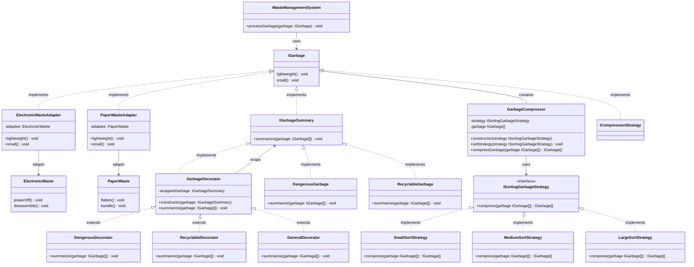

```mermaid
classDiagram
    %% Target
    class IGarbage{
        lightweight() void
        small() void
    }
    %% Adaptee
    class ElectronicWaste{
        powerOff() void
        disassemble() void
    }
    class PaperWaste{
        flatten() void
        bundle() void
    }
    %% Adapter
    class ElectronicWasteAdapter{
        -adaptee: ElectronicWaste
        +lightweight() void
        +small() void
    }
    class PaperWasteAdapter{
        -adaptee: PaperWaste
        +lightweight() void
        +small() void
    }
    %% Client
    class WasteManagementSystem{
        +processGarbage(garbage: IGarbage) void
    }

    %% Relationships
    IGarbage <|.. ElectronicWasteAdapter : implements
    IGarbage <|.. PaperWasteAdapter : implements
    ElectronicWasteAdapter --> ElectronicWaste : adapts
    PaperWasteAdapter --> PaperWaste : adapts
    WasteManagementSystem --> IGarbage : uses
    
    %% Stragtgy
    class ISortingGarbageStrategy{ 
        <<interface>>
        +compress(garbage IGarbage[]) IGarbage[]
    }
    %% Concrete Strategies
    class SmallSortStrategy {
        +compress(garbage IGarbage[]) IGarbage[]
    }
    %% Concrete Strategies
    class MediumSortStrategy {
        +compress(garbage IGarbage[]) IGarbage[]
    }
    %% Concrete Strategies
    class LargeSortStrategy {
        +compress(garbage IGarbage[]) IGarbage[]
    }
    %% Context
    class GarbageCompressor {
        -strategy ISortingGarbageStrategy
        -garbage IGarbage[]
        +constructor(strategy ISortingGarbageStrategy)
        +setStrategy(strategy ISortingGarbageStrategy) void
        +compressGarbage(garbage IGarbage[]) IGarbage[]
    }
    %% Relationships
    ISortingGarbageStrategy <|.. SmallSortStrategy : implements
    ISortingGarbageStrategy <|.. MediumSortStrategy : implements
    ISortingGarbageStrategy <|.. LargeSortStrategy : implements
    GarbageCompressor --> ISortingGarbageStrategy : uses
    
    %% Component
    class IGarbageSummary{
        +summarize(garbage: IGarbage[]) void
    }
    %% Concrete Component
    class DengerousGarbage{
        +summarize(garbage: IGarbage[]) void
    }
    %% Concrete Component
    class RecyclableGarbage{
        +summarize(garbage: IGarbage[]) void
    }
    %% Decorator
    class GarbageDecorator{
        -wrappedGarbage: IGarbageSummary
        +constructor(garbage: IGarbageSummary)
        +summarize(garbage: IGarbage[]) void
    }
    %% Concrete Decorator
    class DengerousDecorator{
        +summarize(garbage: IGarbage[]) void
    }
    %% Concrete Decorator
    class RecyclableDecorator{
        +summarize(garbage: IGarbage[]) void
    }
    %%  Concrete Decorator
    class GeneralDecorator{
        +summarize(garbage: IGarbage[]) void
    }
    %% Relationships
    IGarbageSummary <|.. DengerousGarbage : implements
    IGarbageSummary <|.. RecyclableGarbage : implements
    IGarbageSummary <|.. GarbageDecorator : implements
    GarbageDecorator --> IGarbageSummary : wraps
    GarbageDecorator <|.. DengerousDecorator : extends
    GarbageDecorator <|.. RecyclableDecorator : extends
    GarbageDecorator <|.. GeneralDecorator : extends

    IGarbage <|.. ICompressionStrategy : implements
    IGarbage <|.. IGarbageSummary : implements
    %% IGarbage --> GarbageCompressor : uses
    IGarbage o-- GarbageCompressor : contains
```