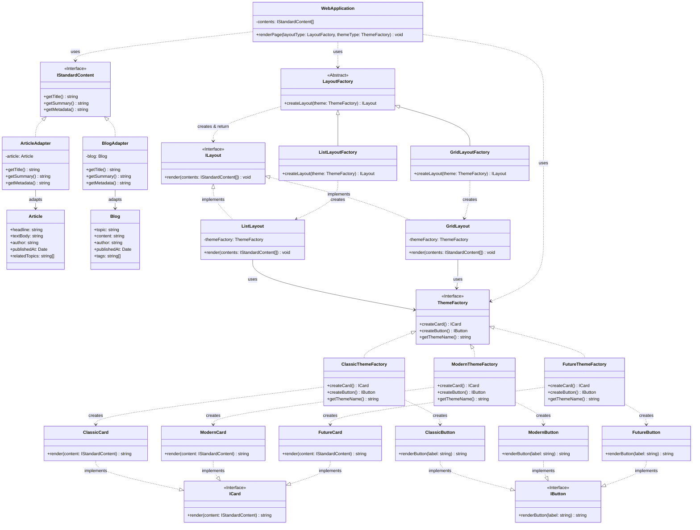

## Adapter + Abstract Factory + Factory Method
- **Target**: IStandardContent
- **Adaptees**: Article, Blog
- **Adapters**: ArticleAdapter, BlogAdapter
- **Abstract Factory**: ThemeFactory
- **Concrete Factories**: ClassicThemeFactory, ModernThemeFactory, FutureThemeFactory
- **Abstract Products**: ICard, IButton
- **Concrete Products**: ClassicCard, ClassicButton, ModernCard, ModernButton, FutureCard, FutureButton
- **Factory Method Creator**: LayoutFactory
- **Concrete Creators**: ListLayoutFactory, GridLayoutFactory
- **Factory Method Products**: ILayout
- **Concrete Products**: ListLayout, GridLayout
- **Client**: WebApplication

## Part of code is crucial
```ts
public renderPage(layoutType: LayoutFactory, themeType: ThemeFactory) {
        const layout = layoutType.createLayout(themeType);
        layout.render(this.contents);
    }
```
```ts
// --- Setup Data (Mockup) ---
const rawData = [
    new Article("Design Patterns", "Adapter is compatible with Factory.", "Bob", new Date(), ["Code"]),
    new Blog("My Day", "Sunny day in Bangkok.", "Alice", new Date(), ["Lifestyle"])
];

// แปลงข้อมูลด้วย Adapter
const standardizedData: IStandardContent[] = [
    new ArticleAdapter(rawData[0] as Article),
    new BlogAdapter(rawData[1] as Blog)
];

// --- Execution ---
const app = new WebApplication(standardizedData);

console.log("Scenario 1: User ชอบอ่านง่ายๆ (List + Classic)");
app.renderPage(new ListLayoutFactory(), new ClassicThemeFactory());

console.log("\nScenario 2: User วัยรุ่นชอบความทันสมัย (Grid + Modern)");
app.renderPage(new GridLayoutFactory(), new ModernThemeFactory());

console.log("\nScenario 3: User สาย Tech (List + Future)");
app.renderPage(new ListLayoutFactory(), new FutureThemeFactory());
```

```ts
render(contents: IStandardContent[]): void {
    console.log(`\n=== 📜 Layout: LIST VIEW | Theme: ${this.themeFactory.getThemeName()} ===`);
    const cardRenderer = this.themeFactory.createCard();
    const buttonRenderer = this.themeFactory.createButton();

    contents.forEach(item => {
        console.log(cardRenderer.render(item));
        console.log(`   ${buttonRenderer.renderButton("Read More")} ${buttonRenderer.renderButton("Share")}`);
    });
    console.log("=================================================");
}
```

```ts
render(contents: IStandardContent[]): void {
    console.log(`\n=== ▦ Layout: GRID VIEW | Theme: ${this.themeFactory.getThemeName()} ===`);
    const cardRenderer = this.themeFactory.createCard();
    const buttonRenderer = this.themeFactory.createButton();

    console.log("Row 1 [Col 1] [Col 2] ...");
    contents.forEach(item => {
        console.log(`[GRID-ITEM] ${cardRenderer.render(item).replace(/\n/g, "\n\t")}`);
        console.log(`\t   Actions: ${buttonRenderer.renderButton("View")} ${buttonRenderer.renderButton("Edit")}`);
    });
    console.log("=================================================");
}
```

```ts
class ClassicCard implements ICard {
    render(content: IStandardContent): string {
        return `
    +--------------------------------+
    | [CLASSIC] ${content.getTitle()}
    | ------------------------------
    | ${content.getSummary()}
    | [Meta]: ${content.getMetadata()}
    +--------------------------------+`;
    }
}
```
```ts
class ModernCard implements ICard {
    render(content: IStandardContent): string {
        return `
    ✨ ${content.getTitle()}
       ${content.getSummary()}
       Running low key: ${content.getMetadata()}`;
    }
}
```
```ts
class FutureCard implements ICard {
    render(content: IStandardContent): string {
        return `
    >>> STREAM_DATA: ${content.getTitle()}
    >>> CONTENT: ${content.getSummary()}
    >>> HASH: ${content.getMetadata()}
    _END_STREAM_`;
    }
}
```

```ts
class ClassicButton implements IButton {
    renderButton(label: string): string {
        return `[ ${label} ]`;
    }
}
```

```ts
class ClassicThemeFactory implements ThemeFactory {
    createCard(): ICard { return new ClassicCard(); }
    createButton(): IButton { return new ClassicButton(); }
    getThemeName(): string { return "Classic 90s"; }
}
```

```ts
class ModernButton implements IButton {
    renderButton(label: string): string {
        return `✨ ${label} ✨`;
    }
}
```

```ts
class ModernThemeFactory implements ThemeFactory {
    createCard(): ICard { return new ModernCard(); }
    createButton(): IButton { return new ModernButton(); }
    getThemeName(): string { return "Modern 2025"; }
}
```

```ts
class FutureButton implements IButton {
    renderButton(label: string): string {
        return `>>> [${label.toUpperCase()}] <<<`;
    }
}
```

```ts
class FutureThemeFactory implements ThemeFactory {
    createCard(): ICard { return new FutureCard(); }
    createButton(): IButton { return new FutureButton(); }
    getThemeName(): string { return "Cyberpunk 2077"; }
}
```
## Explanation
- User เลือกใช้ LayoutFactory (List/Grid) และ ThemeFactory (Classic/Modern/Future) เพื่อ render content ที่เป็น IStandardContent (ผ่าน Adapter)
- **Adapter Pattern** ช่วย normalize data structure ของ Article และ Blog ให้เป็น IStandardContent
- **Abstract Factory** สร้าง UI components (Card + Button) ที่มี visual style สอดคล้องกันตาม theme ที่เลือก
- **Factory Method** สร้าง layout (List/Grid) ที่ใช้ components จาก Abstract Factory เพื่อ render content list
- การผสมผสาน pattern ทั้งสามนี้ ช่วยให้ระบบมีความยืดหยุ่นสูง สามารถเพิ่มประเภท content, layout, หรือ theme ได้ง่ายในอนาคต โดยไม่กระทบกับโค้ดเดิม

### ตัวอย่างการขยาย:
- **เพิ่ม Content Type**: สร้าง `Video` class และ `VideoAdapter` ที่ implements `IStandardContent`
- **เพิ่ม Layout**: สร้าง `MasonryLayout` และ `MasonryLayoutFactory` ที่ extends `LayoutFactory`
- **เพิ่ม Theme**: สร้าง `DarkThemeFactory` พร้อม `DarkCard` และ `DarkButton`
- **เพิ่ม Component**: เพิ่ม `IIcon` interface และให้แต่ละ theme สร้าง icon ของตัวเอง