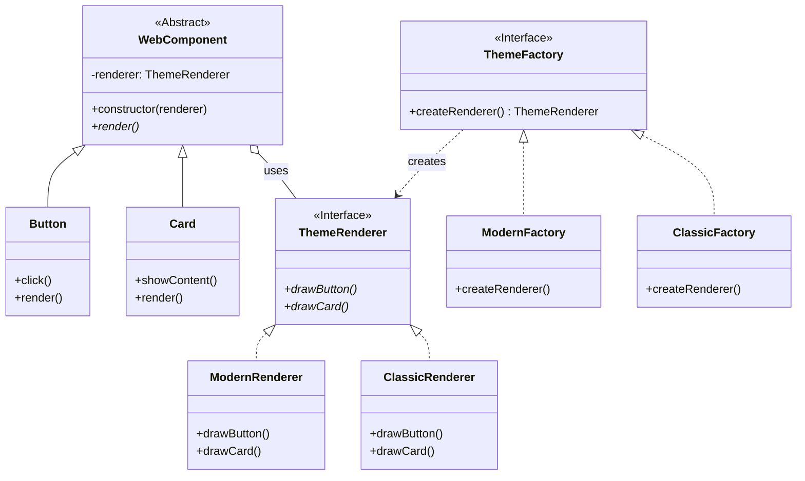
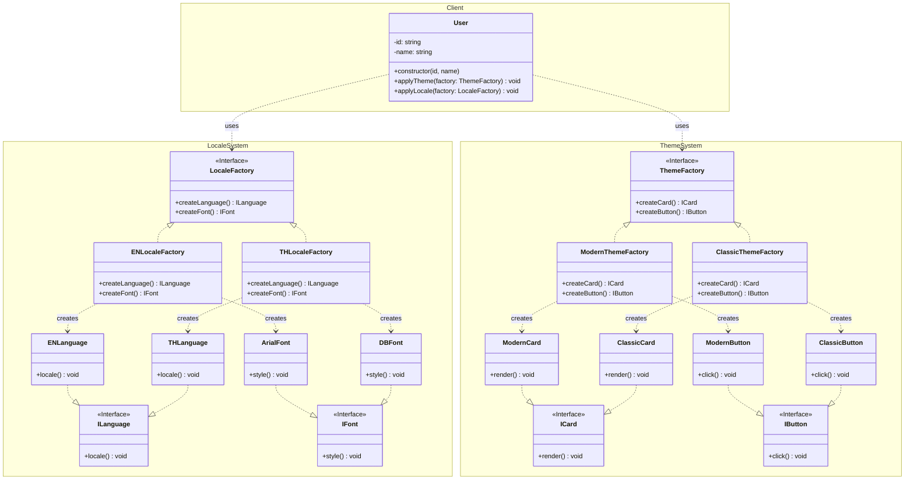

```mermaid
classDiagram
    %% --- The Bridge: Abstraction Side (Logic) ---
    class WebComponent {
        <<Abstract>>
        -renderer: ThemeRenderer
        +constructor(renderer)
        +render()*
    }
    class Button {
        +click()
        +render()
    }
    class Card {
        +showContent()
        +render()
    }

    WebComponent <|-- Button
    WebComponent <|-- Card

    %% --- The Bridge: Implementation Side (Style) ---
    class ThemeRenderer {
        <<Interface>>
        +drawButton()*
        +drawCard()*
    }
    class ModernRenderer {
        +drawButton()
        +drawCard()
    }
    class ClassicRenderer {
        +drawButton()
        +drawCard()
    }

    ThemeRenderer <|.. ModernRenderer
    ThemeRenderer <|.. ClassicRenderer

    %% The Bridge Connection
    WebComponent o-- ThemeRenderer : uses

    %% --- The Factory (Creator) ---
    class ThemeFactory {
        <<Interface>>
        +createRenderer() ThemeRenderer
    }
    class ModernFactory {
        +createRenderer()
    }
    class ClassicFactory {
        +createRenderer()
    }

    ThemeFactory <|.. ModernFactory
    ThemeFactory <|.. ClassicFactory

    %% Factory creates the specific Renderer
    ThemeFactory ..> ThemeRenderer : creates
```

```mermaid
classDiagram
    %% ==========================================
    %% PART 1: LOCALE FACTORY (Language + Font)
    %% ==========================================
    namespace LocaleSystem {
        class ILanguage {
            <<Interface>>
            +locale() void
        }
        class IFont {
            <<Interface>>
            +style() void
        }
        class LocaleFactory {
            <<Interface>>
            +createLanguage() ILanguage
            +createFont() IFont
        }
        
        class ENLanguage {
            +locale() void
        }
        class THLanguage {
            +locale() void
        }
        class ArialFont {
            +style() void
        }
        class DBFont {
            +style() void
        }
        
        class ENLocaleFactory {
            +createLanguage() ILanguage
            +createFont() IFont
        }
        class THLocaleFactory {
            +createLanguage() ILanguage
            +createFont() IFont
        }
    }

    %% ==========================================
    %% PART 2: THEME FACTORY (Card + Button)
    %% ==========================================
    namespace ThemeSystem {
        class ICard {
            <<Interface>>
            +render() void
        }
        class IButton {
            <<Interface>>
            +click() void
        }
        class ThemeFactory {
            <<Interface>>
            +createCard() ICard
            +createButton() IButton
        }
        
        class ModernCard {
            +render() void
        }
        class ModernButton {
            +click() void
        }
        class ClassicCard {
            +render() void
        }
        class ClassicButton {
            +click() void
        }
        
        class ModernThemeFactory {
            +createCard() ICard
            +createButton() IButton
        }
        class ClassicThemeFactory {
            +createCard() ICard
            +createButton() IButton
        }
    }

    %% ==========================================
    %% PART 3: CLIENT
    %% ==========================================
    namespace Client {
        class User {
            -id: string
            -name: string
            +constructor(id, name)
            +applyTheme(factory: ThemeFactory) void
            +applyLocale(factory: LocaleFactory) void
        }
    }

    %% ==========================================
    %% RELATIONSHIPS: LOCALE SYSTEM
    %% ==========================================
    LocaleFactory <|.. ENLocaleFactory
    LocaleFactory <|.. THLocaleFactory
    
    ENLocaleFactory ..> ENLanguage : creates
    ENLocaleFactory ..> ArialFont : creates
    THLocaleFactory ..> THLanguage : creates
    THLocaleFactory ..> DBFont : creates
    
    ENLanguage ..|> ILanguage
    THLanguage ..|> ILanguage
    ArialFont ..|> IFont
    DBFont ..|> IFont

    %% ==========================================
    %% RELATIONSHIPS: THEME SYSTEM
    %% ==========================================
    ThemeFactory <|.. ModernThemeFactory
    ThemeFactory <|.. ClassicThemeFactory
    
    ModernThemeFactory ..> ModernCard : creates
    ModernThemeFactory ..> ModernButton : creates
    ClassicThemeFactory ..> ClassicCard : creates
    ClassicThemeFactory ..> ClassicButton : creates
    
    ModernCard ..|> ICard
    ClassicCard ..|> ICard
    ModernButton ..|> IButton
    ClassicButton ..|> IButton

    %% ==========================================
    %% RELATIONSHIPS: CLIENT USAGE
    %% ==========================================
    User ..> LocaleFactory : uses
    User ..> ThemeFactory : uses
```