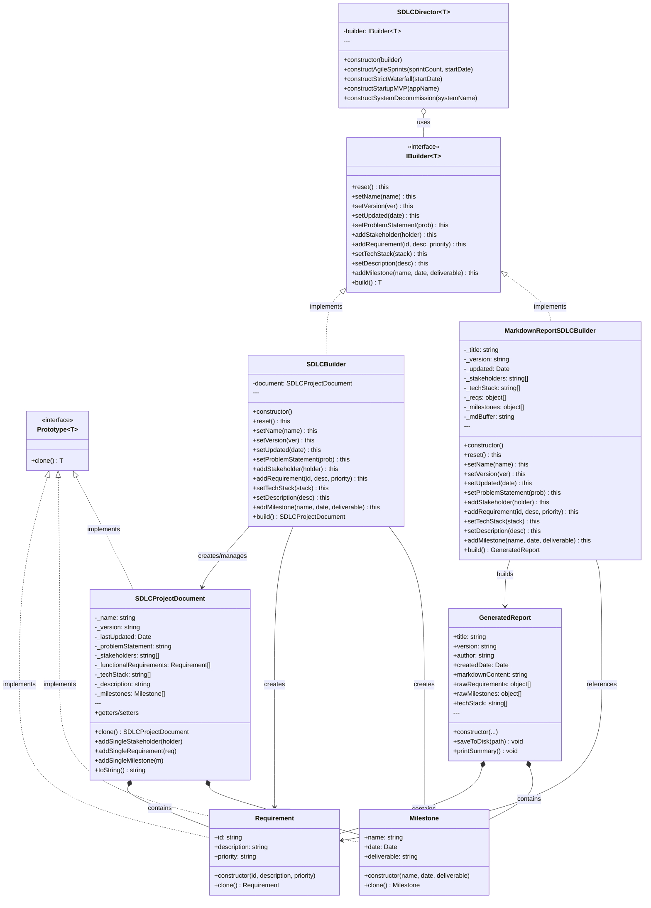

# SDLC Project Document - Prototype + Builder Pattern

## Part of code is crucial
```ts
public reset(): this {
        this.document = new SDLCProjectDocument();
        return this;
    }
```
```ts
public build(): SDLCProjectDocument {
        if (!this.document.name) throw new Error("Document needs a name!");
        const result = this.document;
        this.reset();
        return result;
    }
```
```ts
public reset(): this {
        this._title = "Untitled";
        this._version = "Draft";
        this._updated = new Date();
        this._description = "";
        this._problem = "";
        this._stakeholders = [];
        this._techStack = [];
        this._reqs = [];
        this._milestones = [];
        this._mdBuffer = "";
        return this;
    }
```
```ts
 public build(): GeneratedReport {
        if (this._reqs.length === 0) {
            console.warn("⚠️ Warning: Building a report with no requirements.");
        }

        const report = new GeneratedReport(
            this._title,
            this._version,
            "System Director",
            this._updated,
            this._mdBuffer,
            this._reqs,
            this._milestones,
            this._techStack
        );

        this.reset();
        return report;
    }
```
```ts
public constructAgileSprints(sprintCount: number, startDate: Date): void {
        this.builder.reset()
            .setName(`Agile Project (${sprintCount} Sprints)`)
            .setVersion("1.0.0")
            .setProblemStatement("Rapid iteration needed.")
            .addStakeholder("Product Owner")
            .addStakeholder("Scrum Master")
            .addStakeholder("Development Team")
            .addRequirement("FR1", "User authentication", "High")
            .addRequirement("FR2", "Data visualization dashboard", "Medium")
            .setTechStack(["Jira", "React", "Node.js", "PostgreSQL"]);

        let currentDate = new Date(startDate);

        this.builder.addMilestone("Kickoff", currentDate, "Project Charter");

        for (let i = 1; i <= sprintCount; i++) {
            currentDate = new Date(currentDate.setDate(currentDate.getDate() + 14));

            this.builder.addMilestone(
                `Sprint ${i} Demo`,
                new Date(currentDate),
                `Working Increment v0.${i}`
            );
        }
    }
```

```ts
public constructStrictWaterfall(startDate: Date): void {
        this.builder.reset()
            .setName("Government Enterprise System")
            .setVersion("1.0.0")
            .setProblemStatement("Compliance and stability focused.")
            .setTechStack(["Java", "Oracle"])
            .addRequirement("REQ-W01", "System Security Module", "Critical")
            .addRequirement("REQ-W02", "Audit Trail Logging", "High");

        const date = new Date(startDate);

        this.builder.addMilestone("Requirement Freeze", date, "Signed SRS Document");

        date.setDate(date.getDate() + 30);
        this.builder.addMilestone("Design Approval", new Date(date), "System Architecture Doc");

        date.setDate(date.getDate() + 90);
        this.builder.addMilestone("Implementation Complete", new Date(date), "Source Code & Unit Test");

        date.setDate(date.getDate() + 45);
        this.builder.addMilestone("Go-Live", new Date(date), "Production Release");
    }
```

```ts
public constructStartupMVP(appName: string): void {
        this.builder.reset()
            .setName(`${appName} - MVP Launch`)
            .setVersion("0.1.0-alpha")
            .setProblemStatement("Validate market fit with core features.")
            .setDescription("A minimal viable product to test assumptions.")
            .addStakeholder("Founders")
            .addStakeholder("Early Adopters")
            .setTechStack(["Flutter", "Firebase", "Stripe"])
            .addRequirement("MVP-01", "Sign up with Google", "Critical")
            .addRequirement("MVP-02", "Basic Payment Flow", "Critical");

        const today = new Date();
        this.builder.addMilestone("Concept", today, "Pitch Deck");

        const launchDay = new Date(today);
        launchDay.setDate(today.getDate() + 30);
        this.builder.addMilestone("Soft Launch", launchDay, "TestFlight Build");
    }
```
```ts
public constructSystemDecommission(systemName: string): void {
        this.builder.reset()
            .setName(`Decommissioning: ${systemName}`)
            .setVersion("Final")
            .setProblemStatement("Legacy system replacement and data archiving.")
            .setDescription("Steps to safely sunset the old system.")
            .addStakeholder("Compliance Team")
            .addStakeholder("Data Archivist")
            .setTechStack(["Legacy Mainframe", "COBOL"])
            .addRequirement("DEC-01", "Export all data to Cold Storage", "High")
            .addRequirement("DEC-02", "Shut down servers", "High");

        const date = new Date();
        this.builder.addMilestone("Data Backup", date, "Backup Logs");

        date.setDate(date.getDate() + 7);
        this.builder.addMilestone("Server Shutdown", date, "Hardware Disposal Receipt");
    }
```
## Solution for the crucial part
- เเก้ปัญหาเรื่องการสร้าง Document Project SDLC ถ้าเราต้องการเปลี่ยนข้อมูลเเค่บางส่วน เเทนที่จะต้องเขียนใหม่ทั้งหมด สามารถใช้ Prototype Pattern ในการ clone ข้อมูลเดิมเเล้วปรับเปลี่ยนเฉพาะส่วนที่ต้องการได้ เเละการปรับเปลี่ยนข้อมูลฌแพาะส่วนก็ทำได้ง่ายด้วย Builder Pattern ที่ช่วยให้การสร้าง Document มีความยืดหยุ่น เเละสามารถสร้างรูปเเบบต่างๆ ได้ตามต้องการ

## Planning in the Future
- เพิ่มฟีเจอร์ในการส่งออก Document ในรูปเเบบอื่นๆ เช่น PDF หรือ HTML
- เพิ่มตัวเลือกในการปรับแต่งรูปเเบบของ Document เช่น การเลือกเทมเพลต หรือการจัดรูปเเบบเนื้อหา
- พัฒนาอินเทอร์เฟซผู้ใช้ (UI) ที่ใช้งานง่ายสำหรับการสร้างเเละจัดการ SDLC Project Document

## Prototype + Builder Component
- Prototype: Prototype<T>
- Concrete Prototypes: Requirement, Milestone, SDLCProjectDocument
- Builder Interface: IBuilder<T>
- Concrete Builders: SDLCBuilder, MarkdownReportSDLCBuilder
- Director: SDLCDirector<T>
- Product: SDLCProjectDocument, GeneratedReport


