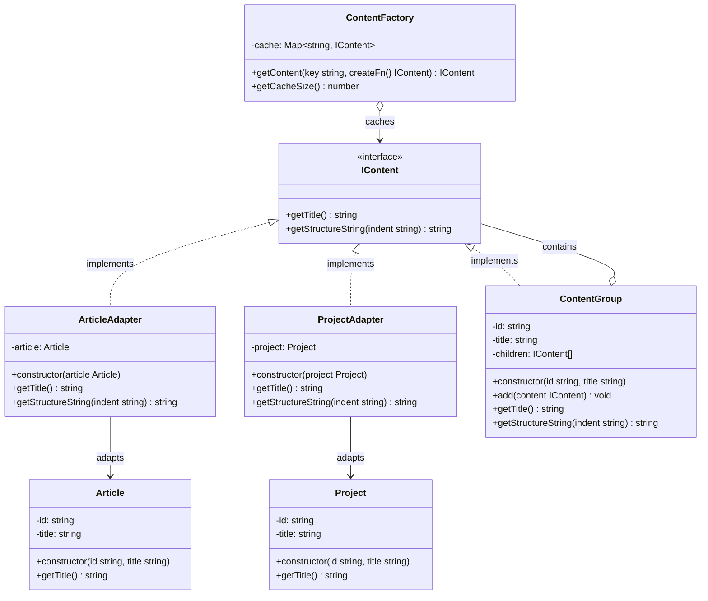

## Part of Code is Crucial
Flyweight Factory for checking existing or creating new Object
```ts
/**
     * เมธอดหลัก: "มีก็เอาของเดิม ไม่มีค่อยสร้างใหม่"
     * @param key คีย์สำหรับอ้างอิง (เช่น ID ของบทเรียน)
     * @param createFn ฟังก์ชันสำหรับสร้าง Object ถ้ายังไม่มีใน Cache
     */
    public getContent(key: string, createFn: () => IContent): IContent {
        if (this.cache.has(key)) {
            // console.log(`♻️ [Factory] Reusing existing content: ${key}`);
            return this.cache.get(key)!;
        }

        // console.log(`✨ [Factory] Creating NEW content: ${key}`);
        const newContent = createFn();
        this.cache.set(key, newContent);
        return newContent;
    }
```

concrete flyweight - composite
```ts
public getTitle(): string { return this.title; }

    public getStructureString(indent: string): string {
        let output = `${indent}+ 📂 [Category] ${this.title}\n`;

        for (const child of this.children) {
            output += child.getStructureString(indent + "  ");
        }
        return output;
    }
```
composite - add child
```ts
public add(content: IContent): void {
        if (!content) {
            console.warn(`[ContentGroup] Warning: Attempted to add undefined content to '${this.title}'`);
            return;
        }
        this.children.push(content);
    }
```
adapter 
```ts
public getTitle(): string {
        return this.article.getTitle();
    }
```

```ts
public getTitle(): string {
        return this.project.getTitle();
    }
```


## Planning Scale in The Future
- หยิบ singleton เข้ามาจัดการ flyweight factory ให้มี instance เดียวทั่ว app ปัองกันการสร้าง factory ซ้ำซ้อน

## Adapter + Composite + Flyweight Component
- `IContent`: **Target**, **Component** , **Flyweight Interface**
- `ArticleAdapter`, `ProjectAdapter`: **Adapter**, **Leaf**, **Concrete Flyweight**
- `ContentGroup`: **Composite**, **Concrete Flyweight**, **Context**
- `ContentFactory`: **Flyweight Factory**
- `Article`, `Project`: **Adaptee**, **Intrinsic State**
- **Client Code**: ใช้ factory เพื่อสร้าง content ต่างๆ ผ่าน adapter เเละจัดกลุ่มด้วย composite
