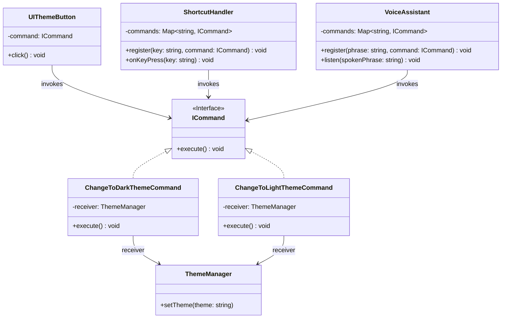

```mermaid
classDiagram
	%% ==============================
	%% Command Pattern (Theme Control)
	%% ==============================

	class ThemeManager {
		+setTheme(theme: string)
	}

	class ICommand {
		<<Interface>>
		+execute() void
	}

	class ChangeToDarkThemeCommand {
		-receiver: ThemeManager
		+execute() void
	}

	class ChangeToLightThemeCommand {
		-receiver: ThemeManager
		+execute() void
	}

	class UIThemeButton {
		-command: ICommand
		+click() void
	}

	class ShortcutHandler {
		-commands: Map~string, ICommand~
		+register(key: string, command: ICommand) void
		+onKeyPress(key: string) void
	}

	class VoiceAssistant {
		-commands: Map~string, ICommand~
		+register(phrase: string, command: ICommand) void
		+listen(spokenPhrase: string) void
	}

	%% Relationships
	ICommand <|.. ChangeToDarkThemeCommand
	ICommand <|.. ChangeToLightThemeCommand

	ChangeToDarkThemeCommand --> ThemeManager : receiver
	ChangeToLightThemeCommand --> ThemeManager : receiver

	UIThemeButton --> ICommand : invokes
	ShortcutHandler --> ICommand : invokes
	VoiceAssistant --> ICommand : invokes
```
