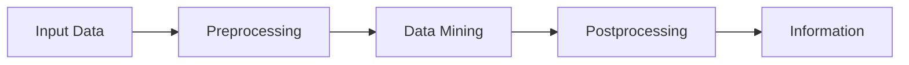

<Callout title="Warning" type="warning">
This article is a work in progress and may contain incomplete information or inaccuracies. Please verify details from reliable sources.
</Callout>

# Data Mining (DM)

# บทที่ 1: Data Mining (นิยามและภาพรวม)

## 1) Data Mining คืออะไร? (นิยามแบบตกผลึก)
> Data Mining is the process of automatically discovering useful information in large data repositories.
> — Tan et al. (การขุดค้นข้อมูล คือกระบวนการค้นหาข้อมูลที่เป็นประโยชน์โดยอัตโนมัติจากแหล่งข้อมูลขนาดใหญ่)

คีย์เวิร์ดสำคัญ 3 ข้อ:
- Non-trivial (ไม่ธรรมดา): ไม่ใช่แค่การ query ง่ายๆ แต่ต้องค้นหา pattern ที่ซับซ้อน
- Implicit & Previously Unknown (แฝงอยู่และไม่เคยรู้มาก่อน): ความรู้ซ่อนอยู่ ไม่ได้บอกไว้โต้งๆ
- Potentially Useful (เอาไปใช้ประโยชน์ได้): นำไปช่วยตัดสินใจทางธุรกิจหรือวิทยาศาสตร์ได้

เปรียบเทียบสั้นๆ:
- Query: ถามว่า "เมื่อวานขายกาแฟได้กี่แก้ว?" (ถามตรง ตอบตรง)
- Data Mining: ถามว่า "ลูกค้าที่ซื้อกาแฟเย็น มักจะซื้อคู่กับขนมชนิดไหนในช่วงบ่ายวันศุกร์?" (หาความสัมพันธ์ที่ซ่อนอยู่)

## 2) KDD Process (Knowledge Discovery in Databases)

Data Mining เป็นเพียง "ขั้นตอนหนึ่ง" ใน KDD โดยมีรายละเอียดสำคัญ:
- Data Preprocessing:
	- Data Subsetting/Sampling: เลือกข้อมูลมาบางส่วนเพื่อประมวลผลเมื่อข้อมูลใหญ่เกินไป
	- Feature Selection: เลือก column ที่มีผลจริงๆ ตัด column ขยะทิ้ง
	- Dimensionality Reduction: ลดมิติข้อมูล เช่น ยุบรวมตัวแปร หรือใช้ PCA เพื่อให้โมเดลทำงานง่ายขึ้น
	- Normalization: ปรับสเกลตัวเลขให้เท่าเทียมกัน (เช่น อายุ 0–100 กับ เงินเดือน 0–100,000 ต้องปรับให้สเกลใกล้เคียง)
- Postprocessing:
	- กรอง pattern ที่ซ้ำซ้อนหรือไม่สมเหตุสมผล
	- สร้าง visualization และสรุปผลให้มนุษย์เข้าใจง่าย

## 3) Case Study: Super Mart — Customer Churn Prediction
เพื่อให้เห็นภาพชัดเจนตามหนังสือ Tan (ที่มักยกตัวอย่าง Market Basket Analysis หรือ Classification) เรามาจำลอง Project "ทำนายว่าลูกค้าคนไหนจะเลิกเป็นสมาชิก (Customer Churn Prediction)" กันครับ

- Input Data (ข้อมูลดิบ): ลูกค้าจำนวน 100,000 คน จากฐานข้อมูล
	- Data fields: [ID, name, age, gender, salary, registration_date, days_since_last_purchase, total_purchase, address, phone]

### Step 1: Data Preprocessing {/*(เตรียมวัตถุดิบ)*/}
{/* ขั้นตอนนี้สำคัญที่สุด (กินเวลา 60–80% ของงานจริง) */}

- Data Subsetting (Sampling):
	- ข้อมูล 100,000 คนอาจ run นานเกินไปสำหรับ test เราสุ่มมา 10,000 คน ที่เป็นตัวแทนกลุ่มประชากรอย่างเหมาะสม
- Feature Selection:
	- ตัดทิ้ง: name, phone, ID (ไม่มีผลต่อการวิเคราะห์ว่าเขาจะเลิกเป็นลูกค้าหรือไม่)
	- เก็บไว้: age, total_purchase, days_since_last_purchase
- Dimensionality Reduction:
	- สมมติเรามี column "ยอดซื้อปี 2023", "ยอดซื้อปี 2024", "ยอดซื้อปี 2025" เราอาจยุบรวมเหลือ column เดียวคือ "ยอดซื้อเฉลี่ย 3 ปี" เพื่อลดความซับซ้อน
- Normalization:
	- age: ค่าอยู่ระหว่าง 18–80
	- salary: ค่าอยู่ระหว่าง 15,000–200,000
	- problem: ถ้าเอาเข้า Data Mining เลย ค่าเงินเดือนจะกลบค่าอายุหมด
	- solution: ปรับทั้งคู่ให้อยู่ในช่วง $0$ ถึง $1$ (Min–Max Scaling)

### Step 2: Data Mining {/*(ขุดหา Pattern)*/}
- Goal: ต้องการแบ่งกลุ่มว่าใคร "อยู่ต่อ" หรือ "จะเลิก" (Classification)
- Technique: ใช้ Decision Tree ในการสร้างกฎ (Rules) เพื่อทำนาย
- Process (Example Rules Discovered):
	- Rule 1: ถ้า "ไม่ได้ซื้อของเกิน 30 วัน" และ "ยอดซื้อรวมต่ำกว่า 500" → มีโอกาส "เลิก" 90%
	- Rule 2: ถ้า "อายุ > 50" และ "ซื้อของทุกสัปดาห์" → มีโอกาส "อยู่ต่อ" 95%

### Step 3: Postprocessing {/*(เจียระไน)*/}
- Filtering Patterns:
	- เราอาจเจอ pattern แปลกๆ เช่น "คนที่มีเงินเดือน 0 บาท มีโอกาสอยู่ต่อ 100%" (ซึ่งจริงๆ อาจเป็นข้อมูล error) จึงต้องกรองกฎที่ make sense หรือที่มีความเชื่อมั่น (confidence) สูงๆ เท่านั้น
- Visualization: วาดกราฟ Decision Tree ออกมาให้ทีมการตลาดดู
- Pattern Interpretation: แปลความหมาย
	- ตัวอย่าง: "จากการขุดข้อมูล พบว่าลูกค้าที่มีความเสี่ยงจะหนีหาย คือกลุ่มวัยรุ่นที่ไม่ได้เข้าร้านมาเกิน 45 วัน"

### Output: Information {/*(สารสนเทศ)*/}
- ข้อมูลที่พร้อมใช้งานเพื่อตัดสินใจ
- Action: ส่งคูปองส่วนลด 50% ให้ลูกค้ากลุ่มวัยรุ่นที่ไม่ได้เข้าร้านมาเกิน 30 วัน เพื่อดึงพวกเขากลับมา

## บทสรุป (Takeaway)
- Data Mining ตามแนวทางของ Tan et al. ไม่ใช่เวทมนตร์ แต่คือ "กระบวนการแปลงข้อมูลดิบ (Data) ให้เป็นความรู้ (Knowledge)"
- ถ้า Preprocessing ไม่ดี (เช่น ไม่ Normalize) → ผลลัพธ์ Data Mining จะผิดเพี้ยน (Garbage In, Garbage Out)
- ถ้าไม่ทำ Postprocessing → จะได้ pattern ขยะมากมายที่ใช้งานจริงไม่ได้

<a href="https://github.com/TaiChi112/FumadProff/blob/main/content/docs/Computer_Science/DM/DM.mdx" target="_blank" className="editLink_e1cfa">📝 Edit this page on GitHub</a>