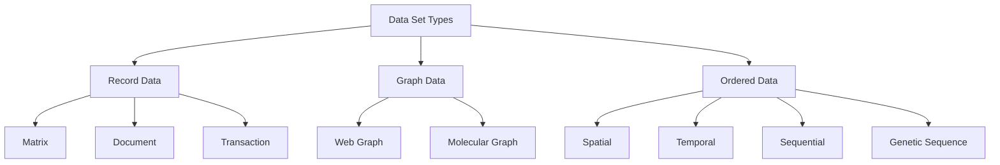
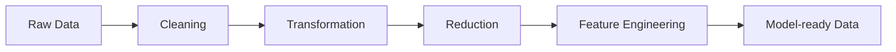

<Callout title="Warning" type="warning">
This article is a work in progress and may contain incomplete information or inaccuracies. Please verify details from reliable sources.
</Callout>

# Data Understanding and Preprocessing 

## 1) Attribute and Objects

### What is a Data Set?
Data set คือชุดของ objects (เช่น คน, สินค้า, เอกสาร, เซนเซอร์) ที่ถูกอธิบายด้วย attributes (คุณลักษณะ)

- Object = หน่วยที่เราสนใจวิเคราะห์ (row)
- Attribute = ตัวแปรที่ใช้บรรยาย object (column)

ตัวอย่าง:
- Object: ลูกค้า 1 คน
- Attributes: อายุ, รายได้, จังหวัด, ยอดซื้อรวม

### Attribute Values และ Measurement Scale

ค่าของ attribute สามารถอยู่บนสเกลการวัดต่างกัน ซึ่งมีผลโดยตรงต่อวิธีคำนวณ similarity/distance

| Scale    | ความหมาย                 | เปรียบเทียบอะไรได้       | ตัวอย่าง               |
| -------- | ------------------------ | --------------------- | -------------------- |
| Nominal  | เป็นป้ายชื่อ/หมวด            | เท่ากันหรือไม่เท่ากัน       | สี, ประเทศ            |
| Ordinal  | มีลำดับ                     | มาก-น้อยเชิงอันดับ        | ระดับความพึงพอใจ 1-5   |
| Interval | มีระยะห่างเท่ากัน แต่ไม่มีศูนย์แท้ | ต่างกันได้               | อุณหภูมิ C              |
| Ratio    | มีศูนย์แท้                   | ต่างกันและเทียบอัตราส่วนได้ | น้ำหนัก, ความยาว, รายได้ |

### Difference Between Ratio and Interval

- Interval: ส่วนต่างมีความหมาย แต่คำว่า "สองเท่า" ไม่มีความหมายเชิงกายภาพ
  - เช่น $20^\circ C$ ไม่ได้ร้อนเป็น 2 เท่าของ $10^\circ C$
- Ratio: มีศูนย์แท้ จึงเทียบสัดส่วนได้
  - เช่น 10 kg หนักเป็น 2 เท่าของ 5 kg

### Discrete and Continuous Attributes

- Discrete: ค่านับได้เป็นจุดๆ เช่น จำนวนลูกค้า, จำนวนคลิก
- Continuous: ค่าวัดได้ต่อเนื่อง เช่น เวลา, ระยะทาง, อุณหภูมิ

### Asymmetric Attributes

ใช้กับกรณีที่ "การมีค่า" สำคัญกว่า "การไม่มีค่า" เช่น
- อาการโรค (มีอาการ = สำคัญ, ไม่มีอาการ = อาจไม่ช่วยแยก)
- การกดซื้อสินค้า (ซื้อ = สัญญาณสำคัญ)

จึงมักใช้ Jaccard มากกว่า SMC ในข้อมูล binary แบบไม่สมมาตร

### Critiques of Attribute Categorization

ข้อควรระวัง:
- ข้อมูลจริงมักผสมหลายชนิดในคอลัมน์เดียว
- ขอบเขตระหว่าง ordinal กับ interval อาจไม่ชัด
- การ encode ผิดชนิดทำให้โมเดลตีความผิด

### Key Message for Attribute Types

ชนิดข้อมูลไม่ใช่แค่เรื่องนิยาม แต่กำหนดว่า
1. ใช้สถิติอะไร
2. ใช้ระยะ/ความคล้ายแบบไหน
3. ควร preprocessing แบบใด

## 2) Types of Data and Data Sets

### Important Characteristics of Data

ลักษณะสำคัญที่ต้องดูตั้งแต่ต้น:
- Dimensionality: จำนวนฟีเจอร์
- Sparsity: ข้อมูลส่วนใหญ่เป็นศูนย์/ว่างหรือไม่
- Resolution: ความละเอียดของการวัด
- Distribution: รูปทรงการกระจาย เช่น skewed, heavy-tail

### Types of Data Sets

ตัวอย่างแบบเร็ว:
- Matrix: ตารางลูกค้า-ฟีเจอร์
- Document: เอกสารหลายฉบับแทนด้วยคำ (bag-of-words/embedding)
- Transaction: ตะกร้าสินค้าต่อบิล
- Graph: โหนด-เส้นเชื่อม เช่น เพจลิงก์หาเพจ
- Ordered: ข้อมูลที่ลำดับมีความหมาย เช่น time series

## 3) Data Quality

คุณภาพข้อมูลส่งผลตรงกับคุณภาพโมเดล

| ปัญหา           | คำอธิบาย               | ผลกระทบ                   | วิธีรับมือเบื้องต้น                           |
| -------------- | -------------------- | ------------------------- | -------------------------------------- |
| Noisy Data     | ค่าผิดปกติจากการวัด/บันทึก | โมเดลเรียนรู้ pattern หลอก   | smoothing, robust model, outlier check |
| Missing Values | ค่าว่าง                | loss of information, bias | imputation, model that handles missing |
| Fake Data      | ข้อมูลปลอม/สแปม        | สถิติผิดทิศทาง                | validation rules, anomaly detection    |
| Wrong Data     | หน่วยผิด/พิมพ์ผิด         | ข้อสรุปผิด                   | range/unit checks, constraint checks   |
| Duplicate Data | ข้อมูลซ้ำ                | นับซ้ำ, distribution เพี้ยน    | deduplication, entity resolution       |

หลักคิด: Garbage In, Garbage Out

## 4) Similarity and Distance

### Similarity vs Dissimilarity

- Similarity: ค่าสูง = คล้าย
- Distance (dissimilarity): ค่าต่ำ = คล้าย

### Similarity/Dissimilarity for Simple Attributes

- Nominal: ดู match/mismatch
- Ordinal: แปลงอันดับเป็นคะแนนแล้วเทียบ
- Numeric: ใช้ระยะเชิงเรขาคณิตหรือเชิงสถิติ

### Euclidean Distance

$$
d(x,y)=\sqrt{\sum_{i=1}^{n}(x_i-y_i)^2}
$$

เหมาะกับข้อมูลเชิงตัวเลขที่สเกลใกล้กัน (หรือ normalize แล้ว)

### Minkowski Distance

$$
d_p(x,y)=\left(\sum_{i=1}^{n}|x_i-y_i|^p\right)^{1/p}
$$

- $p=1$ Manhattan
- $p=2$ Euclidean

### Mahalanobis Distance

$$
d_M(x,y)=\sqrt{(x-y)^T\Sigma^{-1}(x-y)}
$$

ข้อดี:
- คำนึงถึงความสัมพันธ์ระหว่างฟีเจอร์
- ดีเมื่อฟีเจอร์มีสเกลต่างกันและมี covariance

### Common Properties

Distance ที่เป็น metric ควรมี:
1. Non-negativity
2. Identity of indiscernibles
3. Symmetry
4. Triangle inequality

Similarity โดยทั่วไปคาดหวัง:
1. ค่าสูงขึ้นเมื่อวัตถุคล้ายมากขึ้น
2. มักถูก normalize ให้อยู่ในช่วงคงที่ เช่น 0 ถึง 1

### Similarity Between Binary Vectors: SMC vs Jaccard

กำหนด
- $f_{11}$: ทั้งคู่เป็น 1
- $f_{00}$: ทั้งคู่เป็น 0
- $f_{10}, f_{01}$: ไม่ตรงกัน

$$
SMC=\frac{f_{11}+f_{00}}{f_{11}+f_{10}+f_{01}+f_{00}}
$$

$$
Jaccard=\frac{f_{11}}{f_{11}+f_{10}+f_{01}}
$$

สรุป:
- SMC ใช้ทั้งกรณี 1-1 และ 0-0
- Jaccard ไม่ให้รางวัลกับ 0-0 เหมาะกับ sparse asymmetric binary data

### Cosine Similarity

$$
\cos(\theta)=\frac{x\cdot y}{\|x\|\|y\|}
$$

เหมาะกับข้อมูลที่สนใจ "ทิศทาง" มากกว่า "ขนาด" เช่น document vectors

### Correlation

Correlation วัดความสัมพันธ์เชิงเส้นระหว่างตัวแปร/เวกเตอร์

ข้อจำกัด:
- จับได้เฉพาะความสัมพันธ์เชิงเส้น
- ไวต่อ outliers
- correlation สูงไม่ได้แปลว่าเหตุและผล

### Correlation vs Cosine vs Euclidean

| Measure     | โฟกัส            | จุดเด่น             | จุดระวัง            |
| ----------- | --------------- | ----------------- | ----------------- |
| Euclidean   | ระยะห่างจริง      | เข้าใจง่าย          | แพ้สเกลและ outlier |
| Cosine      | มุมระหว่างเวกเตอร์ | ดีสำหรับ sparse text | ไม่สนใจ magnitude  |
| Correlation | แนวโน้มร่วมเชิงเส้น | ตัดผลจาก mean ได้   | ไม่จับ nonlinear    |

### Information-Based Measures

#### Information and Probability

เหตุการณ์ที่โอกาสเกิดต่ำให้ "สารสนเทศ" สูงกว่า

$$
I(x)=-\log p(x)
$$

#### Entropy

วัดความไม่แน่นอนของตัวแปรสุ่ม

$$
H(X)=-\sum_x p(x)\log p(x)
$$

#### Mutual Information

วัดข้อมูลร่วมที่ตัวแปรหนึ่งให้เกี่ยวกับอีกตัวแปร

$$
I(X;Y)=\sum_{x,y}p(x,y)\log\frac{p(x,y)}{p(x)p(y)}
$$

## 5) Data Preprocessing

### 5.1 Aggregation

รวมข้อมูลหลายหน่วยเป็นหน่วยใหญ่ขึ้น เช่น รายวัน -> รายเดือน

### 5.2 Sampling and Types of Sampling

วัตถุประสงค์: ลดขนาดข้อมูลแต่ยังรักษา distribution ที่สำคัญ

ชนิดที่พบบ่อย:
- Simple random sampling
- Stratified sampling
- Reservoir sampling (เหมาะกับ data stream)

### 5.3 Discretization and Unsupervised Discretization

Discretization คือแปลงค่าต่อเนื่องเป็นช่วง

แบบ unsupervised:
- Equal-width bins
- Equal-frequency bins

ข้อดี:
- โมเดลง่ายขึ้น ตีความง่ายขึ้น

### 5.4 Binarization

แปลงค่าเป็น 0/1 เช่น
- ถ้ายอดซื้อ > 1000 ให้เป็น 1 ไม่เช่นนั้น 0

### 5.5 Attribute Transformation

ตัวอย่าง:
- Normalization (min-max, z-score)
- Log transform สำหรับข้อมูล skewed
- Standardization เพื่อให้ฟีเจอร์เทียบกันได้

### 5.6 Curse of Dimensionality

เมื่อมิติเพิ่มขึ้น:
- จุดข้อมูลห่างกันมากขึ้น
- ความหมายของ "ใกล้/ไกล" แย่ลง
- ต้องใช้ข้อมูลมากขึ้นเพื่อครอบคลุม space

### 5.7 Dimension Reduction (PCA)

PCA หาแกนใหม่ที่อธิบาย variance ได้มากสุด แล้วลดจำนวนมิติ

ประโยชน์:
- ลด noise
- เร่งความเร็วโมเดล
- ช่วย visualization (เช่น 2D projection)

### 5.8 Feature Subset Selection

เลือกเฉพาะฟีเจอร์ที่มีประโยชน์จริง

แนวทาง:
- Filter methods (เช่น correlation, MI)
- Wrapper methods
- Embedded methods

### 5.9 Feature Creation

สร้างฟีเจอร์ใหม่จากของเดิมเพื่อเพิ่มสัญญาณ เช่น
- รายได้ต่อสมาชิกครัวเรือน
- อัตราการซื้อซ้ำต่อเดือน

## 6) Quick Recap

แกนสำคัญของบทนี้มี 4 เรื่อง:
1. เข้าใจชนิดข้อมูลและสเกลการวัดให้ถูก
2. เลือก similarity/distance ให้ตรงธรรมชาติข้อมูล
3. แก้ data quality ก่อนฝึกโมเดล
4. ทำ preprocessing เพื่อลดมิติ เพิ่มสัญญาณ และทำให้ข้อมูลพร้อมใช้งาน

## 7) Beginner-Friendly Examples

ส่วนนี้เป็นตัวอย่างเสริมสำหรับคนที่เพิ่งเริ่มอ่านบทนี้ เพื่อให้เห็นภาพจากข้อมูลจริงมากขึ้น

### 7.1 ตัวอย่างชนิดข้อมูลและสเกลการวัด

| ตัวอย่าง             | ชนิดข้อมูล  | เหตุผล                       |
| ------------------ | -------- | --------------------------- |
| สีรถ: แดง, น้ำเงิน, ดำ  | Nominal  | เป็นแค่ชื่อกลุ่ม ไม่มีลำดับ           |
| ระดับความพึงพอใจ 1-5 | Ordinal  | มีลำดับ แต่ระยะห่างอาจไม่เท่ากันจริง |
| อุณหภูมิ 20°C, 30°C   | Interval | ต่างกันได้ แต่ไม่มีศูนย์แท้          |
| น้ำหนัก 10 kg, 20 kg  | Ratio    | มีศูนย์แท้และเทียบเป็นกี่เท่าได้      |

### 7.2 ตัวอย่างว่า Ratio ต่างจาก Interval อย่างไร

- ถ้าอุณหภูมิเปลี่ยนจาก 10°C เป็น 20°C เราไม่ควรพูดว่า “ร้อนขึ้น 2 เท่า” เพราะเป็น interval scale
- ถ้าน้ำหนักเปลี่ยนจาก 5 kg เป็น 10 kg เราพูดได้ว่า “หนักขึ้น 2 เท่า” เพราะเป็น ratio scale

### 7.3 ตัวอย่างข้อมูลชุดเดียวที่มีปัญหาหลายแบบ

| Customer_ID |  Age | Salary | Last_Purchase_Days | Note                |
| ----------- | ---: | -----: | -----------------: | ------------------- |
| C001        |   25 |  18000 |                  2 | ปกติ                 |
| C002        |   45 |  85000 |                 45 | ปกติ                 |
| C003        |   35 |  85000 |                 45 | ข้อมูลซ้ำกับ C002 บางส่วน |
| C004        |   50 |  -5000 |                  5 | Salary ผิดปกติ        |
| C005        |   23 |  15000 |                    | Missing วันล่าสุด      |

สิ่งที่ควรเห็นจากตารางนี้:
- C003 ชวนคิดเรื่อง duplicate data
- C004 ชวนคิดเรื่อง wrong data
- C005 ชวนคิดเรื่อง missing values
- ข้อมูลลักษณะนี้ต้อง clean ก่อนเอาไปทำ similarity หรือ model

### 7.4 ตัวอย่าง Euclidean Distance แบบง่าย

สมมติข้อมูล 2 จุดคือ
- A = (2, 3)
- B = (5, 7)

คำนวณระยะ:

$$
d(A,B)=\sqrt{(5-2)^2+(7-3)^2}
=\sqrt{3^2+4^2}
=\sqrt{25}
=5
$$

แปลความหมาย:
- ยิ่งค่าระยะน้อย จุดยิ่งคล้ายกัน
- ถ้าฟีเจอร์สเกลต่างกันมาก ควร normalize ก่อน ไม่เช่นนั้นระยะจะเพี้ยน

### 7.5 ตัวอย่าง Cosine Similarity แบบเอกสารสั้น

สมมติข้อความ 2 ชุด:
- Doc 1: data mining data model
- Doc 2: data mining mining model

ทั้งสองเอกสารมีคำหลักคล้ายกันมาก แม้ความยาวอาจไม่เท่ากัน

เหตุผลที่ cosine เหมาะ:
- สนใจทิศทางของเวกเตอร์คำมากกว่าความยาว
- ถ้าเอกสารยาวขึ้นแต่สัดส่วนคำใกล้เดิม similarity ยังสูงได้

### 7.6 ตัวอย่าง SMC vs Jaccard

สมมติ binary vector 2 ชุด:
- X = [1, 1, 0, 0]
- Y = [1, 0, 0, 0]

สังเกตว่า
- ทั้งคู่มี 0 ตรงกันหลายตำแหน่ง
- ถ้าใช้ SMC จะให้คะแนนสูงจากการที่ 0 ตรงกัน
- ถ้าใช้ Jaccard จะสนใจเฉพาะตำแหน่งที่เป็น 1

สรุปง่ายๆ:
- SMC เหมาะเมื่อ 0 และ 1 สำคัญพอๆ กัน
- Jaccard เหมาะเมื่อ "การมีค่า" สำคัญกว่า "การไม่มีค่า"

### 7.7 ตัวอย่าง Data Quality และวิธีแก้

| ปัญหา           | ตัวอย่าง                | วิธีแก้ที่เหมาะกับมือใหม่                   |
| -------------- | --------------------- | ----------------------------------- |
| Missing Values | อายุหายไป 1 แถว        | เติมค่าเฉลี่ย/ค่ามัธยฐาน หรือทิ้งแถวถ้าน้อยมาก |
| Duplicate Data | ลูกค้าคนเดิมถูกบันทึก 2 ครั้ง | ลบ record ซ้ำ                         |
| Wrong Data     | รายได้ติดลบ             | ตรวจสอบและแก้หน่วยหรือการบันทึก          |
| Noisy Data     | ยอดซื้อกระโดดผิดปกติ      | ตรวจ outlier และพิจารณา smoothing    |

### 7.8 ตัวอย่าง Preprocessing ก่อนและหลัง

| ขั้นตอน             | ก่อน                      | หลัง                              |
| ----------------- | ------------------------ | -------------------------------- |
| Feature Selection | มี Name, ID, Phone        | เหลือเฉพาะ Age, Salary, Purchases |
| Normalization     | Salary = 85000, Age = 25 | ทุกคอลัมน์อยู่ช่วง 0 ถึง 1              |
| Discretization    | อายุเป็นตัวเลขต่อเนื่อง        | แปลงเป็นกลุ่มวัยรุ่น/วัยทำงาน/วัยสูงอายุ    |

### 7.9 ตัวอย่าง Curse of Dimensionality แบบเข้าใจง่าย

ถ้ามีข้อมูลแค่ 2 มิติ เราอาจพอเห็นว่าจุดไหนใกล้กันหรือไกลกัน
แต่ถ้าเพิ่มฟีเจอร์เป็น 100 มิติ:
- จุดข้อมูลจะกระจายห่างกันมากขึ้น
- ระยะห่างระหว่างจุดเริ่มไม่แตกต่างชัด
- การหาเพื่อนบ้านใกล้สุดจะยากขึ้น

สรุปสั้น:
- มิติเยอะไม่ได้แปลว่าดีเสมอไป
- ถ้าฟีเจอร์ไม่ช่วยจริง ควรลดมิติหรือคัดฟีเจอร์ออก

### 7.10 ตารางช่วยเลือก measure ที่เหมาะ

| ชนิดข้อมูล             | measure ที่มักใช้         | เหตุผล                       |
| ------------------- | --------------------- | --------------------------- |
| Nominal             | Match / mismatch      | ไม่มีลำดับหรือระยะ               |
| Ordinal             | Rank-based similarity | สนใจลำดับมากกว่าค่าจริง          |
| Numeric ทั่วไป        | Euclidean / Minkowski | วัดระยะเชิงปริมาณ              |
| Sparse binary       | Jaccard               | ไม่อยากให้น้ำหนักกับ 0-0 มากเกินไป |
| Text / document     | Cosine similarity     | สนใจทิศทางของเวกเตอร์คำ        |
| ฟีเจอร์มีความสัมพันธ์กันสูง | Mahalanobis           | คำนึง covariance ของข้อมูล      |

### 7.11 Mindset ที่ควรจำ

1. ข้อมูลชนิดไหน
2. มีปัญหาอะไร
3. ควรวัดความคล้าย/ระยะยังไง
4. ต้อง preprocess อะไรก่อนใช้โมเดล

