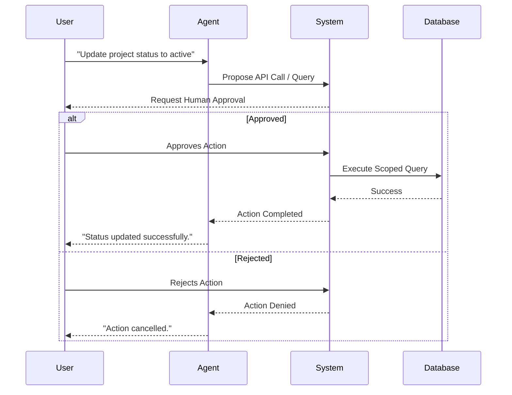

# Agentic Database Applications

As AI agents become more capable, the desire to let them interact with databases grows. While agents can be excellent at analyzing data, they should rarely be allowed to modify data autonomously. Instead, agentic database applications must rely on controlled workflows and proposed operations. Giving an AI unrestricted access to your database is extremely dangerous.

<Callout title="Work in Progress" type="warning">
  This section outlines the theoretical boundaries for safe agent-database interaction. The actual runtime integrations for `taichi112.works` are still in development.
</Callout>

## The Risks of Unrestricted AI Access

If an AI agent can execute any SQL command, you expose the system to several severe risks:
- **Destructive Writes**: Accidentally dropping a table or deleting production user data.
- **Data Leaks**: Querying and exposing sensitive information (like passwords or PII) that the agent shouldn't have access to.
- **Hallucinated Schemas**: The AI making up table names or columns that don't exist, leading to crashed applications.
- **Performance Degradation**: Generating wildly inefficient queries that lock up the database.

## Minimum Safety Checklist

When designing an agentic database workflow, ensure you implement the following safety measures:
- **Default to read-only access**: Agents should only have read permissions by default.
- **Use schema allowlists**: Restrict the agent's visibility to only the tables and columns it needs to see.
- **Require approval for writes**: All destructive or modifying operations must go through a human-in-the-loop review.
- **Log every proposed and executed action**: Maintain an audit trail of what the agent tried to do and what was approved.
- **Prepare rollback or recovery steps**: Always have a plan for how to undo an action if something goes wrong.
- **Route writes through scoped APIs**: Agents should trigger predefined API endpoints for writes, rather than composing direct SQL `INSERT` or `UPDATE` statements.

## Safe Agent-Database Interaction

To build safe agentic applications, we must implement strict boundaries and approval flows.

### 1. Read-Only vs. Write Actions
Agents should almost always operate with **read-only** permissions when exploring data. If an agent needs to write data (like updating a record), it should do so through carefully scoped API endpoints rather than direct database writes.

### 2. The Human-in-the-Loop Model
The safest way to allow an agent to perform complex database operations is the **Human-in-the-Loop (HITL)** model:
1. **Natural Language**: The user asks a question ("How many active projects do we have?").
2. **Query Generation**: The agent translates this into a database query.
3. **Review**: The system pauses and presents the proposed query to a human for approval.
4. **Execution**: Only after human approval does the system execute the query against the database.

### 3. Audit Logs and Rollback Thinking
Every action an agent takes must be logged. If an agent modifies data, there must be a clear audit trail of *why* the decision was made, and a fast way to rollback those changes if necessary.

## The Safe Agent Workflow

Below is a conceptual workflow for how an AI agent safely interacts with a database:

---

**Next Step**: Put these concepts into practice in the [Database Labs](../labs).
