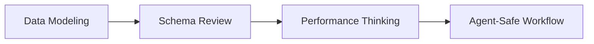

# Database Labs

Understanding database concepts is only the first step. To truly master them, you must bridge the gap between abstract theory and practical execution.

<Callout title="Work in Progress" type="warning">
  Lab exercises are currently conceptual. A fully interactive sandbox environment will be available soon.
</Callout>

## The Theory → Execution Loop

In `taichi112.works`, we believe in a tight feedback loop:
1. **Concept**: Learn the core principle.
2. **Execution**: Write the code (or mental model).
3. **Result**: Observe the structural or performance impact.

## Lab Roadmap

These workshop-style tasks are designed to guide you through practical database engineering. No real database migrations are required yet—these are conceptual exercises.

### Workshop Overview

| Lab | Theory Focus | Expected Output | Safety Note |
|---|---|---|---|
| **1. Data Modeling Basics** | Relationships & Keys | Sketch of tables and columns. | No code execution. |
| **2. Schema Design Review** | Normalization | Redesigned multi-table layout. | No code execution. |
| **3. Query Performance** | N+1 Problem & Joins | Mental map of batched queries. | Read-only concepts. |
| **4. Agent-Safe Workflow** | Human-in-the-loop | Diagram of approval flow. | Prevent destructive queries. |

### Scenario: Project Tracker

To tie all these concepts together, consider a simple **Project Tracker** application.

A user wants to track projects and the tasks within them. As we build this, we encounter every major database concept:
- We identify the core objects we need to store (User, Project, Task).
- We design how they connect (a User owns Projects, a Project contains Tasks).
- We enforce rules (Tasks must have titles, Projects belong to a valid User).
- We ensure the system doesn't lose data if the server crashes while saving.
- We make sure the dashboard loads instantly even with thousands of tasks.
- We design a workflow so an AI assistant can help manage projects without accidentally deleting everything.

| Step | What we do | Knowledge used | Related page | Why it matters |
|---|---|---|---|---|
| **1. Ideation** | Identify Entities | Entity, Table, Column | [Overview](../overview) | Decides what data to store. |
| **2. Design** | Connect Entities | Primary Key, Foreign Key | [Schema Design](../schema-design) | Defines structural relationships. |
| **3. Validation** | Enforce Rules | Constraint, Normalization | [Foundations](../foundations) | Prevents invalid or duplicate data. |
| **4. Safety** | Protect Operations | Transaction, Rollback | [Reliability](../reliability) | Ensures data integrity during failures. |
| **5. Speed** | Optimize Queries | Index, Join, N+1 Query | [Performance](../performance) | Keeps the application fast at scale. |
| **6. AI Agents** | Safe Automation | Human-in-the-loop | [Agentic Applications](../agentic-applications) | Prevents destructive AI actions. |

### Knowledge Map

This table summarizes the core vocabulary used throughout the database modules.

| Keyword | Used when | Read more | Why it matters |
|---|---|---|---|
| **Entity** / **Relationship** | Ideation & Design | [Schema Design](../schema-design) | Defines what data exists and how it connects. |
| **Primary Key** / **Foreign Key** | Connecting tables | [Schema Design](../schema-design) | Links data together securely. |
| **Constraint** | Validating data | [Foundations](../foundations) | Enforces rules so bad data never saves. |
| **Transaction** / **Rollback** | Handling failures | [Reliability](../reliability) | Ensures all-or-nothing data operations. |
| **Index** / **N+1 Query** / **Pagination** | Speeding up queries | [Performance](../performance) | Keeps applications fast at scale. |
| **Human Approval** / **Read-only Access** | AI workflows | [Agentic Applications](../agentic-applications) | Protects databases from autonomous destruction. |

### Lab 1: Data Modeling Basics
**Goal**: Design a simple relationship between Users and Projects.
- **Mental Exercise**: Sketch out what tables and columns are needed to track which users own which projects.
- **Execution**: Define the Primary Keys and Foreign Keys needed to make this relationship reliable.

### Lab 2: Schema Design Review
**Goal**: Identify flaws in an existing schema.
- **Mental Exercise**: Look at a table that stores User data and Project data in the same row (violating normalization).
- **Execution**: Redesign the table into two separate, related tables to prevent data duplication.

### Lab 3: Query Performance Thinking
**Goal**: Retrieve nested data efficiently without causing bottlenecks.
- **Mental Exercise**: How do we get a user and all of their active projects in a single step without overwhelming the database (avoiding the N+1 problem)?
- **Execution**: Understand the difference between querying in a loop versus using a proper database Join.

### Lab 4: Agent-Safe Database Workflow
**Goal**: Design a safe approval flow for an AI agent.
- **Mental Exercise**: An AI agent proposes a dangerous query: `DELETE FROM Users WHERE last_login < 2020`. This query is strictly for review training and should not be executed directly.
- **Execution**: Outline the conceptual human-in-the-loop review steps required to intercept, review, and reject this destructive query before it ever reaches the database.

---

**Next Step**: Return to the [Database Systems Overview](../) to review the core concepts.
