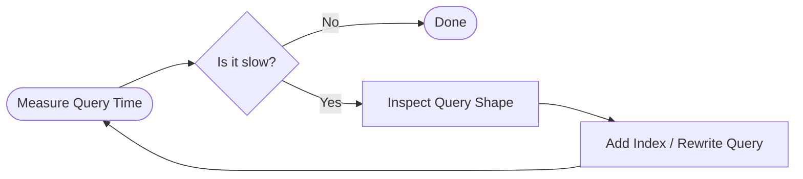

# Database Performance

A database can have the perfect schema and be completely reliable, but if retrieving data takes 10 seconds, the application is practically unusable.

<Callout title="Work in Progress" type="warning">
  This section covers performance concepts. Advanced caching and Prisma query optimization will be added later.
</Callout>

## Why Performance Matters

As an application grows, tables get larger. A query that takes 10 milliseconds with 100 rows might take 10 seconds with 1,000,000 rows. Database performance directly impacts server costs, user experience, and the ability to scale.

## Core Performance Concepts

Here is a quick overview of performance strategies:

| Concept | What it is | When to use it |
|---|---|---|
| **Index** | A "table of contents" for fast lookups. | When searching a column frequently (e.g., `email`). |
| **Query Shape** | Requesting only the data you need. | When a page loads too much hidden data. |
| **N+1 Queries** | Looping database calls unnecessarily. | Use Joins or ORM batching instead. |
| **Pagination** | Loading data in small chunks. | Lists with more than 50 items. |
| **Join** | Combining related tables in one query. | When you need User and Profile data at once. |
| **Cache** | Storing slow query results in fast memory. | When data is read constantly but changes rarely. |

<Callout title="Knowledge Links" type="info">
  **Used in the Project Tracker scenario ([Labs](../labs))**:
  When displaying a user's dashboard, we use an **index** to find their projects instantly. We fetch the project and its related tasks in one step to avoid an **N+1 query** loop, keeping the **query shape** optimized. If they have hundreds of tasks, we use **pagination** to only load what's visible. Compare this structural thinking back to [Schema Design](../schema-design).
</Callout>

## The Golden Rule: Measure Before Optimizing

Avoid **premature optimization**. Don't spend days architecting a complex caching layer for a database table that only holds 50 rows.

1. Build the feature cleanly.
2. Measure the query time under realistic conditions.
3. If it is slow, add an index.
4. If it is still slow, rewrite the query or add caching.

---

**Next Step**: See how these design, reliability, and performance concepts support autonomous systems in [Agentic Applications](../agentic-applications).
