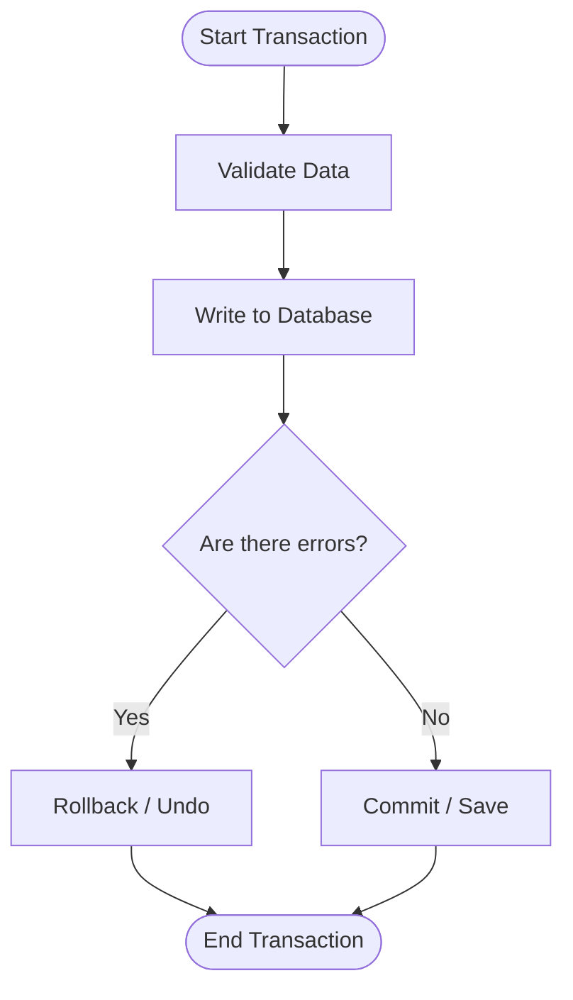

# Database Reliability

A database must be reliable. If an application crashes, the UI can be reloaded. If a database loses data, the business or user trust is permanently broken.

<Callout title="Work in Progress" type="warning">
  This section introduces reliability principles. Specific DevOps backup strategies will be added soon.
</Callout>

## What is Reliability?

In practical software terms, database reliability means:
- The data you save is exactly the data you retrieve.
- The system can survive unexpected failures (like a server crashing or power loss).
- Invalid or corrupted data is strictly prevented from entering the system.

## Core Reliability Tools

### ACID Properties

Reliable relational databases (like PostgreSQL) guarantee **ACID** properties:
This ensures that database transactions are processed reliably.

| Property | Meaning | Practical Example |
|---|---|---|
| **Atomicity** | "All or nothing." | Money is deducted AND item ships. If one fails, both fail. |
| **Consistency** | Data must always be valid. | You cannot save an order without a valid user ID. |
| **Isolation** | Transactions don't mix. | Two users buying the last ticket won't break the system. |
| **Durability** | Saved means saved forever. | If power goes out right after saving, data remains. |

<Callout title="Knowledge Links" type="info">
  **Used in the Project Tracker scenario ([Labs](../labs))**:
  When a user creates a new project with multiple initial tasks, we use a **transaction** to ensure either everything saves or nothing does. If something fails, a **rollback** prevents partial data. This works alongside the **constraint** rules we defined in [Schema Design](../schema-design) to maintain absolute **data integrity**.
</Callout>

### Safe Transaction Flow

When an application processes critical data, it uses a transaction to maintain ACID properties:

### Constraints & Data Integrity

Constraints (like `NOT NULL`, `UNIQUE`, and Foreign Keys) are your first line of defense. They prevent bad data at the deepest level, ensuring your application code doesn't have to carry the entire burden of data validation.

### Backups and Migrations

- **Backups**: Regular snapshots of your database ensure you can recover from catastrophic events.
- **Migrations**: Version control for your database schema. Instead of manually clicking around to add a column, you write a migration file. This ensures every environment (local, testing, production) is structured identically and safely.

## Failure Thinking

Building reliable systems requires "failure thinking"—assuming that eventually, something will break. When building features, always ask: *What happens if the database is unreachable right now? What happens if this query fails halfway through?*

---

**Next Step**: Explore how to keep your reliable database running fast in [Performance](../performance).
