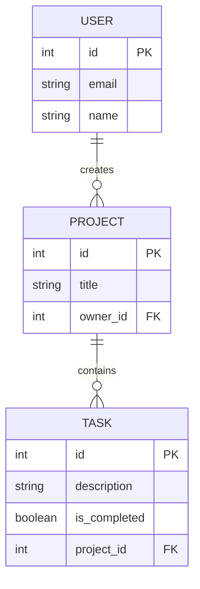

# Schema Design

Schema design is the process of planning how your data is structured, stored, and connected within a database. It acts as the blueprint for your entire application.

<Callout title="Work in Progress" type="warning">
  This module introduces foundational concepts. Deep dives into complex normalization and Prisma examples will be added later.
</Callout>

## Core Concepts

Understanding schema design requires a firm grasp on how data points relate to each other:

| Concept | Description | Real-world Example |
|---|---|---|
| **Entity / Table** | A real-world object you need to store. | `User`, `Project` |
| **Row** | A single distinct record. | "Alice's User Profile" |
| **Column** | A specific piece of information. | `email`, `created_at` |
| **Primary Key** | Uniquely identifies a single row. | `id: 1` |
| **Foreign Key** | Links a row to another table's primary key. | `owner_id: 1` |
| **Constraint** | Rule ensuring data is valid. | `email must be UNIQUE` |

<Callout title="Knowledge Links" type="info">
  **Used in the Project Tracker scenario ([Labs](../labs))**:
  We identify real-world concepts as an **Entity**, and map how they connect via a **Relationship**. We use a **Primary Key** to uniquely identify each row, a **Foreign Key** to link rows together, and a **Constraint** to enforce data validity. Learn the bedrock of these rules in [Foundations](../foundations).
</Callout>

### Visualizing Relationships

Here is a simplified Entity-Relationship Diagram (ERD). Note: This is a conceptual learning model, not the exact production schema.

## Normalization

Normalization is the practice of organizing your tables to reduce data redundancy (duplicate data) and improve data integrity. In simple terms, it means storing a piece of information in exactly one place. If a user changes their name, you should only have to update it in one table, not fifty.

## Why Schema Design Matters

A poorly designed schema can cripple an application as it grows:
- **Maintainability**: Clear, well-structured data makes writing code easier and less prone to bugs.
- **Correctness**: Good schema design prevents invalid states, such as orders existing for users who were deleted.
- **Query Performance**: The way you structure your data directly impacts how fast the database can retrieve it.

## Connecting to This Project

In `taichi112.works`, we use **Prisma** to define our schema. Prisma allows us to map out entities and relationships in a highly readable format (`schema.prisma`), which then safely translates into **PostgreSQL** tables and constraints.

---

**Next Step**: Learn how a well-designed schema supports system resilience in [Reliability](../reliability).
