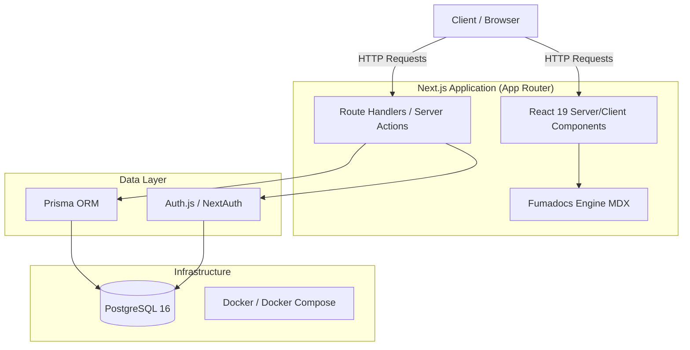

# System Architecture Document

**Project Name:** Personal Profile Prototype (taichi112.works)  
**Last Updated:** 2026-08-29  

---

## 1. High-Level Architecture

The platform follows a modern, server-rendered **Next.js App Router** architecture. It functions as both an interactive Single Page Application (SPA)-like experience for the main portfolio and a Static Site Generated (SSG) platform for technical documentation (Fumadocs).

## 2. Core Technologies

| Layer | Technology | Purpose |
|---|---|---|
| **Framework** | Next.js 16.2.6 (App Router) | Core routing, rendering (SSR/RSC), and API endpoints |
| **UI Library** | React 19.2.3 | Component construction and state management |
| **Styling** | Tailwind CSS 4 + PostCSS | Utility-first styling, dark mode, responsive design |
| **Database** | PostgreSQL 16 | Relational data storage (Users, Leads) |
| **ORM** | Prisma 7 | Type-safe database queries and schema migrations |
| **Auth** | NextAuth.js v5 (Beta) | Google OAuth & Credentials authentication |
| **Documentation** | Fumadocs + MDX | Compiles Markdown to interactive React pages |
| **Runtime** | Bun | Lightning-fast script execution and unit testing |

## 3. Directory Structure Strategy

- `/app`: Next.js application routes. Uses `[tab]` dynamic routing for the portfolio SPA, and `[tab]/docs/[[...slug]]` for Fumadocs routing.
- `/docs`: Markdown and MDX source files for Fumadocs. Organized by categories (e.g., `/computer_science`).
- `/src`: Design patterns, algorithms, and sandbox code intended for demonstration.
- `/lib`: Shared utilities, Prisma client instantiation, and configuration.
- `/project-docs`: Standard SDLC documentation (PRD, Architecture, Test Plans) intended for human developers and PMs.
- `/.docs`: AI Agent instructions and repository governance standards.

## 4. Key Architectural Patterns

1. **Server Components by Default:** Uses React Server Components (RSC) to minimize JavaScript bundles. Interactive components (e.g., Theme Toggle, Nav) are marked with `"use client"`.
2. **SSOT (Single Source of Truth) Styling:** Tailwind configuration handles central theme variables. 
3. **Docs-as-Code:** Engineering and product requirements are stored alongside the codebase (`/project-docs` and `/.docs`) ensuring versions stay in sync.
4. **Dynamic Imports:** Heavy UI components (e.g., Particles, Modals) are loaded via `next/dynamic` to ensure high Lighthouse scores.

## 5. Deployment & CI/CD

- **Containerization:** The application is packaged using an Alpine-based `node:20` Docker image.
- **Local Dev:** `docker-compose` is used to spin up a local PostgreSQL instance alongside the Next.js dev server.
- **CI Pipeline:** GitHub Actions runs `bun run lint`, `bun run build`, and `bun test` on every push.
