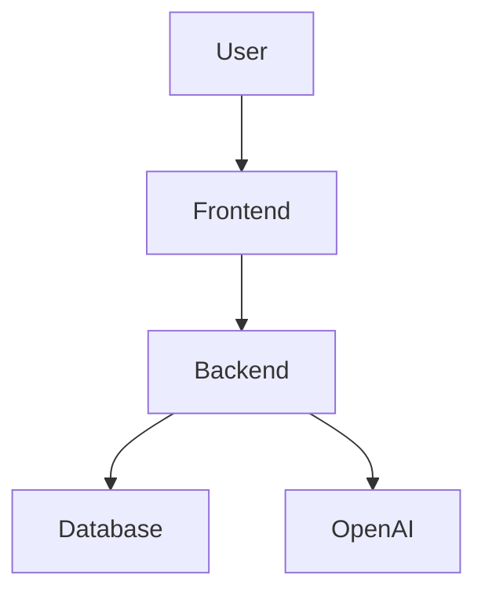

# 🚀 AI Resume Builder


> 🧠 AI-powered platform for generating tailored resumes based on job positions and companies

---

# 🧭 1. Planning

## 📌 Problem Statement
Users need multiple resume versions tailored to different companies, which is time-consuming and inefficient.

## 🎯 Vision & Goals
- Automatically generate tailored resumes using AI
- Reduce resume creation time by 80%
- Improve ATS pass rate

## 🗺️ Roadmap
- [x] Basic resume builder
- [x] Google OAuth login
- [ ] AI resume customization (In Progress)
- [ ] Export PDF
- [ ] Multi-language support

---

# 🔍 2. Analysis

## ⚙️ Requirements

### Functional
- Create / Edit Resume
- Generate AI-tailored Resume
- Export Resume (PDF)

### Non-Functional
- Response time < 2s
- Secure user data
- Scalable system

## 🧱 Tech Stack

| Layer       | Technology       | Reason |
|------------|----------------|--------|
| Frontend   | Next.js        | SEO + performance |
| Backend    | Node.js        | Lightweight API |
| Database   | PostgreSQL     | Structured data |
| AI         | OpenAI API     | Resume optimization |

## 📦 Prerequisites
- Node.js >= 18
- PostgreSQL
- OpenAI API Key

---

# 🏗️ 3. Design

## 🧩 Architecture



## 📁 Project Structure

```
project/
│── frontend/
│── backend/
│── database/
│── docs/
│── README.md
```

## 🧠 Key Design Decisions
- Modular architecture
- REST API
- AI handled via service layer

---

# 🚀 4. Implementation

## 📥 Installation

```bash
git clone https://github.com/yourusername/ai-resume-builder.git
cd project
npm install
```

## 🔐 Environment Variables

```bash
cp .env.example .env
```

Example:
```
DATABASE_URL=your_db_url
OPENAI_API_KEY=your_key
```

## ▶️ Run Project

```bash
npm run dev
```

---

# 🧪 5. Testing

## 🧬 Testing Strategy
- Unit Testing
- Integration Testing
- Manual Testing

## ▶️ Run Tests

```bash
npm run test
```

## 📊 Coverage
- Current: 75%

---

# 🌐 6. Deployment

## 🚀 Hosting

| Component | Platform  | Status |
|----------|----------|--------|
| Frontend | Vercel   | ✅ |
| Backend  | Railway  | ✅ |
| Database | Supabase | ✅ |

## ⚙️ Deployment Steps
1. Push to GitHub
2. Run CI pipeline
3. Deploy to production

---

# 🛠️ 7. Maintenance

## 🐛 Issue Reporting
Use GitHub Issues (bug / feature / improvement)

## ⏱️ SLA

| Priority | Response Time | Fix Time |
|---------|--------------|---------|
| Critical | < 1 hour | < 24 hours |
| High     | < 4 hours | 3-7 days |
| Low      | < 48 hours | Flexible |

## 🔐 Security Policy
security@yourproject.com

## 📌 Project Status
🟢 Active Development

---

# 🤝 Contributing

## 🔄 Workflow
1. Fork repo
2. Create branch
3. Commit
4. Open PR

## 📝 Commit Convention
feat: add feature  
fix: bug fix  

---

# 📜 License
MIT License

---

# 💡 Future Ideas
- Resume scoring system
- Job matching AI
- Company-specific templates
