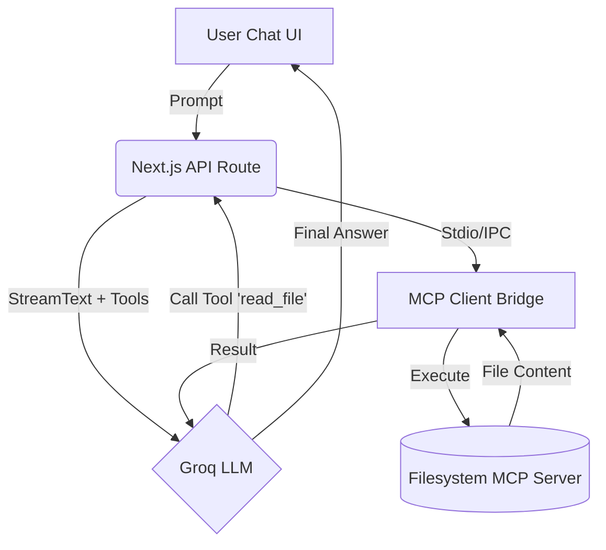

# 🚀 คู่มือการเชื่อมต่อ MCP Servers เข้ากับ Next.js Web UI

คู่มือนี้จะสอนขั้นตอนการเปลี่ยนแชทบอทธรรมดา ให้กลายเป็น **Agentic Software Engineer** โดยการเชื่อมต่อกับเครื่องมือ MCP (Model Context Protocol) เพื่อให้ AI สามารถอ่านไฟล์, รันคำสั่ง, ดึงข้อมูลจาก GitHub และ Linear ได้ด้วยตัวเอง

---

## 🗺️ Architecture Overview (สถาปัตยกรรมระบบ)



---

## 🛠️ ขั้นตอนที่ 1: ติดตั้งไลบรารี MCP SDK
เราจำเป็นต้องให้ฝั่ง Next.js รู้จักกับโปรโตคอล MCP ก่อน ให้รันคำสั่งนี้ในโฟลเดอร์ `/home/dev/ai-factory/web-ui`:

```bash
cd /home/dev/ai-factory/web-ui
bun add @modelcontextprotocol/sdk
```

---

## 🌉 ขั้นตอนที่ 2: สร้างสะพานเชื่อมต่อ (MCP Client Bridge)
สร้างไฟล์ใหม่ที่ `lib/ai/mcp-client.ts` เพื่อทำหน้าที่เชื่อมต่อกับเซิร์ฟเวอร์ MCP เบื้องหลังผ่านทาง Stdio (Command Line) และแปลงให้อยู่ในฟอร์แมตที่ Vercel AI SDK เข้าใจ

**สร้างไฟล์: `lib/ai/mcp-client.ts`**
```typescript
import { Client } from "@modelcontextprotocol/sdk/client/index.js";
import { StdioClientTransport } from "@modelcontextprotocol/sdk/client/stdio.js";
import { tool } from "ai";
import { z } from "zod";

// ตัวอย่างการเชื่อมต่อกับ Filesystem MCP
export async function getFilesystemTools() {
  const transport = new StdioClientTransport({
    command: "/home/dev/.bun/bin/bunx",
    args: ["-y", "@modelcontextprotocol/server-filesystem", "/home/dev/ai-factory"],
  });

  const mcpClient = new Client(
    { name: "nextjs-chat", version: "1.0.0" },
    { capabilities: {} }
  );

  await mcpClient.connect(transport);
  
  // แปลงเครื่องมือของ MCP ให้อยู่ในฟอร์แมตของ Vercel AI SDK
  return {
    read_file: tool({
      description: "Read the contents of a file in the workspace",
      parameters: z.object({ path: z.string().describe("Absolute path to the file") }),
      execute: async ({ path }) => {
        const result = await mcpClient.callTool({
          name: "read_file",
          arguments: { path },
        });
        return result.content;
      },
    }),
    list_directory: tool({
      description: "List files in a directory",
      parameters: z.object({ path: z.string() }),
      execute: async ({ path }) => {
        const result = await mcpClient.callTool({
          name: "list_allowed_directories",
          arguments: { path },
        });
        return result.content;
      },
    }),
  };
}
```

---

## 🔌 ขั้นตอนที่ 3: เสียบ Tools เข้ากับ API Route ของแชทบอท
แก้ไขไฟล์ API Route ของแชท เพื่อเพิ่ม Tools ที่เราดึงมาจาก MCP Client เข้าไปให้ Groq โมเดลเรียกใช้ได้

**แก้ไขไฟล์: `app/(chat)/api/chat/route.ts`**
ค้นหาบรรทัดที่มีคำว่า `const result = streamText({` และเพิ่ม `getFilesystemTools()` เข้าไป:

```typescript
// ด้านบนสุดของไฟล์ ให้ Import:
import { getFilesystemTools } from "@/lib/ai/mcp-client";

// ... เลื่อนลงมาตรงฟังก์ชัน execute ...
const mcpTools = await getFilesystemTools();

const result = streamText({
  model: getLanguageModel(chatModel),
  messages: modelMessages,
  tools: {
    ...mcpTools, // <--- เสียบ MCP Tools ตรงนี้!
    createDocument: createDocument({ dataStream, modelId: chatModel, session }),
    getWeather, // Tool เดิมของ Vercel
  },
  // ...
});
```

---

## 🧪 ขั้นตอนที่ 4: รีสตาร์ทและทดสอบ (Test the Agent)
หลังจากเพิ่มโค้ดเสร็จแล้ว ให้รีสตาร์ทเซิร์ฟเวอร์เพื่อให้โค้ดใหม่ทำงาน:

1. กลับไปที่หน้าเว็บ `http://localhost:3000`
2. พิมพ์คำสั่งทดสอบในช่องแชท:
   > "ช่วย list ไฟล์ทั้งหมดที่อยู่ในโฟลเดอร์ /home/dev/ai-factory ให้ดูหน่อย"
3. สังเกตพฤติกรรม: AI จะวิเคราะห์คำสั่ง -> รัน Tool `list_directory` -> คืนค่ารายชื่อไฟล์กลับมาให้คุณ!

---

💡 **หมายเหตุสำหรับคุณ:** หากคุณทำตามขั้นตอนนี้สำเร็จ เราจะใช้วิธีเดียวกันนี้ในการเชื่อมต่อ **GitHub MCP** (เพื่อให้ AI สั่ง Commit โค้ดได้) และ **Linear MCP** (เพื่อให้ AI จัดการ Task ได้) ในบทเรียนถัดไปครับ!
