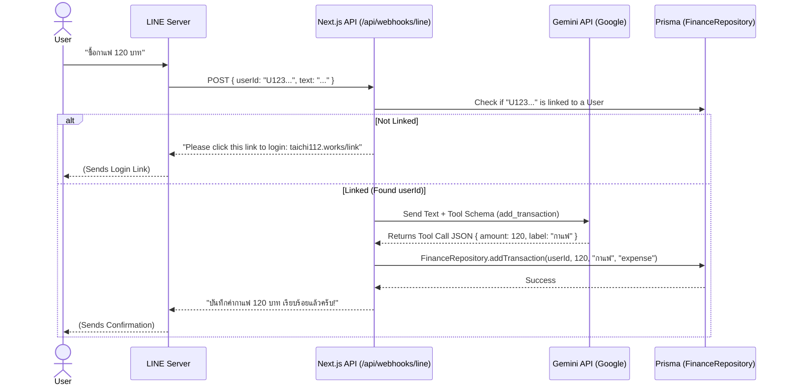

# 🌐 Omnichannel AI Architecture (FinanceFlow)

**Status:** Proposed / Blueprint for Future Phase
**Author:** Staff Engineer AI (Antigravity)

## 1. Overview
The goal is to allow users to interact with `FinanceFlow` (and other micro-projects) via external messaging platforms like **LINE**, Discord, or Telegram, without rewriting the core business logic. Users will be able to type natural language (e.g., "วันนี้กินข้าวไป 50 บาท") and the system will automatically parse and save it to the database.

## 2. Core Differences: Terminal vs. Messaging App

| Feature | Local Terminal (MCP) | LINE Bot (Webhook) |
| :--- | :--- | :--- |
| **Interface** | Antigravity CLI | LINE App -> Next.js API Route |
| **LLM Provider**| Built-in Antigravity AI (Gemini Pro) | Developer must call an LLM API directly (e.g., Gemini API via `@google/genai`) |
| **Function Calling**| Handled natively by MCP protocol | Handled by LLM API Function Calling (Tools) |
| **Identity** | Inherently yours (Local machine) | Requires **Account Linking** (LINE User ID <-> Google Email) |

## 3. System Architecture Workflow

When a user sends a message via LINE, the following sequence occurs:

## 4. Implementation Steps (For the Future)

When we are ready to implement this, we will execute the following steps:

### Phase 1: Account Linking (Identity)
1. Add a `lineUserId` string column to the `Account` or `User` table in Prisma.
2. Create a specific Next.js page (e.g., `/api/auth/line-link`) that authenticates the user via NextAuth and binds the `lineUserId` from the URL parameters to their session.

### Phase 2: The LLM Router
1. Obtain a `GEMINI_API_KEY` from Google AI Studio.
2. Install the `@google/genai` SDK in the Next.js project.
3. Define the **Function Declarations** (Tool schemas) that perfectly match the `add_transaction` and `get_financial_summary` tools we built in the MCP server.

### Phase 3: The LINE Webhook
1. Setup a LINE Messaging API Channel.
2. Create `app/api/webhooks/line/route.ts` in Next.js.
3. Verify the LINE signature.
4. Extract the message text, pass it to the Gemini API, execute the returned function call against `FinanceRepository`, and reply to the user.

## 5. Staff Engineer Verdict
Do not build this immediately. The foundation is solid, but building a robust webhook and prompt-engineering the LLM requires its own dedicated sprint. Save this blueprint, focus on completing the web-based OS features first, and tackle this as a high-impact standalone epic later.
