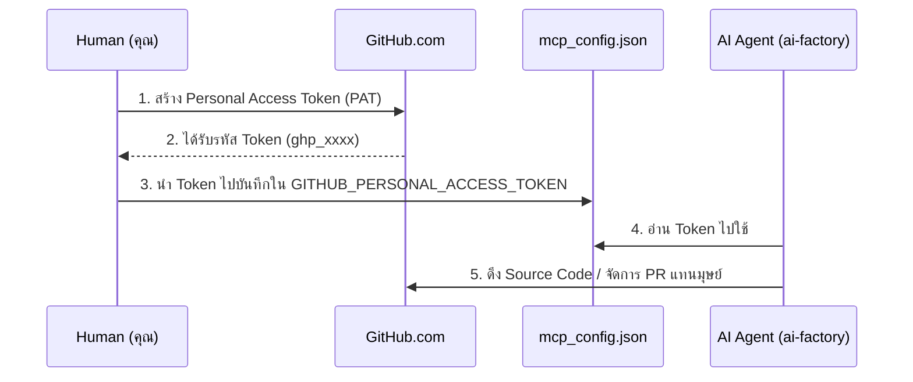

# 🐙 คู่มือการเตรียม GitHub Personal Access Token

คู่มือนี้อธิบายขั้นตอนการขอ Token จาก GitHub เพื่อให้เซิร์ฟเวอร์ AI ของเรา (ผ่าน MCP) สามารถเข้าไปอ่านโค้ด โคลนโปรเจกต์ และจัดการ Repository ได้

## 📊 ภาพรวมการทำงาน (Architecture Flow)

## 📝 ขั้นตอนการเตรียมข้อมูล (Step-by-Step)
1. เข้าไปที่เว็บ [GitHub.com](https://github.com) และ Log in ด้วยบัญชีของคุณ
2. คลิกที่รูป Profile มุมขวาบน -> เลือก **Settings**
3. เลื่อนแถบเมนูซ้ายมือลงล่างสุด คลิก **Developer settings**
4. เลือก **Personal access tokens** -> **Tokens (classic)**
5. คลิกปุ่ม **Generate new token (classic)**

## 📋 ข้อมูลที่ต้องกรอก (Fields & Configurations)

| ชื่อ Field บนหน้าจอ | สิ่งที่ต้องกรอก / เลือก | ผลลัพธ์ (ความหมาย) |
| :--- | :--- | :--- |
| **Note** | `ai-factory-mcp-token` | ชื่ออ้างอิงให้รู้ว่า Token นี้เอามาใช้ทำอะไร |
| **Expiration** | `No expiration` หรือ `90 days` | อายุการใช้งานของ Token (แนะนำ 90 วันเพื่อความปลอดภัย) |
| **Select scopes: `repo`** | ✅ ติ๊กถูก (เลือกทั้งหมดย่อยในหมวดนี้) | อนุญาตให้ AI อ่านและเขียนโค้ดใน Repository ได้ |
| **Select scopes: `workflow`**| ✅ ติ๊กถูก | อนุญาตให้ AI สั่งรัน GitHub Actions ได้ |

## ✅ ผลลัพธ์ที่คาดหวัง (Expected Output)
- เมื่อกดปุ่ม Generate token สำเร็จ หน้าจอจะแสดงรหัส Token สีเขียว (เช่น `ghp_A1b2C3d4E5f6G7h8I9j0K...`)
- **การจัดการ:** ให้ Copy รหัสนี้ไปวางทับคำว่า `REPLACE_WITH_YOUR_GITHUB_TOKEN` ในไฟล์ `~/.gemini/config/mcp_config.json` (ช่อง github) ทันที
