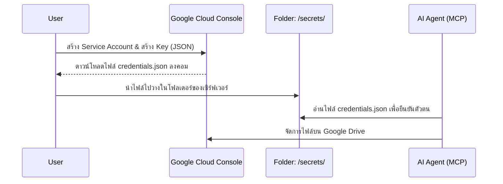

# ☁️ คู่มือการเตรียม Google Cloud Credentials (JSON)

เพื่อที่จะให้ AI Agent เข้าถึง Google Drive, Google Docs, หรือ Google Calendar ของคุณหรือองค์กร เราจำเป็นต้องใช้สิทธิ์แบบ **Service Account** ผ่านไฟล์ Credentials `.json`

## 📊 ภาพรวมการทำงาน (Architecture Flow)

## 📝 ขั้นตอนการเตรียมข้อมูล (Step-by-Step)
1. เข้าไปที่ [Google Cloud Console](https://console.cloud.google.com/)
2. เลือกโปรเจกต์ ไปที่ **IAM & Admin** -> **Service Accounts**
3. คลิก **+ CREATE SERVICE ACCOUNT**
4. หลังจากสร้างเสร็จ คลิกที่อีเมล Service Account นั้น -> ไปที่แท็บ **KEYS**
5. คลิก **ADD KEY** -> **Create new key**

## 📋 ข้อมูลที่ต้องกรอก (Fields & Configurations)

| ชื่อ Field / ขั้นตอน | สิ่งที่ต้องเลือก | ผลลัพธ์ (ความหมาย) |
| :--- | :--- | :--- |
| **Service account details** | ตั้งชื่อเช่น `ai-mcp-worker` | สร้างหุ่นยนต์จำลองของ Google Cloud |
| **Grant this service account access to project (Role)** | เลือก `Editor` | ให้สิทธิ์หุ่นยนต์สามารถจัดการเอกสารได้เต็มรูปแบบ |
| **Key type (ตอนกด Create Key)** | เลือก `JSON` | รูปแบบไฟล์กุญแจมาตรฐานที่ MCP Server รองรับ |

## ✅ ผลลัพธ์ที่คาดหวัง (Expected Output)
- ไฟล์ชื่อคล้ายๆ `project-name-123456.json` จะถูกดาวน์โหลดลงเครื่องคอมพิวเตอร์ของคุณอัตโนมัติ
- **การจัดการ:**
  1. สร้างโฟลเดอร์สำหรับเก็บความลับบนเซิร์ฟเวอร์: `mkdir -p /home/dev/ai-factory/secrets`
  2. อัปโหลดไฟล์ JSON นี้ไปเก็บไว้ตั้งชื่อว่า `/home/dev/ai-factory/secrets/gcp-credentials.json`
  3. (สำคัญ) หากโปรเจกต์คุณใช้ Git **ห้าม Push โฟลเดอร์ `secrets/` เด็ดขาด**
