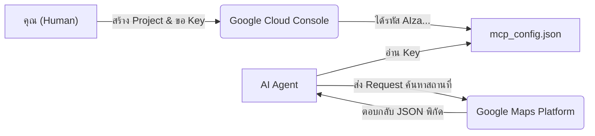

# 🗺️ คู่มือการเตรียม Google Maps API Key

คู่มือนี้อธิบายขั้นตอนการขอ API Key จาก Google Cloud เพื่อให้ AI Agent (ผ่าน MCP) สามารถค้นหาสถานที่ ดึงพิกัด และคำนวณระยะทางได้

## 📊 ภาพรวมการทำงาน (Architecture Flow)

## 📝 ขั้นตอนการเตรียมข้อมูล (Step-by-Step)
1. เข้าไปที่ [Google Cloud Console](https://console.cloud.google.com/)
2. สร้าง Project ใหม่ (หรือเลือกโปรเจกต์ที่มีอยู่)
3. ไปที่เมนู **APIs & Services** -> **Library**
4. ค้นหาและกดปุ่ม **Enable (เปิดใช้งาน)** ให้กับ API ต่อไปนี้:
   - `Geocoding API`
   - `Places API`
5. ไปที่เมนู **APIs & Services** -> **Credentials**
6. คลิกปุ่ม **+ CREATE CREDENTIALS** -> เลือก **API key**

## 📋 ข้อมูลที่ต้องจัดการหลังสร้าง Key

| เมนูในหน้า Credentials | การตั้งค่าที่แนะนำ (Best Practice) | ผลลัพธ์ (ความหมาย) |
| :--- | :--- | :--- |
| **API restrictions** | เลือก `Restrict key` และติ๊กเลือกเฉพาะ `Geocoding API`, `Places API` | ป้องกันไม่ให้คนขโมย Key ไปใช้กับ Service อื่นที่เสียเงิน |
| **Billing** | ต้องผูกบัตรเครดิตใน Google Cloud Billing | หากไม่ผูกบัตร API จะใช้งานไม่ได้ (Google ให้เครดิตฟรี $200/เดือน) |

## ✅ ผลลัพธ์ที่คาดหวัง (Expected Output)
- หน้าจอจะแสดงป๊อปอัป "Your API key" ที่มีรหัสเริ่มต้นด้วย `AIza...` (เช่น `AIzaSyB1...`)
- **การจัดการ:** นำรหัสนี้ไปวางทับ `REPLACE_WITH_YOUR_MAPS_API_KEY` ในไฟล์ `~/.gemini/config/mcp_config.json` (ช่อง google-maps)
