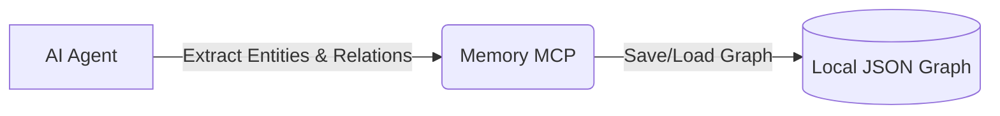

# 🧠 คู่มือการใช้ Memory MCP (Knowledge Graph)

Memory MCP ทำให้ AI สามารถจำบริบท โครงสร้างโปรเจกต์ และกฎการเขียนโค้ดของทีมข้าม Session ได้ โดยไม่ต้องใช้ API Key แต่ระบบจะสร้างไฟล์เก็บความจำ (Knowledge Graph) ไว้ในเครื่อง

## 📊 ภาพรวมการทำงาน

**การจัดการ:** ไม่ต้องตั้งค่า API Key พร้อมใช้งานทันที
