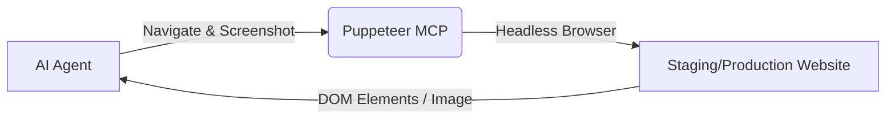

# 🕷️ คู่มือการใช้ Puppeteer MCP

Puppeteer MCP ไม่ต้องใช้ API Key ใดๆ แต่ต้องการให้เครื่องเซิร์ฟเวอร์ติดตั้ง Browser (Chromium) เพื่อให้ AI สามารถเปิดเบราว์เซอร์แบบ Headless เข้าไปแคปจอ หรือทดสอบ E2E ได้

## 📊 ภาพรวมการทำงาน

**การจัดการ:** ไม่ต้องตั้งค่า API Key เพิ่มเติม ระบบพร้อมใช้งานทันทีผ่านคำสั่ง `bunx @modelcontextprotocol/server-puppeteer`
