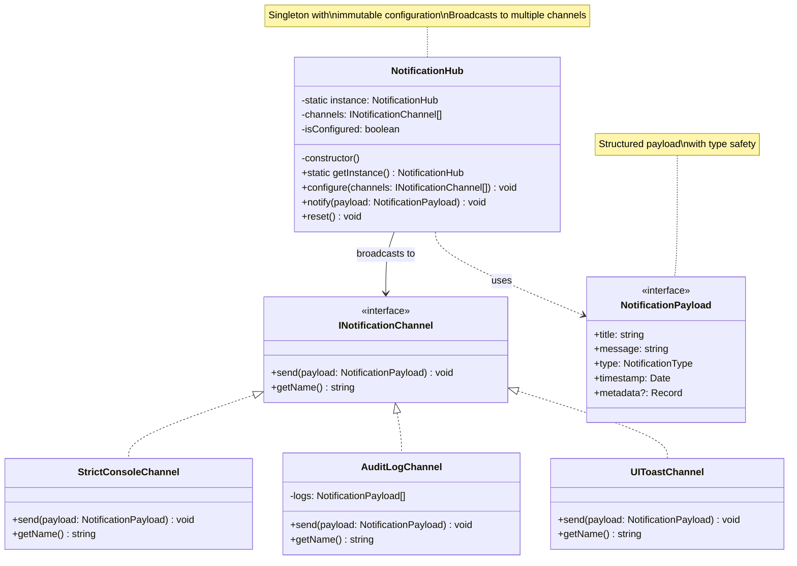

# Singleton Pattern Edit - Strict Notification Hub

## Description - Edit Version
- **NotificationHub**: Singleton with strict configuration
- **INotificationChannel**: Interface สำหรับ channels
- **NotificationPayload**: Structured, type-safe payload with metadata
- **Channels**: Multiple channel implementations
- **Key Features:**
  - Immutable config: configure() once
  - Composite channels: broadcast to multiple
  - Structured payload: enforces complete data
  - isConfigured flag prevents reconfiguration
