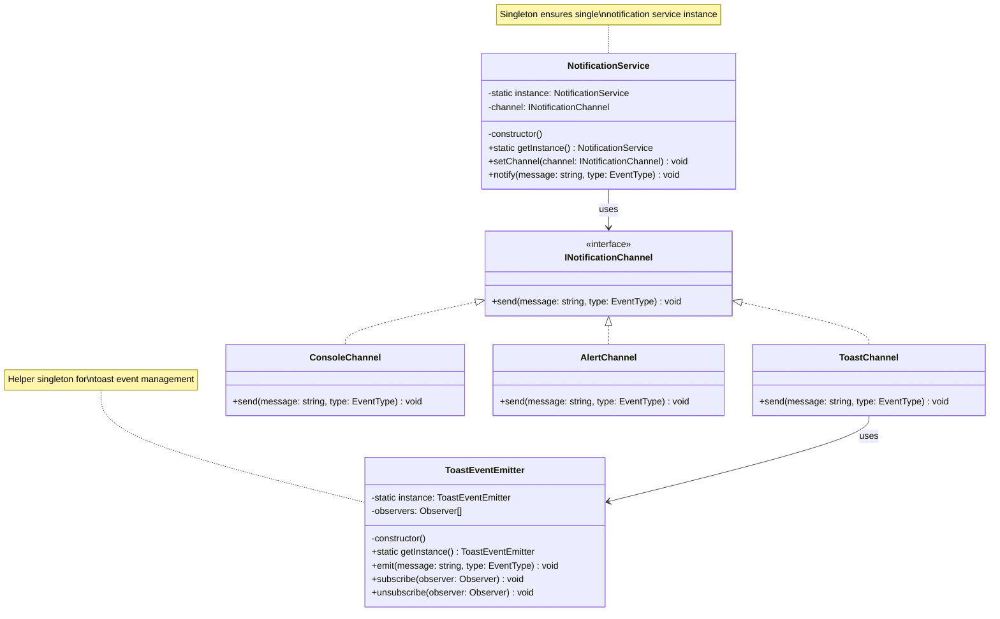

# Singleton Pattern - Notification System

## Description
- **NotificationService**: Singleton class สำหรับจัดการการแจ้งเตือน ใช้ Bridge pattern กับ INotificationChannel
- **INotificationChannel**: Interface สำหรับช่องทางการแจ้งเตือนต่างๆ
- **ToastChannel/ConsoleChannel/AlertChannel**: Concrete implementations ของช่องทางแจ้งเตือน
- **ToastEventEmitter**: Helper singleton สำหรับจัดการ observers ของ toast notifications
