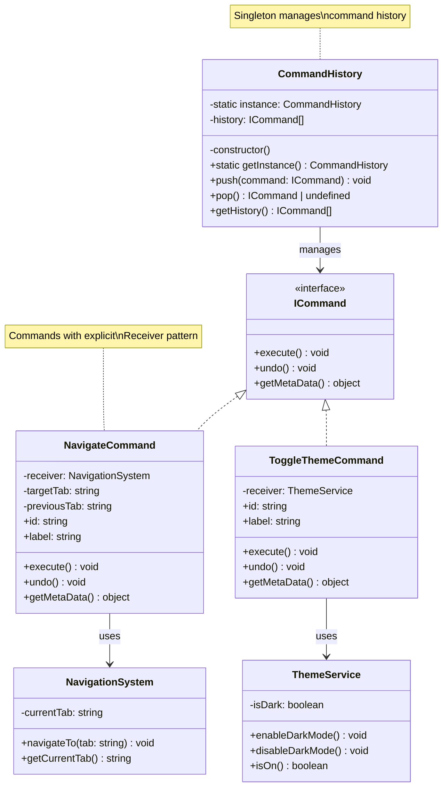

# Singleton + Command Pattern Edit - Strict Mode

## Description
- **CommandHistory**: Singleton จัดการ history กลาง
- **ICommand**: Interface ที่มี getMetaData() สำหรับดึงข้อมูล
- **NavigationSystem/ThemeService**: Receivers ที่เก็บ business logic
- **Commands**: ตัวกลางที่สั่ง Receiver ทำงาน
- Separation of Concerns ชัดเจน
