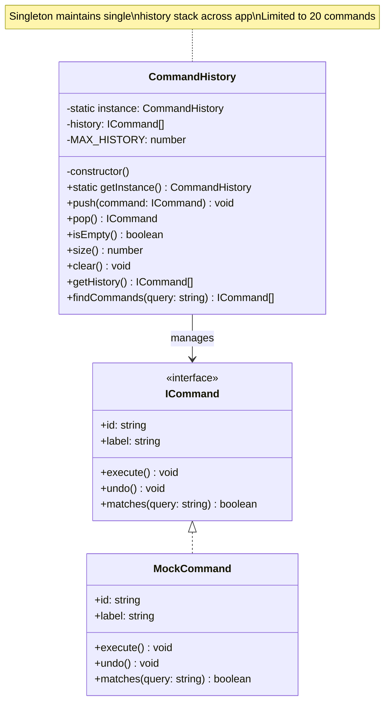

# Singleton Pattern - Command History

## Description
- **CommandHistory**: Singleton class ที่จัดการ undo/redo history แบบ centralized
- **ICommand**: Interface สำหรับ commands ที่สามารถ execute และ undo ได้
- **MockCommand**: Example concrete command implementation
- Maintains maximum 20 commands เพื่อป้องกัน memory bloat
