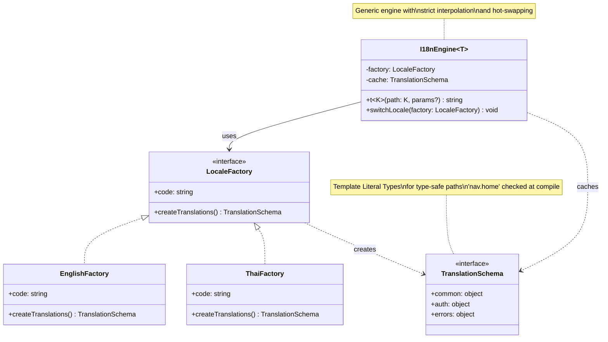

# Factory Method Edit - Type-Safe i18n Engine

## Description
- **LocaleFactory**: Interface สำหรับ language factories
- **TranslationSchema**: Schema with functions for interpolation
- **I18nEngine**: Generic engine รองรับ type-safe dot notation
- **Key Features:**
  - Template Literal Types for path ('nav.home')
  - Strict interpolation with required params
  - Hot-swapping locales
