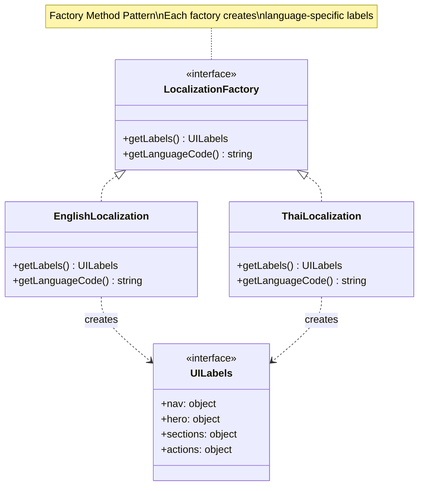

# Factory Method Pattern - Localization

## Description
- **LocalizationFactory**: Interface ที่ define factory method `getLabels()`
- **EnglishLocalization/ThaiLocalization**: Concrete factories ที่สร้าง UILabels สำหรับแต่ละภาษา
- **UILabels**: Product interface ที่มี labels สำหรับ nav, hero, sections, actions
- Add ภาษาใหม่โดยสร้าง concrete factory class
