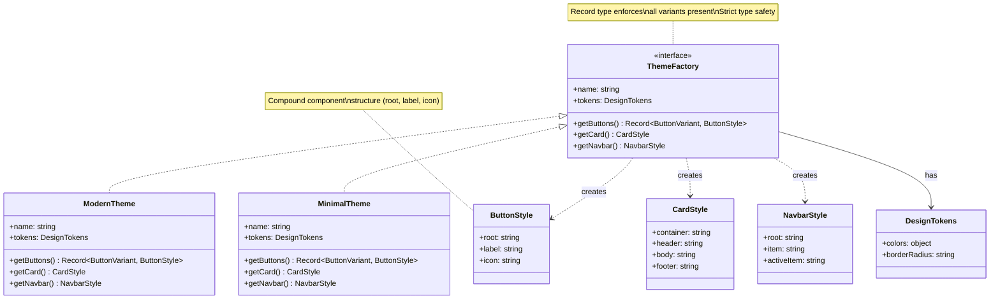

# Abstract Factory Edit - Structured Design System

## Description
- **ThemeFactory**: Abstract factory with structured components
- **ButtonStyle/CardStyle**: Structured component styles
- **DesignTokens**: Reusable design tokens
- **Key Features:**
  - Record<ButtonVariant, ButtonStyle> ensures all variants
  - Compound components (root, label, icon)
  - Separation of tokens from components
