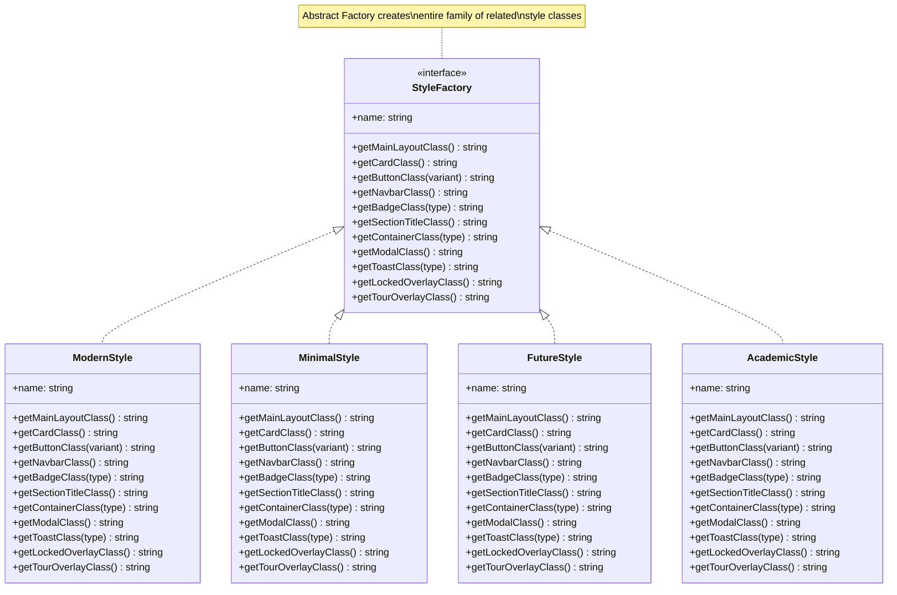

# Abstract Factory Pattern - Theming System

## Description
- **StyleFactory**: Abstract factory interface ที่ define methods สำหรับสร้าง style objects
- **ModernStyle/MinimalStyle/FutureStyle/AcademicStyle**: Concrete factories แต่ละ theme
- แต่ละ factory สร้าง consistent set ของ styles (buttons, cards, modals, etc.)
- Switch entire theme ได้ในครั้งเดียว
