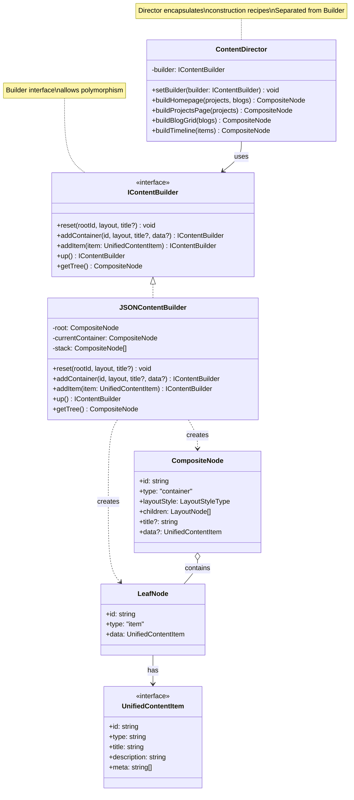

# Builder Pattern Edit - Full-Scale with Director

## Description - Edit Version
- **IContentBuilder**: Builder interface สำหรับ polymorphism
- **JSONContentBuilder**: Concrete builder implementation
- **ContentDirector**: Separates construction recipes
- **CompositeNode/LeafNode**: Products being built
- **Key Features:**
  - Strict separation: Director (recipes) vs Builder (steps)
  - Interface-based: supports multiple builder types
  - Method chaining enabled
  - Director provides high-level recipes
