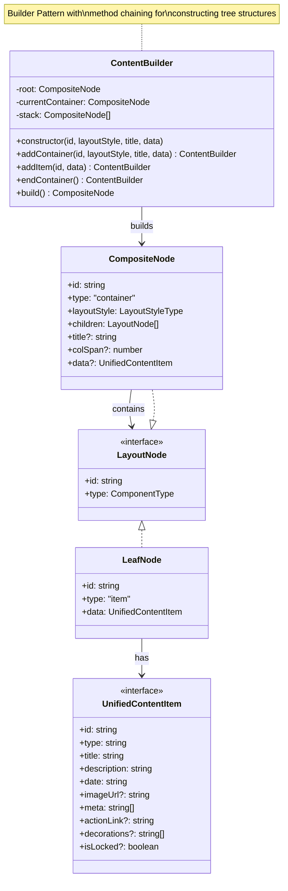

# Builder Pattern - Content Tree Builder

## Description
- **ContentBuilder**: Builder class ที่ construct hierarchical content structures แบบ step-by-step
- **LayoutNode**: Base interface สำหรับ tree nodes
- **LeafNode**: Represents single content item (no children)
- **CompositeNode**: Container ที่มี children และ layout style
- **UnifiedContentItem**: Normalized data type สำหรับ content
- Method chaining enables readable tree construction
